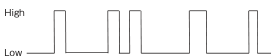

罗马尼亚语大学历史学会

B5W-LD0101-1/2

CSM_B5W-LD0101-1_2_DS_J_1_5

高感度&小型のダストセンサ

- •LED光源を用いながら最小粒径0.5 μmの粒子を検出可能
- •大気を効率的に吸い込む独自の流路構造
- ・コンバクトな光学系により小型化を実現
RoHS滴合

## 形式構成

D基本種別

- L:光センサ 01:基準構造
- (2)七ンサ種別
(4)機能
(): 基準機能
⑤椢包形態

- ]: ]個
- 2:300個
## 種類

<table><tr><td>形状</td><td>棱出方式</td><td>接筋方式</td><td>出力形式</td><td>形式</td><td>极包形象</td></tr><tr><td rowspan="2">路撒冷),只有31%的巴勒斯坦人能使用水</td><td rowspan="2">光截近方式</td><td rowspan="2">コネクタ提高</td><td rowspan="2">バルス出力(ブルアップボールボールス)の成功</td><td>形B5W-LD0101-1</td><td>1個</td></tr><tr><td>形B5W-LD0101-2</td><td>300個</td></tr></table>

(納爾についてはお取引き商社にお問い会わせください、

芒精入当社贩壳店 または オムロンFAストア $\rightarrow$ www.fa.omron.co.jp

omron 1

---

B5W-LD0101-1/2

## 定格/性能/外装仕様

絶対最大定格 (Ta=25℃)

<table><tr><td>项目</td><td>記号</td><td>定格值</td><td>単位</td></tr><tr><td>電源電圧</td><td>Vcc</td><td>5.5</td><td>V</td></tr><tr><td>閾値電圧</td><td>Vth</td><td>5.5</td><td>V</td></tr><tr><td>動作温度</td><td>Topt</td><td>0∼45</td><td>℃</td></tr><tr><td>保存温度</td><td>Tstg</td><td>−25∼65</td><td>℃</td></tr></table>

### 外蒙仕様

<table><tr><td rowspan="2">接続方式</td><td rowspan="2">質量 (g)</td><td colspan="2">材質</td></tr><tr><td>ケース</td><td>レンズ</td></tr><tr><td>コネクタ接続</td><td>20</td><td>PC</td><td>PMMA</td></tr></table>

電気的特性 (Ta=25°C、 Vcc=5V、 OLx)

<table><tr><td rowspan="2">项目</td><td colspan="3">特性值</td><td rowspan="2">罪位</td><td rowspan="2">得考</td></tr><tr><td>MIN</td><td>TYP</td><td>MAX</td></tr><tr><td>V OC</td><td>4.5</td><td>5</td><td>5.5</td><td>V</td><td>リップル電腦30mV以下(キ)を接受</td></tr><tr><td>V PI</td><td>0</td><td>–</td><td>3.5</td><td>V</td><td></td></tr><tr><td>V(OUT1) /V(OUT2) /V(C) /V(C) 出力電圧</td><td>4.5</td><td>–</td><td>–</td><td>V</td><td>粒子接知時バルス出力</td></tr><tr><td>V(OUT1) /V(OUT2) ローレベル出力電圧</td><td>–</td><td>–</td><td>0.7</td><td>V</td><td>粒子排放時バルス出力</td></tr><tr><td>消費費流</td><td>–</td><td>–</td><td>90</td><td>mA</td><td>LED-ON</td></tr></table>

*300Hz以下のノイズがないよう、 ご注意ください。 リップル電圧の許容偵は実機でご確認お願いします。

<table><tr><td colspan="2" rowspan="2">项目</td><td colspan="3">特性值</td><td rowspan="3">罪位 count</td><td rowspan="3">得考 按照下列各项而予以决定─(7)〔除以下法律程序外〔述明法律程序</td></tr><tr><td rowspan="2">MIN —</td><td rowspan="2">TYP 300</td><td rowspan="2">MAX —</td></tr><tr><td>V(OUT1)和子核出数</td><td>PN1</td></tr><tr><td>V(OUT2)和子核出数</td><td>PN2</td><td>0</td><td>—</td><td>—</td><td>count</td><td>的贸易的现有资料,非常复杂的原因是钻石走私情况十分</td></tr></table>

検出特性 (Ta=25°C、 Vcc=5V、 OLx)

## 最小検出粒径

V(OUT1): 約0.5μm以上 V(OUT2): 約2.5μm以上

芒精入当社贩壳店 または オムロンFAストア $\rightarrow$ www.fa.omron.co.jp

OMRON

2

---

B5W-LD0101-1/2

## 特性データ (参考値)

粉鹿量—検出粒子数 相関グラフ

測定環境

粉塵量計 型式:TSI DUSTTRAK II MODEL8530 分級インバクタ:1.0μm、 K値設定:1

ダストセンサ 閾値: 0.5V 測定時間: 20se

参考文献

Condition Ta=25℃、 Voc=5V、 OLx

注, 因此30台实测结果の参考特性です。

## 曲力信号

V(OUT1)、V(OUT2)

·粒子非换出時はOV、 検出時は5Vの正八しスを出力します。

•測定時間内の八しス数をカウントし、 センサカウント数としてください。 •最小ゾしス幅は0.5msecです。

・サンプリング周波数は4kHz以上としてください

内部ブロック図

* 點作させるためには、 しきい恤電圧Vthを0.5〜3.0V程度に設定いただく必要があります。 推奨しきい恤電圧Vthは0.5Vで、 「 定格 / 性能 / 外装仕様」 の検出特性の条件と同じです

芒精入当社贩壳店 または オムロンFAストア $\rightarrow$ www.fa.omron.co.jp

omron 3

---

正しくお使いください

B5W-LD0101-1/2

詳しくは共通の注意事項およびで注文に際してので承諾事項をで覧ください。

^ 注意

安全を確保する目的で直接的または間接的に人体 を検出する用途に本製品は使用できません。 人体保護用の検出装置として本製品を使用しない でください。

## 安全上の要点

- ●定格電圧・電流範囲を超えて、 使用しないでください。
- 定格電圧・電流範囲以上の電圧・電流を印加すると、 破裂
したり、 焼損したりするおそれがあります。
- ●電圧の極性など、 誤配線をしないでください。
破裂したり、 焼損したりするおそれがありまず
- ●防水仕様ではありませんので、 水がかからないようにし
てください。
- ●取り付けに際してはヒータ部がエンドユーザからアクセ
- スできないように配置してください。
## 使用上の注意

- ●定格を超える周囲雰囲気、 環境では使用しないでください。
- 本製品の廃棄時には産業廃棄物として廃棄してください。
- ●取り付け姿勢: 鉛直(土3°以内)に立てた姿勢でで使用く
ださい。
- ● 吸気口を下、 排気口を上にして設置してください。 吸気
口、 排気口についてはダストの通路を妨げぬよう、 次
ベージに示す通り指定のスペースを確保ください。
- ●検出領域を完全に暗い状態に保つように、 レンズ掃除用
の窓には蒼をしてください。
- ●測定開始安定時間は電源投入後約1分後となります。
- ●レンズに付着した汚れは乾いた綿棒で拭き取ってください。
- ●取り付けに際してはヒータ部がエンドユーザからアクセ
スできないように配置してください。
- ●有機溶剤は、 レンズの特性が変化しますので、 使用しな
いでください。
- ●本製品は静電気などのサージ電圧により、 素子の損傷や
信頼性低下を起こすことがあります。 取り扱いに際して
は、 リストバンド・静電気防止手袋を使用し、 静電気対
- 電源を印加した状態でコネクタを挿抜しないでください。
- ●センサ感度調整用半固定抵抗器には鵷れないでください。
- •本製品に機械的ストレスを加えないでください。 製品に
損傷を与え、 センサ特性の不良の原因となることが想定
されます。 また、 御社製品に搭載された状態でこれら不
具合の発生がないことを十分にで確認ください。
- ●本製品の取り扱い時には、 はんだ面リード部、 基板エッ
ジ部などの鋭利な箇所に触れますと、 怪我をする恐れが
ありますので、 こ注意ください。
- ●本製品の取り扱い時には、 レンズ表面に傷や汚れが付か
ないようにで注意ください。
センサ特性の変動要因となる可能性がでざいます。 また、 氷結・結露の無いようにしてください。

- ●コネクタを挿抜する際は、 水平または垂直に行ってくだ
さい。 上下、 左右、 斜め方向にこじって、 コネクタを挿
抜しないでください。 コネクタ挿入時は奥まで完全に挿
入してください。
- 9 落下した製品はこ使用しないでください。 製品に損傷を与
え、 センサ特性の不良の原因となることが想定されます。
- ●以下の特性変動を十分評価し使用可能か判断された上で
こ使用ください。
(a) 温度特性(本製品を使用する際、 周囲温度に変動がある 場合、 そのセンサ出力変動)

(b) 応答特性(本製品を使用する際、 サンプリングタイミン グによるセンサ出力変動)

(c) 氷結・結露状態(本製品を使用する際、 氷結・結露が発生した場合、 そのセンサ出力変動)

これらの特性変動に起因する不具合、 誘発される損害につ きましては、 保証の対象から除かれるものとします。

芒精入当社贩壳店 または オムロンFAストア $\rightarrow$ www.fa.omron.co.jp

OMRON

4

---

B5W-LD0101-1/2

外形寸法

CADデータマークの高晶は、 2次完CAD採面・3次完CADモデルのデータをご用意しています。 CADデータけ、 www.fa.omron.co.jpからダウンロードができます。

(单位:mm)

本体

形B5W-LD0101-1/2

## 取付条件

ダストセンサにおける吸排気口の推奨寸法を以下に示します。

下図のとおり、 吸気口を下、 排気口を上にして設置してください, 図示してあるスペースを確保してください。

※前後方向は吸排気口をできるだけセンサケースへ近づけること ※繪付トルク荷重0.54N・m以下、 M3ねじにてソリのない平面部に取り付けてくだきい。

OMRON

5

芒精入当社贩壳店 または オムロンFAストア $\rightarrow$ www.fa.omron.co.jp

