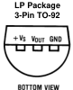

Product Folder

☺

Tools & Software

Support & Community

参考资料

Texas

INSTRUMENTS

参考文献

JAJS924J -JUNE 1999-REVISED NOVEMBER 2016

## LM61 2.7V、SOT-23またはTO-92温度センサ

1 特長

- · 較正済み線形スケール係数: $10 \mathrm{mV} /{ }^{\circ} \mathrm{C}$
- • -30℃~100℃の動作温度範囲
- ・リモート・アプリケーションに最適
- • UL認定のコンポーネント
- • 25°Cにおいて±2°Cまたは±3°Cの精度(最大値)
- • -25°C〜85°Cについて±3°Cの精度(最大値)
- • -30°C〜100°Cについて±4°Cの精度(最大値)
- · 10mV/°Cの温度勾配(最大値)
- ·電源電圧範囲: 2.7V~10V
- • 消費電流: 25°Cにおいて125μA (最大値)
- • 非直線性: ±0.8°C (最大値
- • 出力インビーダンス: 800Ω (最大値)
2 アプリケーション

- · 携带電話
- •
عンピュータ
- •電源モジューノ
- ・バッテリ管理
- • FAXマシン
- • プリンタ
- • HVAC
- • ディスク・ドライフ
- • 家電製品

Copyright © 2016, Texas Instruments Incorporated

$$ \\ \mathrm{V}_{\mathrm{O}}=\left(10 \mathrm{mV} /{ }^{\circ} \mathrm{C} \times \mathrm{T}^{\circ} \mathrm{C}\right)+600 \mathrm{mV} \\ $$

## 3 概要

LM61デバイスは高精度の統合回路温度センサで、 単一 の2.7V電源により動作し、 -30℃〜100℃の温度範囲を検出できます。 LM61の出力電圧は温度に正比例 (10mV/℃)し、 DCオフセットは600mVです。 このオフセット により、 負電源を必要とせずに負温度を読み取れます。

LM61 の公称出力電圧は、-30℃〜100℃ の温度範囲に ついて 300mV〜1600mV です。 LM61 は、 室温で ± 2℃、 -25℃〜85℃の温度範囲全体にわたって±3℃の精度を維持するよう較正済みです。

LM61の線形出力、 600mVのオフセット、 工場での較正に より、 単一電源の環境で負温度の読み取りが要求される 場合に必要な外部回路が簡素化されます。 静止電流が 125μA未満なので、 自己発熱が非常に少なく、 静止空気中で0.2℃以下に抑えられています。 LM61は本質的に低消費電力であり、 様々なロジック・ゲートの出力から直接電源を供給できるので、 専用の制御端子を備えていなくても 容易にシャットダウンができます。

## 製品情報(1)

<table><tr><td>型番</td><td>× 2 分 为 一 分</td><td>本体サイズ(公称)</td></tr><tr><td rowspan="2">LM61</td><td>SOT-23 (3)</td><td>1.30mm×2.92mm</td></tr><tr><td>TO-92 (3)</td><td>4.30mm×4.30mm</td></tr></table>

(1)提供されているすべてのバッケージについては、 巻末の注文情報 を参照してください。

## 主な仕様

<table><tr><th><th>值</th></tr><tr><td>25°C での精度</td><td>±2°C 主たは±3°C</td></tr><tr><td>-25°C 〜85°Cでの精度</td><td>±3°C</td></tr><tr><td>-30°C 〜100°Cでの精度</td><td>±4°C</td></tr><tr><td>温度勾配</td><td>10mV/°C</td></tr><tr><td>電源電圧</td><td>2.7V〜10V</td></tr><tr><td>25°Cでの消費電流</td><td>125μA</td></tr><tr><td>非線形性</td><td>±0.8°C</td></tr><tr><td>出力にプロジェクス</td><td>800Ω</td></tr></table>

English Data Sheet: SNIS121

---

LM61 JAJS924J-JUNE 1999-REVISED NOVEMBER 2016

TEXAS INSTRUMENTS

www.ti.com

## 目次

1 特長...... 1

3 概要 ...... 1

4 改訂履歷……2

5 Pin Configuration and Functions ...... 3 6 Specifications ...... 3

6.1 Absolute Maximum Ratings …… 3

6.2 ESD Ratings …… 3

6.3 Recommended Operating Conditions …… 3

6.4 Thermal Information …… 4

6.5 Electrical Characteristics …… 4

6.6 Typical Characteristics …… 5

Detailed Description …… 7

7.1 Overview …… 7

7.2 Functional Block Diagram …… 7

7.3 Feature Description …… 7

7.4 Device Functional Modes …… 7

8 Application and Implementation……8

8.1 Application Information……8

8.2 Typical Applications …… 8

9 Power Supply Recommendations……11

10 Layout …… 11 10.1 Layout Guidelines …… 11

10.2 Layout Examples……11

10.3 Thermal Considerations …… 12

11 デバイスおよびドキュメントのサポート……14

11.1 関連資料……14

11.2 ドキュメントの更新通知を受け取る方法…… 14

11.3 三三元1.17一2……14

11.4 商標……14

11.5 静電気放電に関する注意事项……14

11.6 Glossary……14

12 メカニカル、パッケージ、および注文情報……14

## 4 改訂履歷

資料番号末尾の英字は改訂を表しています。その改訂履歴は英語版に準じています

## Revision I (February 2013) から Revision J に変更

- • 「 製品情報」 表,
「 デバイス比較表」 、
「 ビン構成および機能」 セクション、
「 仕様」 セクション、
「 ESD定格」 表,
「 詳細説明」 セク
ション、
「 アプリケーションと実装」 セクション、
「 電源に関する推奨事項」 セクション、
「 レイアウト」 セクション、
「 デバイスおよびド
キュズントのサボート」 セクション、
「 メカニカル、 バッケージ、 および注 文情報」 セクション 追加............................... 1
- Added Thermal Information table……4
- Changed RiUA values for DBZ (SOT-23) From: 450°C/W To: 286.3°C/W and for LP (TO-92) From: 180°C/W To:
162.2°C/W …………………………………………………………………………………………………………………………………………………………………………………………………………………………………………………………………………………………………………………………………………………………………………………………………………………………………………………………………………………………………………………………………………………………………………
## Revision H (February 2013) から Revision I に変更

Page

- ナショナル・セミコンダクターのデータシートのレイアウトをTIPォーマットに 変更…… 1
2

Copyright 1999-2016, Texas Instruments Incorporated

---

Texas INSTRUMENTS

LM61

J AJS924J –JUNE 1999–REVISED NOVEMBER 2016

www.ti.com

## 5 Pin Configuration and Functions

Pin Functions

<table><tr><td colspan="2">PIN</td><td rowspan="2">TYPE</td><td rowspan="2">DESCRIPTION</td></tr><tr><td>NAME</td><td>NO.</td></tr><tr><td>+VS</td><td>1</td><td>Power</td><td>Positive power supply pin.</td></tr><tr><td>VOUT</td><td>2</td><td>Output</td><td>Temperature sensor analog output.</td></tr><tr><td>GND</td><td>3</td><td>Ground</td><td>Device ground pin, connected to power supply negative terminal.</td></tr></table>

## 6 Specifications

### 6.1 Absolute Maximum Ratings

over operating free-air temperature range (unless otherwise noted) ${ }^{(1)}$

<table><tr><td></td><td>MIN</td><td>MAX</td><td>UNIT</td></tr><tr><td>Supply voltage</td><td>12</td><td>–0.2</td><td>V</td></tr><tr><td>Output voltage</td><td>(+V S + 0.6)</td><td>–0.6</td><td>V</td></tr><tr><td>Output current</td><td></td><td>10</td><td>mA</td></tr><tr><td>Input current at any pin (2)</td><td></td><td>5</td><td>mA</td></tr><tr><td>Maximum junction temperature, T J</td><td></td><td>125</td><td>°C</td></tr><tr><td>Storage temperature, T stg</td><td>–65</td><td>150</td><td>°C</td></tr></table>

(1) Stresses beyond those listed under Absolute Maximum Ratings may cause permanent damage to the device. These are stress ratings only, which do not imply functional operation of the device at these or any other conditions beyond those indicated under Recommended Operating Conditions . Exposure to absolute-maximum-rated conditions for extended periods may affect device reliability. (2) When the input voltage (V $_{\text{i}}$ ) at any pin exceeds power supplies (V $_{\text{i}}$ < GND or V $_{\text{i}}$ > V $_{\text{Si}}$ ), the current at that pin must be limited to 5 mA.

### 6.2 ESD Ratings

<table><tr><td></td><td></td><td>VALUE</td><td>UNIT</td></tr><tr><td rowspan="2">V (ESD)</td><td rowspan="2">Electrostatic discharge</td><td>Human‐body model (HBM), per ANSI/ESDA/JEDEC JS‐001 (1) (2)</td><td>±2500</td><td rowspan="2">V</td></tr><tr><td>Machine Model (MM) (3)</td><td>±250</td></tr></table>

(1) JEDEC document JEP155 states that 500-V HBM allows safe manufacturing with a standard ESD control process. (2) The human body model is a 100-pF capacitor discharged through a 1.5-kΩ resistor into each pin. (3) The machine model is a 200-pF capacitor discharged directly into each pin.

### 6.3 Recommended Operating Conditions

<table><tr><td>+V S</td><td>Supply voltage</td><td rowspan="2">LM61C</td><td rowspan="2">MIN 2–30</td><td rowspan="2">MAX 10 100</td><td>UNIT</td></tr><tr><td rowspan="2">T</td><td rowspan="2">Operating temperature</td><td rowspan="2">V</td></tr><tr><td>LM61B</td><td>–25</td><td>85</td></tr></table>

Copyright © 1999-2016, Texas Instruments Incorporated

3

---

LMI

TEXAS INSTRUMENTS

JAJS924J-JUNE 1999-REVISED NOVEMBER 2016

www.ti.com

### 6.4 Thermal Information

<table><tr><td></td><td rowspan="2">THERMAL METRIC (1)</td><td colspan="2">LM61</td><td rowspan="2">UNIT</td></tr><tr><td></td><td>DBZ (SOT-23) 3 PINS</td><td>LP (TO-92) 3 PINS</td></tr><tr><td>R UA</td><td>Junction-to-ambient thermal resistance (2)</td><td>286.3</td><td>162.2</td><td>°C/W</td></tr><tr><td>R UC(top)</td><td>Junction-to-case (top) thermal resistance</td><td>96</td><td>85</td><td>°C/W</td></tr><tr><td>R SUB</td><td>Junction-to-board thermal resistance</td><td>57.1</td><td>—</td><td>°C/W</td></tr><tr><td>ψ IT</td><td>Junction-to-top characterization parameter</td><td>5.3</td><td>29.2</td><td>°C/W</td></tr><tr><td>ψ IB</td><td>Junction-to-board characterization parameter</td><td>55.8</td><td>141.4</td><td>°C/W</td></tr></table>

(1) For more information about traditional and new thermal metrics, see the Semiconductor and IC Package Thermal Metrics application report. (2) The junction-to-ambient thermal resistance is specified without a heat sink in still air.

### 6.5 Electrical Characteristics

+Vs = 3 V (DC)(1)(2)

<table><tr><td rowspan="2">PARAMETER Accuracy (5)</td><td colspan="2">TEST CONDITIONS</td><td rowspan="2">MIN (3) −2 −3 −3</td><td rowspan="2">TYP (4)</td><td rowspan="2">MAX (3) 2 3 3</td><td rowspan="2">UNIT °C</td></tr><tr><td>TA = 25°C LM61B LM61B</td><td>LM61B LM61C</td></tr><tr><td>Output voltage at 0°C</td><td></td><td></td><td></td><td>600</td><td></td><td>mV</td></tr><tr><td rowspan="2">Nonlinearity (6)</td><td>LM61B</td><td></td><td>−0.6</td><td></td><td>0.6</td><td rowspan="2">°C</td></tr><tr><td>LM61C</td><td></td><td>−0.8</td><td></td><td>0.8</td></tr><tr><td rowspan="2">Sensor gain (average slope)</td><td>LM61B</td><td></td><td>9.7</td><td>10</td><td>10.3</td><td rowspan="2">mV/°C</td></tr><tr><td>LM61C</td><td></td><td>9.6</td><td>10</td><td>10.4</td></tr><tr><td rowspan="3">Output impedance</td><td>+VS = 3 V to 10 V</td><td></td><td></td><td></td><td>0.8</td><td rowspan="3">kΩ</td></tr><tr><td>TA = −30°C to 85°C, +VS = 2.7 V</td><td></td><td></td><td></td><td>2.3</td></tr><tr><td>TA = 85°C to 100°C, +VS = 2.7 V</td><td></td><td></td><td></td><td>5</td></tr><tr><td rowspan="2">Line regulation (7)</td><td>+VS = 3 V to 10 V</td><td></td><td>−0.7</td><td></td><td>0.7</td><td>mV/V</td></tr><tr><td>+VS = 2.7 V to 3.3 V</td><td></td><td>−5.7</td><td></td><td>5.7</td><td>mV</td></tr><tr><td rowspan="2">Quiescent current</td><td rowspan="2">+VS = 2.7 V to 10 V</td><td>TA = 25°C</td><td></td><td>82</td><td>125</td><td rowspan="2">μA</td></tr><tr><td></td><td></td><td></td><td>155</td></tr><tr><td>Change of quiescent current</td><td>+VS = 2.7 V to 10 V</td><td></td><td></td><td>±5</td><td></td><td>μA</td></tr><tr><td>Temperature coefficient of quiescent current</td><td></td><td></td><td></td><td>0.2</td><td></td><td>μA/°C</td></tr><tr><td>Long term stability (8)</td><td colspan="2">TJ = T MAX = 100°C, for 1000 hours</td><td></td><td>±0.2</td><td></td><td>°C</td></tr></table>

(1) Limits are specified to TIs AOQL (Average Outgoing Quality Level). (2) Typical limits represent most likely parametric norm. (3) Maximum and minimum limits apply for T A = T J = T MIN to T MAX . (4) Typical limits apply for T A = T J = 25°C. (5) Accuracy is defined as the error between the output voltage and 10 mV/°C multiplied by the device's case temperature plus 600 mV, at specified conditions of voltage, current, and temperature (expressed in °C). (6) Nonlinearity is defined as the deviation of the output-voltage-versus-temperature curve from the best-fit straight line, over the device's rated temperature range. (7) Regulation is measured at constant junction temperature, using pulse testing with a low duty cycle. Changes in output due to heating effects can be computed by multiplying the internal dissipation by the thermal resistance. (8) For best long-term stability, any precision circuit gives best results if the unit is aged at a warm temperature, or temperature cycled for at least 46 hours before long-term life test begins. This is especially true when a small (Surface-Mount) part is wave-soldered; allow time for stress relaxation to occur. The majority of the drift occurs in the first 1000 hours at elevated temperatures. The drift after 1000 hours does not continue at the first 1000-hour rate.

一4

Copyright 1999-2016, Texas Instruments Incorporated

---

Texas INSTRUMENTS

LM61

1

JAJS924J –JUNE 1999–REVISED NOVEMBER 2016

www.ti.com

### 6.6 Typical Characteristics

The LM61 in the SOT-23 package mounted to a printed-circuit board as shown in Figure 18 was used to generate the following thermal curves.

Figure 1. Junction-to-Ambient Thermal Resistance

Figure 2. Thermal Time Constant

Figure 3. Thermal Response in Still Air with Heat Sink

Figure 4. Thermal Response in Stirred Oil Bath with Heat Sink

Figure 5. Thermal Response in Still Air without Heat Sink

Figure 6. Quiescent Current vs Temperature

Copyright © 1999-2016, Texas Instruments Incorporated

5

---

LMI

TEXAS INSTRUMENTS

JAJS924J-JUNE 1999-REVISED NOVEMBER 2016

www.ti.com

## Typical Characteristics (continued)

The LM61 in the SOT-23 package mounted to a printed-circuit board as shown in Figure 18 was used to generate the following thermal curves.

Figure 7. Accuracy vs Temperature

Figure 8. Noise Voltage

Figure 9. Supply Voltage vs Supply Current

Figure 10. Start-Up Response

16

Copyright © 1999–2016, Texas Instruments Incorporated

---

Texas INSTRUMENTS

LM61

1

JAJS924J –JUNE 1999–REVISED NOVEMBER 2016

www.ti.com

## 7 Detailed Descriptio

### 7.1 Overview

The LM61 is a precision integrated-circuit temperature sensor that can sense a –30°C to 100°C temperature range using a single positive supply. The output voltage of the LM61 has a positive temperature slope of 10 mV/°C. A 600-mV offset is included, enabling negative temperature sensing when biased by a single supply. The temperature-sensing element is comprised of a delta-VBE architecture. The temperature-sensing element is then buffered by an amplifier and provided to the VOUT pin. The amplifier has a simple class A output stage as shown in Functional Block Diagram.

### 7.2 Functional Block Diagram

### 7.3 Feature Description

7.3.1 LM61 Transfer Function

The LM61 follows a simple linear transfer function to achieve the accuracy as listed in Electrical Characteristics. Use Equation 1 to calculate the value of VQ.

V0 = 10 mV/°C × T°C + 600 mV

when

- T is the temperature in °C
- Vo is the LM61 output voltage
### 7.4 Device Functional Modes

The only functional mode of the LM61 device is an analog output directly proportional to temperature.

Copyright © 1999-2016, Texas Instruments Incorporated

7

---

LMI

TEXAS INSTRUMENTS

JAJS924J-JUNE 1999-REVISED NOVEMBER 2016

www.ti.com

## 8 Application and Implementation

NOT

Information in the following applications sections is not part of the TI component specification, and TI does not warrant its accuracy or completeness. TI's customers are responsible for determining suitability of components for their purposes. Customers should validate and test their design implementation to confirm system functionality.

### 8.1 Application Information

The LM61 has a wide supply range and a 10-mV/°C output slope with a 600-mV DC. Therefore, it can be easily applied in many temperature-sensing applications where a single supply is required for positive and negative temperatures.

### 8.2 Typical Application

8.2.1 Typical Temperature Sensing Circuit

Figure 11. Typical Temperature Sensing Circuit Diagram

8.2.1.1 Design Requirements

For this design example, use the parameters listed in Table 1 as the input parameters

<table><tr><td>PARAMETER</td><td>VALUE</td></tr><tr><td>Power supply voltage</td><td>2.7 V to 3.3 V</td></tr><tr><td>Accuracy at 25°C</td><td>±2°C (maximum)</td></tr><tr><td>Accuracy over −25°C to 85°C</td><td>±3°C (maximum)</td></tr><tr><td>Temperature slope</td><td>10 mV/°C</td></tr></table>

Table 1. Design Parameters

一8

Copyright 1999-2016, Texas Instruments Incorporated

---

Texas INSTRUMENTS

LM61

1

JAJS924J –JUNE 1999–REVISED NOVEMBER 2016

www.ti.com

8.2.1.2 Detailed Design Procedure

The LM61 is a simple temperature sensor that provides an analog output. Therefore, design requirements related to layout outweigh other requirements in importance. See Layout for more information.

8.2.1.2.1 Capacitive Loads

The LM61 handles capacitive loading well. Without any special precautions, the LM61 can drive any capacitive load as shown in Figure 12 . Over the specified temperature range the LM61 has a maximum output impedance of 5 k $\Omega$ . In an extremely noisy environment it may be necessary to add some filtering to minimize noise pickup. It is recommended that 0.1- $\mu$ F capacitor be added between +VS and GND to bypass the power-supply voltage, as shown in Figure 13 . In a noisy environment it may be necessary to add a capacitor from VOUT to ground. A 1- $\mu$ F output capacitor with the 5-k $\Omega$ maximum output impedance forms a 32-Hz lowpass filter. Because the thermal time constant of the LM61 is much slower than the 5-ms time constant formed by the RC, the overall response time of the LM61 is not significantly affected. For much larger capacitors this additional time lag increases the overall response time of the LM61.

Figure 12. LM61 No Decoupling Required for Capacitive Load

Figure 13. LM61 with Filter for Noisy Environments

Copyright © 1999-2016, Texas Instruments Incorporated

9

---

LMI

TEXAS INSTRUMENTS

JAJS924J-JUNE 1999-REVISED NOVEMBER 2016

www.ti.com

8.2.1.3 Application Curve

Figure 14. Accuracy vs Temperature

8.2.2 Other Application Circuits

Figure 15 shows an application circuit example using the LM61 device. Customers must fully validate and test any circuit before implementing a design based on an example in this section. Unless otherwise noted, the design procedures in Typical Temperature Sensing Circuit are applicable.

Figure 15. Centigrade Thermostat

Figure 16. Conserving Power Dissipation with Shutdown

10

Copyright 1999-2016, Texas Instruments Incorporated

---

Texas INSTRUMENTS

LM61

1

JAJS924J –JUNE 1999–REVISED NOVEMBER 2016

www.ti.com

## 9 Power Supply Recommendations

In an extremely noisy environment, it may be necessary to add filtering to minimize noise pickup. TI recommends a 0.1-μF capacitor be added between +V S to GND to bypass the power-supply voltage, as shown in Figure 13 .

## 10 Layout

### 10.1 Layout Guidelines

10.1.1 Mounting

The LM61 can be applied easily in the same way as other integrated-circuit temperature sensors. It can be glued or cemented to a surface. The temperature that the LM61 senses is within about 0.2°C of the surface temperature that LM61's leads are attached to.

This presumes that the ambient air temperature is almost the same as the surface temperature; if the air temperature is much higher or lower than the surface temperature, the actual temperature measured would be at an intermediate temperature between the surface temperature and the air temperatures.

To ensure good thermal conductivity the backside of the LM61 die is directly attached to the GND pin. The lands and traces to the LM61 are part of the printed-circuit board, which is the object whose temperature is being measured.

Alternatively, the LM61 can be mounted inside a sealed-end metal tube, and can then be dipped into a bath or screwed into a threaded hole in a tank. As with any IC, the LM61 and accompanying wiring and circuits must be kept insulated and dry, to avoid leakage and corrosion. This is especially true if the circuit may operate at cold temperatures where condensation can occur. Printed-circuit coatings and varnishes such as Humiseal and epoxy paints or dips are often used to ensure that moisture cannot corrode the device or connections.

### 10.2 Layout Examples

Figure 17. Recommended Solder Pads for SOT-23 Package

Copyright © 1999-2016, Texas Instruments Incorporated

.

---

LM61

JAXS924J-JUNE 1999-REVISED NOVEMBER 2016

TEXAS INSTRUMENTS

Layout Examples (continued)

Figure 18. Printed-Circuit Board Used for Heat Sink to Generate All Curves

Figure 19. PCB Layout

### 10.3 Thermal Considerations

The junction-to-ambient thermal resistance is the parameter used to calculate the rise of a device junction temperature due to its power dissipation. For the LM61, Equation 2 is used to calculate the rise in the die temperature.

$$ \\ T_{J}=T_{A}+R_{0 \mid A} \times\left(\left(+V_{S} \times I_{Q}\right)+\left(+V_{S}-V_{O}\right) \times I_{L}\right) \\ $$

where

- o is the quiescent currer
- ${ }_{L}$ is the load current on the output
Table 2 summarizes the rise in die temperature of the LM61 without any loading with a 3.3-V supply, and the thermal resistance for different conditions.

12

Copyright © 1999–2016, Texas Instruments Incorporated

---

Texas INSTRUMENTS

-M61

www.tij.co.jp

JAJS924J -JUNE 1999-REVISED NOVEMBER 2016

<table><tr><td></td><td></td><td></td><td>R 0,IA (°C/W)</td><td>T J – T A (°C)</td></tr><tr><td rowspan="4">SOT-23</td><td rowspan="2">No heat sink(1)</td><td>Still air</td><td>450</td><td>0.26</td></tr><tr><td>Moving air</td><td>—</td><td>—</td></tr><tr><td rowspan="2">Small heat fin(2)</td><td>Still air</td><td>260</td><td>0.13</td></tr><tr><td>Moving air</td><td>180</td><td>0.09</td></tr><tr><td rowspan="4">TO-92</td><td rowspan="2">No heat sink(1)</td><td>Still air</td><td>180</td><td>0.09</td></tr><tr><td>Moving air</td><td>90</td><td>0.05</td></tr><tr><td rowspan="2">Small heat fin(3)</td><td>Still air</td><td>140</td><td>0.07</td></tr><tr><td>Moving air</td><td>70</td><td>0.03</td></tr></table>

Table 2. Temperature Rise of LM61 Due to Self-Heating and Thermal Resistance (R 0JA )

(1) Part soldered to 30 gauge wire. (2) Heat sink used is 1/2 in. 2 printed -circuit board with 2-oz foil with part attached as shown in Figure 18 (3) Part glued and leads soldered to 1 in. 2 of 1/16 in. printed circuit board with 2-oz foil or similar.

<table><tr><td>TEMPERATURE</td><td>V O (TYPICAL)</td></tr><tr><td>100°C</td><td>1600 mV</td></tr><tr><td>85°C</td><td>1450 mV</td></tr><tr><td>25°C</td><td>850 mV</td></tr><tr><td>0°C</td><td>600 mV</td></tr><tr><td>−25°C</td><td>350 mV</td></tr><tr><td>−30°C</td><td>300 mV</td></tr></table>

Table 3. Temperature and Typical V O Values

Copyright © 1999-2016, Texas Instruments Incorporated

3

---

LMI

TEXAS INSTRUMENTS

JAJS924J —JUNE 1999—REVISED NOVEMBER 2016

www.tij.co.jp

## 11 デバイスおよびドキュメントのサポート

### 11.1 関連資料

関連資料については、 以下を参照してください。

- • 『 TO-92のバッケージ•オブションと注文情報』 (SNOA072)
- ・ 『 リモート・システム用の小型温度センサ』 (SNIA009)
### 11.2 ドキュメントの更新通知を受け取る方法

ドキュメントの更新についての通知を受け取るには、 ti.comのデバイス製品フォルダを開いてください。 右上の隅にある「 通知を受け取る」 をクリックして登録すると、 変更されたすべての製品情報に関するダイジェストを毎週受け取れます。 変更の 詳細については、 修正されたドキュメントに含まれている改訂履歴をご覧ください。

### 11.3 コミュニティ・リソース

The following links connect to TI community resources. Linked contents are provided "AS IS" by the respective contributors. They do not constitute TI specifications and do not necessarily reflect TI's views; see TI's Terms of Use.

TI E2ETM Online Community TI's Engineer-to-Engineer (E2E) Community. Created to foster collaboration among engineers. At e2e.ti.com, you can ask questions, share knowledge, explore ideas and help solve problems with fellow engineers.

Design Support TI's Design Support Quickly find helpful E2E forums along with design support tools and contact information for technical support.

### 11.4 商標

E2E is a trademark of Texas Instruments

All other trademarks are the property of their respective owners.

### 11.5 静電気放電に関する注意事項

すべての集積回路は、適切なESD保護方法を用いて、取援いと保存を行うようにして下さい。

静電気放電はわずかな性能の低下から完全なデバイスの故障に歪るまで、様々な損傷を与えます。高精度の集積回路は、損傷に対して敏感 であり、極めてわずかなパラメータの変化により、デバイスに規定された仕様に適合しなくなる場合があります。

### 11.6 Glossary

SLYZ022 — TI Glossary:

This glossary lists and explains terms, acronyms, and definitions

## 12 メカニカル、パッケージ、および注文情報

以降のベージには、メカニカル、パッケージ、および注文に関する情報が記載されています。この情報は、そのデバイスに ついて利用可能な最新のデータです。このデータは予告なく変更されることがあり、ドキュメントが改訂される場合もありま す。本データシートのブラウザ版を使用されている場合は、画面左側の説明をご覧ください。

14

Copyright 1999-2016, Texas Instruments Incorporated

---

Texas INSTRUMENTS

PACKAGE OPTION ADDENDUM

www.li.com

30-Jun-2025

<table><tr><td>Orderable part number</td><td>Status (1)</td><td>Material type (2)</td><td>Package | Pins</td><td>Package qty | Carrier</td><td>RoHS (3)</td><td>Lead finish/ Ball material (4)</td><td>MSL rating/Peak reflow (5)</td><td>Op temp (°C)</td><td>Part marking (6)</td></tr><tr><td>LM61BM3</td><td>NRND</td><td>Production</td><td>SOT-23 (DBZ) | 3</td><td>1000 | LARGE T&amp;R</td><td>No</td><td>Call TI</td><td>Level-1-260C-UNLIM</td><td>-25 to 85</td><td>T1B</td></tr><tr><td>LM61BM3.B</td><td>NRND</td><td>Production</td><td>SOT-23 (DBZ) | 3</td><td>1000 | LARGE T&amp;R</td><td>No</td><td>Call TI</td><td>Level-1-260C-UNLIM</td><td>-25 to 85</td><td>T1B</td></tr><tr><td>LM61BM3.NOPB</td><td>Obsolete</td><td>Production</td><td>SOT-23 (DBZ) | 3</td><td>-</td><td>-</td><td>Call TI</td><td>Call TI</td><td>-25 to 85</td><td>T1B</td></tr><tr><td>LM61BM3X/NOPB</td><td>Active</td><td>Production</td><td>SOT-23 (DBZ) | 3</td><td>3000 | LARGE T&amp;R</td><td>Yes</td><td>SN</td><td>Level-1-260C-UNLIM</td><td>-25 to 85</td><td>T1B</td></tr><tr><td>LM61BM3X/NOPB.A</td><td>Active</td><td>Production</td><td>SOT-23 (DBZ) | 3</td><td>3000 | LARGE T&amp;R</td><td>Yes</td><td>SN</td><td>Level-1-260C-UNLIM</td><td>-25 to 85</td><td>T1B</td></tr><tr><td>LM61BM3X/NOPB.B</td><td>Active</td><td>Production</td><td>SOT-23 (DBZ) | 3</td><td>3000 | LARGE T&amp;R</td><td>Yes</td><td>SN</td><td>Level-1-260C-UNLIM</td><td>-25 to 85</td><td>T1B</td></tr><tr><td>LM61BIZ/LFT3</td><td>Active</td><td>Production</td><td>TO-92 (LP) | 3</td><td>2000 | LARGE T&amp;R</td><td>Yes</td><td>SN</td><td>N/A for Pkg Type</td><td>-25 to 85</td><td>LM61BIZ</td></tr><tr><td>LM61BIZ/LFT3.B</td><td>Active</td><td>Production</td><td>TO-92 (LP) | 3</td><td>2000 | LARGE T&amp;R</td><td>Yes</td><td>SN</td><td>N/A for Pkg Type</td><td>-25 to 85</td><td>LM61BIZ</td></tr><tr><td>LM61BIZ/NOPB</td><td>Active</td><td>Production</td><td>TO-92 (LP) | 3</td><td>1800 | SMALL T&amp;R</td><td>Yes</td><td>SN</td><td>N/A for Pkg Type</td><td>-25 to 85</td><td>LM61BIZ</td></tr><tr><td>LM61BIZ/NOPB.A</td><td>Active</td><td>Production</td><td>TO-92 (LP) | 3</td><td>1800 | SMALL T&amp;R</td><td>Yes</td><td>SN</td><td>N/A for Pkg Type</td><td>-25 to 85</td><td>LM61BIZ</td></tr><tr><td>LM61BIZ/NOPB.B</td><td>Active</td><td>Production</td><td>TO-92 (LP) | 3</td><td>1800 | SMALL T&amp;R</td><td>Yes</td><td>SN</td><td>N/A for Pkg Type</td><td>-25 to 85</td><td>LM61BIZ</td></tr><tr><td>LM61CIM3</td><td>NRND</td><td>Production</td><td>SOT-23 (DBZ) | 3</td><td>1000 | LARGE T&amp;R</td><td>No</td><td>Call TI</td><td>Level-1-260C-UNLIM</td><td>-30 to 100</td><td>T1C</td></tr><tr><td>LM61CIM3.B</td><td>NRND</td><td>Production</td><td>SOT-23 (DBZ) | 3</td><td>1000 | LARGE T&amp;R</td><td>No</td><td>Call TI</td><td>Level-1-260C-UNLIM</td><td>-30 to 100</td><td>T1C</td></tr><tr><td>LM61CIM3NOPB</td><td>Obsolete</td><td>Production</td><td>SOT-23 (DBZ) | 3</td><td>-</td><td>-</td><td>Call TI</td><td>Call TI</td><td>-30 to 100</td><td>T1C</td></tr><tr><td>LM61CIM3X/NOPB</td><td>Active</td><td>Production</td><td>SOT-23 (DBZ) | 3</td><td>3000 | LARGE T&amp;R</td><td>Yes</td><td>SN</td><td>Level-1-260C-UNLIM</td><td>-30 to 100</td><td>T1C</td></tr><tr><td>LM61CIM3X/NOPB.A</td><td>Active</td><td>Production</td><td>SOT-23 (DBZ) | 3</td><td>3000 | LARGE T&amp;R</td><td>Yes</td><td>SN</td><td>Level-1-260C-UNLIM</td><td>-30 to 100</td><td>T1C</td></tr><tr><td>LM61CIM3X/NOPB.B</td><td>Active</td><td>Production</td><td>SOT-23 (DBZ) | 3</td><td>3000 | LARGE T&amp;R</td><td>Yes</td><td>SN</td><td>Level-1-260C-UNLIM</td><td>-30 to 100</td><td>T1C</td></tr><tr><td>LM61CIZ/LFT2</td><td>Active</td><td>Production</td><td>TO-92 (LP) | 3</td><td>2000 | LARGE T&amp;R</td><td>Yes</td><td>SN</td><td>N/A for Pkg Type</td><td>-30 to 100</td><td>LM61CIZ</td></tr><tr><td>LM61CIZ/LFT2.B</td><td>Active</td><td>Production</td><td>TO-92 (LP) | 3</td><td>2000 | LARGE T&amp;R</td><td>Yes</td><td>SN</td><td>N/A for Pkg Type</td><td>-30 to 100</td><td>LM61CIZ</td></tr><tr><td>LM61CIZ/NOPB</td><td>Active</td><td>Production</td><td>TO-92 (LP) | 3</td><td>1800 | SMALL T&amp;R</td><td>Yes</td><td>SN</td><td>N/A for Pkg Type</td><td>-30 to 100</td><td>LM61CIZ</td></tr><tr><td>LM61CIZ/NOPB.A</td><td>Active</td><td>Production</td><td>TO-92 (LP) | 3</td><td>1800 | SMALL T&amp;R</td><td>Yes</td><td>SN</td><td>N/A for Pkg Type</td><td>-30 to 100</td><td>LM61CIZ</td></tr><tr><td>LM61CIZ/NOPB.B</td><td>Active</td><td>Production</td><td>TO-92 (LP) | 3</td><td>1800 | SMALL T&amp;R</td><td>Yes</td><td>SN</td><td>N/A for Pkg Type</td><td>-30 to 100</td><td>LM61CIZ</td></tr></table>

PACKAGING INFORMATION

Addendum-Page 1

---

Texas INSTRUMENTS

PACKAGE OPTION ADDENDUM

www.li.com

30-Jun-2025

(1) Status: For more details on status, see our product life cycle.

(2) Material type: When designated, preproduction parts are prototypes/experimental devices, and are not yet approved or released for full production. Testing and final process, including without limitation quality assurance, reliability performance testing, and/or process qualification, may not yet be complete, and this item is subject to further changes or possible discontinuation. If available for ordering, purchases will be subject to an additional waiver at checkout, and are intended for early internal evaluation purposes only. These items are sold without warranties of any kind.

(3) RoHS values: Yes, No, RoHS Exempt. See the TI RoHS Statement for additional information and value definition.

(4) Lead finish/Ball material: Parts may have multiple material finish options. Finish options are separated by a vertical ruled line. Lead finish/Ball material values may wrap to two lines if the finish value exceeds the maximum column width.

(8) MSL rating/Peak reflow: The moisture sensitivity level ratings and peak solder (reflow) temperatures. In the event that a part has multiple moisture sensitivity ratings, only the lowest level per JEDEC standards is shown. Refer to the shipping label for the actual reflow temperature that will be used to mount the part to the printed circuit board.

(6) Part marking: There may be an additional marking, which relates to the logo, the lot trace code information, or the environmental category of the part.

Multiple part markings will be inside parentheses. Only one part marking contained in parentheses and separated by a ~~* will appear on a part. If a line is indented then it is a continuation of the previous line and the two combined represent the entire part marking for that device.

Important Information and Disclaimer:The information provided on this page represents TTs knowledge and belief as of the date that it is provided. TI bases its knowledge and belief on information provided by third parties, and makes no representation or warranty as to the accuracy of such information. Efforts are underway to better integrate information from third parties. TI has taken and continues to take reasonable steps to provide representative and accurate information but may not have conducted destructive testing or chemical analysis on incoming materials and chemicals. TI and TI suppliers consider certain information to be proprietary, and thus CAS numbers and other limited information may not be available for release.

In no event shall TTs liability arising out of such information exceed the total purchase price of the TI part(s) at issue in this document sold by TI to Customer on an annual basis.

Addendum-Page 2

---

Texas INSTRUMENT

PACKAGE MATERIALS INFORMATION

www.t.com

5-Jul-202

Pack Materials-Page 1

---

Texas INSTRUMENT

PACKAGE MATERIALS INFORMATION

www.b.com

"All dimensions are nominal

<table><tr><td>Device</td><td>Package Type</td><td>Package Drawing</td><td>Pins</td><td>SPQ</td><td>Length (mm)</td><td>Width (mm)</td><td>Height (mm)</td></tr><tr><td>LM61BIM3X/NOPB</td><td>SOT-23</td><td>DBZ</td><td>3</td><td>3000</td><td>208.0</td><td>191.0</td><td>35.0</td></tr><tr><td>LM61CIM3X/NOPB</td><td>SOT-23</td><td>DBZ</td><td>3</td><td>3000</td><td>208.0</td><td>191.0</td><td>35.0</td></tr></table>

Pack Materials-Page 2

---

DBZ0003A

PACKAGE OUTLINE

SOT-23 - 1.12 mm max height

SMALL OUTLINE TRANSISTOR

NOTES:

4214838/F 08/2024

1. All linear dimensions are in millimeters. Any dimensions in parenthesis are for reference only. Dimensioning and tolerancin per ASME Y14.5M.

2. This drawing is subject to change without notic

3. Reference JEDEC registration TO-236, except minimum foot length.

4. Support pin may differ or may not be present.

5. Body dimensions do not include mold flash, protrusions, or gate burrs. Mold flash, protrusions, or gate burrs shall not exceed 0.25mm per side

Texas INSTRUMENTS

www.ti.com

---

DBZ0003A

EXAMPLE BOARD LAYOUT

SOT-23 - 1.12 mm max height

SMALL OUTLINE TRANSISTOR

LAND PATTERN EXAMPLE SCALE:15X

SOLDER MASK DEFINED

SOLDER MASK DETAILS

NOTES: (continued)

4214838/F 08/2024

5. Publication IPC-7351 may have alternate designs

6. Solder mask tolerances between and around signal pads can vary based on board fabrication site.

Texas INSTRUMENTS

www.ti.com

---

DBZ0003A

EXAMPLE STENCIL DESIGN

SOT-23 - 1.12 mm max height

SMALL OUTLINE TRANSISTOR

SOLDER PASTE EXAMPL BASED ON 0.125 THICK STENCI SCALE:15X

NOTES: (continued)

4214838/F 08/2024

7. Laser cutting apertures with trapezoidal walls and rounded corners may offer better paste release. IPC-7525 may have alternate design recommendations.

8. Board assembly site may have different recommendations for stencil design.

TEXAS INSTRUMENTS www.ti.com

---

LP0003A

PACKAGE OUTLINE

TO-92 - 5.34 mm max height

0-92

NOTES:

1. All linear dimensions are in millimeters. Any dimensions in parenthesis are for reference only. Dimensioning and tolerancing per ASME Y14.5M. 2. This drawing is subject to change without notice.

3. Lead dimensions are not controlled within this a

4. Reference JEDEC TO-226, variation AA

5. Shipping method:

a. Straight lead option available in bulk pack only.

b. Formed lead option available in tape and reel or ammo pack

c. Specific products can be offered in limited combinations of shipping medium and lead options. d. Consult product folder for more information on available options.

Texas INSTRUMENTS

www.ti.com

---

LP0003A

EXAMPLE BOARD LAYOUT

TO-92 - 5.34 mm max height

0-92

LAND PATTERN EXAMPLE STRAIGHT LEAD OPTION NON-SOLDER MASK DEFINED

SCALE:15X

LAND PATTERN EXAMPLE FORMED LEAD OPTION NON-SOLDER MASK DEFINED SCALE:15X

4215214/C 04/2025

Texas INSTRUMENTS

www.ti.com

---

LP0003A

TAPE SPECIFICATIONS

TO-92 - 5.34 mm max height

TO-92

Texas INSTRUMENTS

www.ti.com

---

## 重要なお知らせと免責事項

テキサス・インスツルメンツは、 技術データと信頼性データ(データシートを含みます)、 設計リリース(リファレンス デザインを含みま す)、 アブリケーションや設計に関する各種アドバイス、 Web ツール、 安全性情報、 その他のリソースを、 欠陥ガ存在する可能性のある 「 現状のまま」 提供しており、 商品性および特定目的に対する適合性の黙示保証、 第三者の知的財産権の非便害保証を含むいガなる保証 も、 明示的または黙示的にがかわらず拒否します。

これらのリソースは、テキサス・インスツルメンツ製品を使用する設計の経験を積んだ開発者への提供を意図したものです。(1)お客様 のアプリケーションに適した テキサス・インスツルメンツ製品の選定、(2)お客様のアプリケーションの設計、検缸、試験、(3)お客様の アプリケーションに談当する各種規格や、その他のあらゆる安全性、セキュリティ、規制、または他の要件への確実な適合に関する責任 を、お客様のみが单独で負うものとします。

上記の各種リソースは、予告な<変更される可能性ガあります。これらのリソースは、リソースで脱明されているテキサス・インスツル メンツ製品を使用するアプリケーションの開発の目的でのみ、テキサス・インスツルメンツはその使用をお客様に許諾します。これらの リソースに関して、他の目的で複製することや掲載することは禁止されています。テキサス・インスツルメンツや第三者の知的財産権の ライセンスガ付与されている訳ではありません。お客様は、これらのリソースを自身で使用した結果発生するあらゆる申し立て、損害、 費用、損失、責任について、テキサス・インスツルメンツおよびその代理人を完全に補償するものとし、テキサス・インスツルメンツは 一切の責任を拒否します。

テキサス・インスツルメンツの製品は、 テキサス・インスツルメンツの販売条件、 または ti.com やガガる テキサス・インスツルメンツ 製品の関連資料などのいすれがを通じて提供する適用可能な条項の下で提供されています。 テキサス・インスツルメンツガこれらのリソ ースを提供することは、 適用される テキサス・インスツルメンツの保証または他の保証の放棄の拡大や変更を意味するものではありませ ん。

书客様がいかなる追加条項または代替条項を提案した場合でも、 テキサス・インスツルメンツはそれらに異議を唱え、 拒否します。

邮送先住所: Texas Instruments, Post Office Box 655303, Dallas, Texas 75265 Copyright © 2025, Texas Instruments Incorporated

