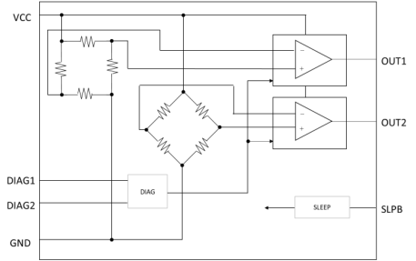
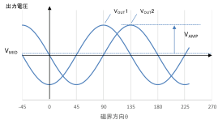
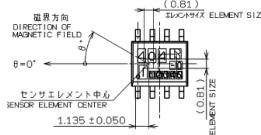
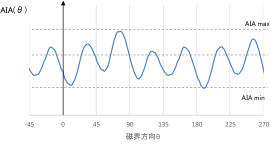
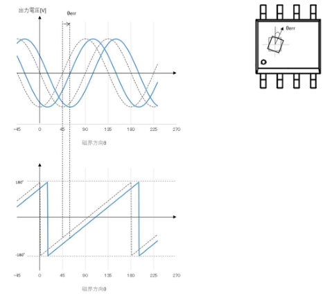
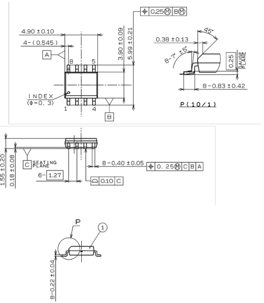
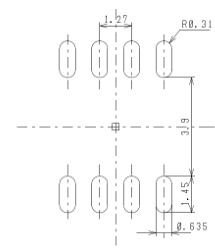
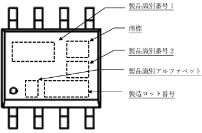
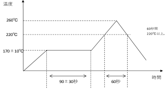

Data Sheet SA4041

## AMR 角度センサ SA404I

### 概要

SA404I は AMR センサとオペアンプで構成された角度センサです。 磁気ベクトル方向 に応じて $\cos 、 \sin のアナログ信号を出力します。 スリーブ機能を搭載しております。

また DIAG ビン入力による出力確認により、 チップ問の断線故障検出が可能です。

### 特县

- ・AMR センサチップと IC チップを内蔵した $\cos$ 、 $\sin 5 \mathrm{~V}$ 高精度出力
- ・スリーブ機能搭載 4uA
- ・ダイアグ検出によるAMR-IC 2 チップ問のワイヤオーブン故障検知が可能
- ·鉛フリー対応
- RoHS 指令準指
- バッケージ
- · SOIC8 4.90mm×5.99mm×1.55mm
- アブリケーション事例
- 操舵角センサ
- ·無接点 回転検出
### ブロック回路

Tokai rika Co,Ltd. All rights reserved Rev. 1.0 2023.06.15

18 TOKAI RIKA

1

---

$\mathrm{R}$ Data Sheet SA404I

## ■端子機能一覽

<table><tr><td>端子 No.</td><td>記号</td><td>機能</td></tr><tr><td>1</td><td>GND</td><td>GND 端子</td></tr><tr><td>2</td><td>DIAG2</td><td>DIAG 入力 2 端子</td></tr><tr><td>3</td><td>OUT2</td><td>出力 2 端子</td></tr><tr><td>4</td><td>GND</td><td>GND 端子</td></tr><tr><td>5</td><td>VCC</td><td>電源端子</td></tr><tr><td>6</td><td>OUT1</td><td>出力 1 端子</td></tr><tr><td>7</td><td>DIAG1</td><td>DIAG 入力 1 端子</td></tr><tr><td>8</td><td>SLPB</td><td>スリーブ入力端子</td></tr></table>

<table><tr><td>项目</td><td>記号</td><td>端子</td><td>条件</td><td>Min</td><td>Max</td><td>单位</td></tr><tr><td>電源電圧</td><td>Vcc</td><td>5</td><td>-</td><td>-0.3</td><td>7</td><td>V</td></tr><tr><td>入力電圧</td><td>Vin</td><td>2, 7, 8</td><td>-</td><td>-0.3</td><td>Vcc</td><td>V</td></tr><tr><td>出力電圧</td><td>Iout</td><td>3, 6</td><td>-</td><td>-10</td><td>10</td><td>mA</td></tr><tr><td>動作温度範圍</td><td>Topr</td><td>-</td><td>-</td><td>-40</td><td>125</td><td>°C</td></tr><tr><td>保存温度範圍</td><td>Tstg</td><td>-</td><td>-</td><td>-40</td><td>140</td><td>°C</td></tr><tr><td>ESD human body model</td><td>-</td><td>-</td><td>-</td><td>± 2</td><td>-</td><td>kV</td></tr><tr><td>ESD charged device model</td><td>-</td><td>-</td><td>-</td><td>± 500</td><td>-</td><td>V</td></tr></table>

■絶対最大定格

<table><tr><td>項目</td><td>記号</td><td>辨子</td><td>条件</td><td>Min</td><td>Typ</td><td>Max</td><td>单位</td></tr><tr><td>電源電圧範圍</td><td>Vcc</td><td>-</td><td>-</td><td>3.0</td><td>5.0</td><td>5.5</td><td>V</td></tr><tr><td>印可磁束密度</td><td>Bore</td><td>-</td><td>-</td><td>50</td><td>-</td><td>-</td><td>mT</td></tr></table>

動作条件

<table><tr><td>項目</td><td>記号</td><td>〈 〉 需子</td><td>条件</td><td>Min</td><td>Typ</td><td>Max</td><td>单位</td></tr><tr><td rowspan="5">消費電流</td><td rowspan="5">Icc</td><td rowspan="5">5</td><td>SLPB = Vcc</td><td>3.5</td><td>5.2</td><td>7.2</td><td>mA</td></tr><tr><td>SLPB–DIAG1= Vcc,DIAG2=0V or</td><td rowspan="2">2.7</td><td rowspan="2">3.9</td><td rowspan="2">5.2</td><td rowspan="2">mA</td></tr><tr><td>SLPB–DIAG2= Vcc,DIAG1=0V</td></tr><tr><td>SLPB–DIAG1=DIAG2 = Vcc</td><td>3.3</td><td>4.7</td><td>6.1</td><td>mA</td></tr><tr><td>SLPB = 0V or OPEN</td><td>-</td><td>4</td><td>10</td><td>uA</td></tr><tr><td>出力 Lo 電圧</td><td>V OL</td><td>3, 6</td><td>IOUT=50uA</td><td>-</td><td>15</td><td>35</td><td>mV</td></tr></table>

■電気的特性

Tokai rika Co,Ltd. All rights reserved Rev. 1.0 2023.06.15

18 TOKAI RIKA

2

---

囚 Data Sheet SA404I

<table><tr><td>項目</td><td>記号</td><td>端子</td><td>条件</td><td>Min</td><td>Typ</td><td>Max</td><td>单位</td></tr><tr><td>出力 Ht 電圧</td><td>V OH</td><td>3, 6</td><td>IOUT→50uA</td><td>4.91</td><td>4.96</td><td>-</td><td>V</td></tr><tr><td>出力電圧</td><td>Vout</td><td>3, 6</td><td>SLPB=Vcc</td><td>0.04 × Vcc</td><td>-</td><td>0.96 × Vcc</td><td>V</td></tr><tr><td>DIAG HH 時出力電圧</td><td>V DOUT</td><td>3, 6</td><td>DIAG1=DIAG2=Vcc</td><td>0.34 × Vcc</td><td>-</td><td>0.65 × Vcc</td><td>V</td></tr><tr><td>SLEEP 時出力電圧</td><td>V SOL</td><td>3, 6</td><td>IOUT→0uA</td><td>-</td><td>0.05</td><td>35</td><td>mV</td></tr><tr><td>出力中心電圧</td><td>V MID</td><td>3, 6</td><td>-</td><td>0.43 × Vcc</td><td>0.50 × Vcc</td><td>0.57 × Vcc</td><td>V</td></tr><tr><td rowspan="4">出力振幅笔圧</td><td rowspan="4">V AMP</td><td rowspan="4">3, 6</td><td>Ta→40°C</td><td>0.26 × Vcc</td><td>0.33 × Vcc</td><td>0.39 × Vcc</td><td>V</td></tr><tr><td>Ta = 25°C</td><td>0.21 × Vcc</td><td>0.25 × Vcc</td><td>0.29 × Vcc</td><td>V</td></tr><tr><td>Ta = 85°C</td><td>0.16 × Vcc</td><td>0.19 × Vcc</td><td>0.23 × Vcc</td><td>V</td></tr><tr><td>Ta = 125°C</td><td>0.12 × Vcc</td><td>0.16 × Vcc</td><td>0.20 × Vcc</td><td>V</td></tr><tr><td rowspan="3">出力振幅笔圧 温度变化率</td><td rowspan="3">⊿TV AMP</td><td rowspan="3">3, 6</td><td>Ta=25°C→−40°C</td><td>-</td><td>30</td><td>-</td><td rowspan="3">%</td></tr><tr><td>Ta=25°C→85°C</td><td>-</td><td>-22</td><td>-</td></tr><tr><td>Ta=25°C→125°C</td><td>-</td><td>-35</td><td>-</td></tr><tr><td>出力振幅笔圧比</td><td>K</td><td>3, 6</td><td>K=V AMP /V AMP 2 ×100</td><td>98</td><td>100</td><td>102</td><td>%</td></tr><tr><td rowspan="3">角度精度</td><td>AIA</td><td>3, 6</td><td>Ta=25°C *1</td><td>-</td><td>±0.20</td><td>±0.35</td><td>deg</td></tr><tr><td rowspan="2">⊿AIA</td><td rowspan="2">3, 6</td><td>Ta=25°C→−40°C, 25°C→85°C *1</td><td>-</td><td>±0.30</td><td>±1.00</td><td>deg</td></tr><tr><td>Ta=25°C→−40°C, 25°C→125°C *1</td><td>-</td><td>-</td><td>±1.58</td><td>deg</td></tr><tr><td>DIAG 入力 アルタウン紙抗</td><td>R ON</td><td>2, 7</td><td>-</td><td>18.5</td><td>22.0</td><td>29.2</td><td>kΩ</td></tr><tr><td>DIAG 入力 関値矩圧</td><td>V DTH</td><td>2, 7</td><td>-</td><td>0.45</td><td>2.5</td><td>3.25</td><td>V</td></tr><tr><td>SLEEP 入力 霜子電流</td><td>ISLPB</td><td>8</td><td>-</td><td>0.05</td><td>0.15</td><td>0.25</td><td>mA</td></tr><tr><td>SLEEP 入力 関値矩圧</td><td>V STH</td><td>8</td><td>-</td><td>0.45</td><td>2.5</td><td>3.25</td><td>V</td></tr><tr><td>電源立ち上がり時間</td><td>T STARTUP</td><td>3, 6</td><td>*2</td><td>-</td><td>-</td><td>1.0</td><td>ms</td></tr><tr><td>出力遲低時間</td><td>T DELAY</td><td>3, 6</td><td>*3</td><td>-</td><td>-</td><td>0.6</td><td>ms</td></tr><tr><td>DIAG 応容時間</td><td>T DIAG</td><td>3, 6</td><td>*4</td><td>-</td><td>-</td><td>0.4</td><td>ms</td></tr><tr><td>SLEEP 応容時間</td><td>TSLPB</td><td>3, 6</td><td>*5</td><td>-</td><td>-</td><td>1.0</td><td>ms</td></tr></table>

* 1 B≧50mT 均一磁場での条件下とする。 印加磁束密度、 オフセット補正によるキャリブレーションにより変動します。 別逾お問い合わせください。 * 2 Vcc 最小動作電圧に到達してから VOUT の 99%に達するまでの時間。 VCC-GND 間コンデンサ容量: 0.15uF 以下。 OUT-GND 間コンデンサ容量: 10 n F 以下。 * 3 磁界方向が変化してから VOUT が変化後の出力電圧 99%に到達するまでの時間。 * 4 DIAG 入力電圧が VOTH に到達してから、 VOH が 99%もしくは Vol.が 1%に到達し安定するまでの時間。 * 5 SLEEP 入力電圧が VSTH に到達してから、 VSOL が 1%に到達し安定するまでの時間。

Tokai rika Co,Ltd. All rights reserved Rev. 1.0 2023.06.15

18 TOKAI RIKA

3

---

18

Data Sheet SA4041

## ■入出力状態表 (表 1)

本 IC はスリーブ機能、 センサチップと IC チップ間の断線故障検出を有しています。 通常使用時は SLPB=Hi を入力してください。 SLPB=Lo の時、 スリーブ状態となります。 DIAG チェック 1, 2, 3 の各入力に応じた出力結果が得られない場合、 断線故障となります。

表 2.入出力状態表

<table><tr><td colspan="3">入力</td><td colspan="2">出力</td><td rowspan="2">備考</td></tr><tr><td>DIAG1</td><td>DIAG2</td><td>SLPB</td><td>OUT1</td><td>OUT2</td></tr><tr><td>Lo</td><td>Lo</td><td>Hi</td><td>VOUT</td><td>VOUT</td><td>通常使用 器序方向により出力変化</td></tr><tr><td>H</td><td>Lo</td><td>H</td><td>VOH</td><td>VOL</td><td>DIAG チェック 1</td></tr><tr><td>Lo</td><td>H</td><td>H</td><td>VOL</td><td>VOH</td><td>DIAG チェック 2</td></tr><tr><td>H</td><td>H</td><td>H</td><td>VDOUT</td><td>VDOUT</td><td>DIAG チェック 3</td></tr><tr><td>Hi or Lo</td><td>Hi or Lo</td><td>Lo</td><td>VSOL</td><td>VSOL</td><td>スリープ</td></tr></table>

$\mathrm{Hi}$ : $\mathrm{VCC}[\mathrm{V}] \quad$ Lo: $0 \mathrm{~V} \quad$

Tokai rika Co,Ltd. All rights reserved Rev. 1.0 2023.06.15

18 TOKAI RIKA

4

---

18

Data Sheet SA4041

■出力波形と角度精度 AIA

磁界方向 $\theta^{\circ}$ に対し、1 周期 $180^{\circ}$ の正弦波形を出力します。(図 1)

OUT1、OUT2 は設計值45° の位相差であり、ATAN 演算をすることで角度を算出できます。

ATAN 演算結果と理想角度 2 $\theta$ との差分より算出します。 AIA $(\theta)=\frac{\operatorname{ATAN}\left(\mathrm{V}_{\mathrm{OUT} 2}(\theta) / \mathrm{V}_{\mathrm{OUT} 1}(\theta)\right)}{\operatorname{ATAN} 演算結果}-\frac{2 \theta}{\mathrm{理想角度}}$

角度精度 AIA は以下式で定義します。 AIA = AIA max - AIA m

図 1.出力波形例(左上図)、AIA( $\theta$ ) 算出結果例(左下図)、PKGと磁界方向の関係(右上図)

Tokai rika Co,Ltd. All rights reserved Rev. 1.0 2023.06.15

18 TOKAI RIKA

5

---

Data Sheet SA4041

■センサチップ実装誤差

センサチップは実装時の誤差成分 $\theta$ err が発生します。実装誤差は±1 $1^{\circ}$ になります(図 2) ATAN 演算結果がシフトします。

図 2.センサチップの実装誤差成分 $\theta \mathrm{er}$

Tokai rika Co,Ltd. All rights reserved Rev. 1.0 2023.06.15

18 TOKAI RIKA

6

---

Data Sheet SA4041

外形寸法

Tokai rika Co,Ltd. All rights reserved Rev. 1.0 2023.06.15

18 TOKAI RIKA

7

---

18 Data Sheet SA404I

■推奨ランドバターン

捺印

<table><tr><td>製品識別番号 1</td><td>製品識別アルファベット</td><td>東海理化品番 (上 6 桁)</td></tr><tr><td>404</td><td>I</td><td>616404</td></tr></table>

Tokai rika Co,Ltd. All rights reserved Rev. 1.0 2023.06.15

18 TOKAI RIKA

8

---

Data Sheet SA4041

■リフロー条件

リフロー推奨条件を示します。(図 3

図 3.リフロー推奨条件

Tokai rika Co,Ltd. All rights reserved Rev. 1.0 2023.06.15

18 TOKAI RIKA

9

---

Data Sheet SA4041

使用上の注意事項

1.絶対最大定格

印加電圧、 動作温度範囲を超えた場合は破壊、 劣化に至る可能性があります。 使用を超えない範囲でのご使用を お願いします。

2.ビン間ショート

導電性異物などによるビン間ショートが発生した場合破壊に至る可能性があります。

3.基板上の応力

AMR センサは応力によって抵抗值が変化します

基板上で発生する応力によりセンサ出力に歪みが発生する場合があります。 実使用状態での確認をお願いします。

4.マグネット設置位置

マグネット中心とセンサ中心位置を合わせるように設計をお願いします。 精度が得られない可能性があります

またマグネットのサイズが小さいなど、センサが受ける磁界ベクトルが均一方向でない場合、精度が得られない可能性があり ます。

5.防湿橱包

防湿梱包開封前は、 5〜40°C85%RH6 か月以内にて保管をお願いします。

防湿梱包開封後は 5〜40°C60%RH 以下 1 か月以内にて保管をお願いします

超過した場合は、 ベーキング処理をお願いします。 条件は 60±5°C 24 時間(上限 4 回)として下さい。

5.外乱磁塌

外乱磁場により、検出対象の磁界ベクトルの方向が変わり角度精度が劣化する恐れがあります。

7.静電氣

本製品含む半導製品は静電気が印加されると破壊、 劣化の可能性があります。 工程内で過大な電圧が印加されないよう に静電気対策の検討をお願いします。

8.使用用途

本製品は高水準な信頼性が要求される航空機器、 原子力装置、 人体の生命を維持するための医療機器など故障により重大な損害が発生する可能性を含む用途に使用する場合は、 事前に当社にご相談ください。 事前の承諾なく使用することで発生した損害尊に関し、 当社は一切の責任を負いません。

耐放射線設計

本製品は耐放射設計には対応しておりません

10.外国為替及び外国貿易法

リスト規制に関する調査は必要に応じてお問い合わせをお願いします。また本製品は軍事的目的での設計はなされておらず

また使用はしないでくだきい

11 製品の環境適合

適用される環境法令をお客様でご確認の上、当社までお問合せをお願いします

12 改造、 複製

本製品の改造、 複製はしないでください。

Tokai rika Co,Ltd. All rights reserved Rev. 1.0 2023.06.15

18 TOKAI RIKA

14

---

Data Sheet SA4041

Tokai rika Co,Ltd. All rights reserved Rev. 1.0 2023.06.15

18 TOKAI RIKA

11

