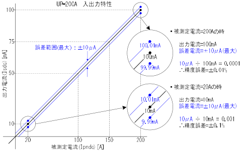
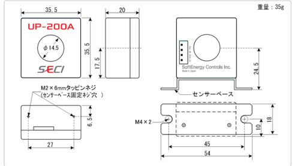
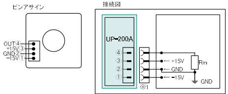
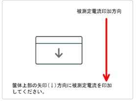

SECI

電流センサーUPシリーズ  UP-200A データシート

## 電気的仕様

### 1 絶対最大定格

<table><tr><td>項目</td><td>記号</td><td>定格</td><td>単位</td><td>備考</td></tr><tr><td>制御電源電圧被測定電流(DC)</td><td>Vc Ipndc</td><td>± 17.5 ± 240</td><td>V A</td><td></td></tr><tr><td>動作周囲温度保存温度</td><td>Ta Tstg</td><td>−30〜+85 −40〜+125</td><td>°C °C</td><td></td></tr></table>

<注意事項>

絶対最大定格を超える温度、電圧(電流)の印加は、製品を破壊する可能性があります。

絶対最大定格を一項目でも、一瞬でも超えることのないようにご注意ください。

### 2 推奨動作条件

<table><tr><td>項目</td><td>記号</td><td>定格</td><td>単位</td><td>備考</td></tr><tr><td>制御電源電圧被測定電流(DC)被測定電流(RMS)測定抵抗</td><td>VcIpndcIpnacRm</td><td>±15±5%±200最大141最大50</td><td>VA A Ω</td><td>Ipndc=±200A時</td></tr><tr><td>動作周囲温度湿度</td><td>TaRH</td><td>10~5020~80</td><td>°C%</td><td>結露なき事</td></tr></table>

### 3 電気的仕様

<table><tr><td>項目</td><td>記号</td><td>定格</td><td>単位</td><td>備考</td></tr><tr><td>入出力比率</td><td>Kn</td><td>1:2000</td><td>–</td><td></td></tr><tr><td>出力電流(DC)</td><td>Isdc</td><td>±100</td><td>mA</td><td>Ipndc=±200A時</td></tr><tr><td>出力電流(RMS)</td><td>Isac</td><td>最大71</td><td>mA</td><td>Ipnac=141A時</td></tr><tr><td>出力電圧</td><td>Vout</td><td>±5</td><td>V</td><td>測定抵抗(Rm)使用時</td></tr><tr><td>精度誤差</td><td>Iac</td><td>±10</td><td>μ A</td><td>誤差電流</td></tr><tr><td>(誤差電流)</td><td>Ac</td><td>±0.01</td><td>%</td><td>Ipndc=±200A時</td></tr><tr><td>オフセット電流</td><td>Ioe</td><td>±3</td><td>μ A</td><td></td></tr><tr><td>応答速度</td><td>tr</td><td>最小100</td><td>A/ μ s</td><td></td></tr><tr><td>周波数带域(±3db)</td><td>Fbw</td><td>0∼100</td><td>KHz</td><td></td></tr><tr><td rowspan="4">消費電流</td><td rowspan="2">Icst</td><td>−30</td><td>mA</td><td>制御電源–側:Isdc/Isac=0A</td></tr><tr><td>50</td><td>mA</td><td>制御電源+側:Isdc/Isac=0A</td></tr><tr><td rowspan="2">Icmax</td><td>−130</td><td>mA</td><td>制御電源–側:Icstb+Isdc</td></tr><tr><td>150</td><td>mA</td><td>制御電源+側:Icstb+Isdc</td></tr></table>

UP200A_rev3.1_2025040

-1

---

SECI

SoftEnergy Controls Inc.

- 測定抵抗(Rm)について
- • 本七ンサーからの出力を電圧で計測する場合は、 測定抵抗 (Rm) が必要になります。
- センサーからの出力電圧が±5.0V以下になるような測定抵抗 (Rm) をご使用ください。
定抵抗(Rm)の算出式を以下に示します。

測定抵抗 (Rm) =出力電圧 (Vout)  ÷ 出力電流 (Isdc/Isac)

- • 最大出力電圧 (5.0V)  ÷ 最大出力電流 (0.1A) = 50 Ω
50 Ω の測定抵抗 (Rm) を本センサーに接続し、 200Aの被測定電流 (Ipndc) を測定した場合、 測
定抵抗の両端の電圧は5.0VIになります。 測定抵抗は50 Ω 以下でご使用ください。
- ・測定誤差をなくすため、 測定抵抗 (Rm) の10,000倍以上の入力インピーダンスの測定器をご使
用ください。
- ・本センサーの精度は最高で0.01%を保証していますが、 センサーの精度は測定抵抗の精度
に依存しますので、 精度の高い測定抵抗をご使用ください。
推奨抵抗(50Ω、抵抗值許容差=0.01%

VISHAY社:VPR221シリーズ(Y092650R0000T9L) 、 VPR221Zシリーズ(Y169050R0000T9L) アルファエレクトロニクス社:PCシリーズ(PCY50R000T) 、 PEシリーズ(PEY50R000T)

## 精度誤差について

UP200A_rev3.1_2025040

- 2 -

---

SECI

SoftEnergy Controls Inc.

• UP–200A 外形图

※1 接続コネクタ:EHR¬4(日本圧着端子製造)

UP200A_rev3.1_2025040

- 3 -

---

SECI

使用上の注意

1 被測定電流を印加した状態で、 電流センサーの制御電源を投入しますと故障の原因になりま す。 必ず、 電流センサーの制御電源を投入後に被測定電流を印加するようにご注意ください。

② 電流センサーの制御電源装置は電源電圧の立ち上がり時間が、 20mS以内の電源装置をご 使用ください。 また、 制御電源装置はデュアル電源タイブを推奨します。

③ 電流センサーの出力電流(電圧)が定格値を大幅に超える値を出力したり、 測定が正常に行わ れていない場合は、 被測定電流を一旦遮断し、 再度被測定電流を印加する事により正常動作 に復帰します。

それでも出力電流(電圧)が正常に戻らない場合は、電流センサーの制御電源を切り、再度制御電源を投入してください。

④強い磁界の発生源や、高電圧・高電流源が近くにある事により、電流センサーが誤動作した り、測定が正常に行われない事があります。電流センサーの安定した動作のために、強い磁界の発生源や、高電圧・高電流源から、電流センサーを離してご使用ください。

⑤ 電流センサーを安定してご使用いただくために、 電流センサーの制御電源投入後、 1 秒間経過した後に被測定電流の測定を開始してください。

⑥ 電流センサーを高精度にご使用いただくために、 出力電流は高精度の電流計で計測する事を お勧めします。

⑦ 床に落とすなど、 過度の衝撃は、 破損、 故障、 性能低下の原因となります。 取り扱いには十分 ご注意ください。

⑧ 破損、 故障の原因となりますので、 本体の分解、 改造は絶対にしないでください。

⑨ ESD(静電気放電)により故障することがあります。 ESDには十分ご注意ください。

動電流センサーの制御電源の極性を間違えて電源を投入しますと故障いたしますので十分ご注意ください。

1 電流センサーの制御電源は、 電源投入後にコネクタを挿入すると故障の原因になります。 必 ず、 コネクタを挿入後に制御電源を投入するようにしてください。

株式会社ソフトエナジーコントロールズ

http://softenergy-controls.co.jp/

本書からの無断の複製はかたくお断りします,

記載内容は予告なく変更する場合があります。

UP200A_rev3.1_2025040

– 4 –

