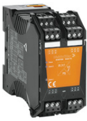
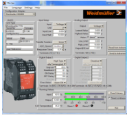
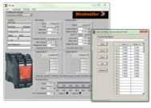
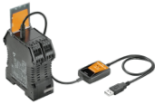
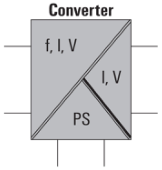
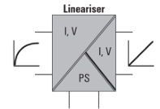
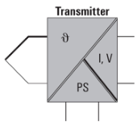
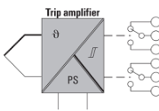
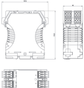
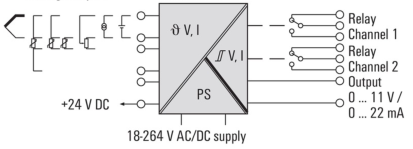

Weidmüller 王

データシート

WAZ6 TTA EX

Weidmüller Interface GmbH & Co. KG

Klingenbergstraße 26

D-32758 Detmold

Germany

www.weidmueller.com

図に類似

WAS/WAZ6 TTA は、 PC て構成可能なユニバーサルシ グナルコンバータおよびトリップアンプマす。 単一のモ ジュールて分離、 伝送、 線形化、 トリップ増幅の機能が 組み合わされます。

これらの優れた特性と優れた構成機能を組み合わせるこ とて、 TTA は非常に特徴的なものになります。

TTA は広い電圧および周囲温度ての、 安定性と精度を備 えています。 それは標準センサーの種類に対応していま す。

- 參考資料

• 全般的入力信号:抵抗温度計、 サーモカップル、 ポテン
ショメータ、 周波数送信機、 直流電圧信号、 電流信号な
どの温度信号
- ・ループ駆動式またはパッシブ入カ
- · 広範囲の電源: 18 264 V AC / DC
- • コーザー定義の線形化
- • PC 上て入カと出力を設定可能
- ・アナログ出カとリレー出力の組み合わせ
- • 周囲温度範囲は - 40 C ~ 70 C
CBX200 USBインターフェースは、 PC への接続に使用さ れまず。

WAS/WAZ6 TTA は、 ATEX Zone 2 および UL C1D2 の 承認を含むオブションとしても提供されます。

一般注文データ

<table><tr><td>バージョン</td><td>入カ : EX. 汎用U、I、R、B、出カ : I/U汎用. リレー×2</td></tr><tr><td>注文番号</td><td>8964320000</td></tr><tr><td>禮別</td><td>WAZ6 TTA EX</td></tr><tr><td>GTIN (EAN)</td><td>4032248782284</td></tr><tr><td>数量</td><td>1 Stock</td></tr><tr><td>配送ステータス</td><td>この記事は今後ご利用いただけなくなります。</td></tr><tr><td>利用可能期限</td><td>2023-12-30</td></tr><tr><td>代替製品</td><td>1481960000</td></tr></table>

作成日 2024/06/28 5:43:29 CEST

カタログステータス 14.06.2024 / 当社は技術的変更を実施する権利を有しています。

1

---

データシート

Weidmüller

WAZ6 TTA EX

Weidmüller Interface GmbH & Co. KG Klingenbergstraße 26 D-32758 Detmold Germany

技术一夕

www.weidmueller.com

<table><tr><td>深念框架、标准和政</td><td>112.4 mm</td><td>奥行舍(♂ンチ)</td><td>4.425 inch</td></tr><tr><td>框架</td><td>45 mm</td><td>帽(♂ンチ)</td><td>1.772 inch</td></tr><tr><td>度、中径</td><td>100 mm</td><td>長さ(♂ンチ)</td><td>3.937 inch</td></tr><tr><td>正味重量</td><td>280 g</td><td></td><td></td></tr><tr><td colspan="4">温度</td></tr><tr><td>保管温度</td><td>-40 °C...85 °C</td><td>動作温度</td><td>0 °C...70 °C</td></tr><tr><td>勤作温度持の温度</td><td>0 ~ 95% (结露なし)</td><td>温度</td><td>5 ~ 95%, 結露なし</td></tr><tr><td colspan="4">失敗の確率</td></tr><tr><td>IEC 61508に準點したSIL</td><td>該当なし</td><td>MTTF</td><td>138 a</td></tr><tr><td colspan="4">入力</td></tr><tr><td>センサー</td><td>熱電対 :B. E. J. K, L. N. R. S, T(IEC 60584),PT100, PT1000, (EN 60571) N100, N1000, (JIS1604), Cu10, Cu25, Cu50, Cu100 (DIN 43760) 2-分-4煉式</td><td>センサー供給</td><td></td></tr><tr><td>ポテンショメータ</td><td>10...50 g, 50...100 g, 100...200 g, 200...400 g, 400...800 g, 800...2 k0, 2...6.5 kΩ, 6.5...100 Ω</td><td>入力洞波数</td><td></td></tr><tr><td>入力数</td><td></td><td></td><td>調整可能。2 Hz ~ 100 kHz</td></tr><tr><td></td><td></td><td>入力電圧</td><td>-200 ~ 500 mV (最小4 mVスパン) 、-20 ~ 50 VDC (最小0.5 Vスパン)</td></tr><tr><td>入力電流</td><td>-20...+50 mA (最小關係 0.4 mA)</td><td>抵抗</td><td>10 5 k</td></tr><tr><td>温度入力範圍</td><td>設定可能. B: +100...+1820 °C, E: -270...+1000 °C, J:-270...+1200 °C, K:-150...+1372 °C, L: +100...+900 °C, N: -180...+1300 °C, R: -50...+1768 °C, S: -50...+1768 °C, T: -270...+400 °C, U: -200...+600 °C, 二一ザー定義</td><td></td><td></td></tr><tr><td colspan="4">出力</td></tr><tr><td>負荷インピーダンス電流</td><td>≤ 600 Ω, @ max 23mA</td><td></td><td></td></tr><tr><td colspan="4">出力(デジタル)</td></tr><tr><td>デジタル出力数</td><td>2</td><td>定性スイッチング電流</td><td>0.1 A</td></tr><tr><td>持续電流</td><td>2 A</td><td>最大開閉電工. AC</td><td>0 V</td></tr><tr><td>趣別</td><td>2 x 1 CO接点 (梶官タンキ), とステリスズキャンプロセスアラーム(4x),アラーム運行合 (設定可能) 0 ~ 180 s</td><td></td><td></td></tr></table>

寸法と重量

作成日 2024/06/28 5:43:29 CEST

カタログステータス 14.06.2024 / 当社は技術的変更を実施する権利を有しています。

2

---

データシート

Weidmüller 王

WAZ6 TTA EX

Weidmüller Interface GmbH & Co. KG Klingenbergstraße 26 D-32758 Detmold Germany

技术一夕

www.weidmueller.com

<table><tr><td>アナログ出力数</td><td>1</td><td>信号出力</td><td>直接表示,以及如</td></tr><tr><td>出力電圧</td><td>-10...+10 V (最小スパンスБ V) の間で調整可能</td><td>出力電流</td><td>0 ~ 20 mAの銀田ず調整可能 (最小スパンは5 mA)</td></tr><tr><td>抵抗負荷電圧</td><td>0...10 Vズ &gt; 10 kΩ /-10...+10 Vズ &gt; 20 kΩ</td><td>抵抗負荷電流</td><td>700 Ω</td></tr><tr><td>送信機能</td><td>Linear, x 1/2, x 3/2, x 5/2, またはユーザ定義カープ (101ポイント)</td><td></td><td></td></tr></table>

出力 (アナログ)

<table><tr><td>ステップ応答案時間</td><td>50 ms (RTD、 mV入力) 、 110 ms (V、 mA入力)</td><td>保護委会认</td><td>IP20</td></tr><tr><td rowspan="2">消費電力</td><td></td><td>温度低数</td><td>0.1 % / K (DC、 RTD) ; &lt;0.1 % FSR / K + CJ工 ラー 0.07 °C/K (サーモカップル)</td></tr><tr><td>3.5 W</td><td>設定</td><td>無料のWindowsンフトウェアを使用する。TTAセットソフトウェア, CBX200USB8978580000構成フザアタが必要</td></tr><tr><td rowspan="2">長期ドリフト</td><td></td><td>電圧供給</td><td>24...240 V AC/DC、 24...36 V AC/24...50VDC (ATEXゾーン2)</td></tr></table>

一般データ

<table><tr><td>EMC 基準</td><td>EN 55011, EN 61000-6</td><td>インパルス耐電圧</td><td>6 kV</td></tr><tr><td>サージ電圧カテゴリー</td><td>III</td><td>定格電圧</td><td>300 V</td></tr><tr><td>污染度</td><td>2</td><td>絶縁電圧</td><td>2.5 kV</td></tr></table>

绝缘協調

<table><tr><td>マーキング</td><td colspan="3">II 3 G Ex nA nC IIC T4 Gc</td></tr><tr><td colspan="4">接続データ</td></tr><tr><td>接続方式</td><td>耐 我クランプ接続</td><td>被覆刺き長さ、定格接続</td><td>7 mm</td></tr><tr><td>クランプ範囲、定格接続</td><td>2.5 mm 2</td><td>クランプ範囲、最小</td><td>0.5 mm 2</td></tr><tr><td>クランプ範囲、最大</td><td>2.5 mm 2</td><td></td><td></td></tr><tr><td colspan="4">分類</td></tr><tr><td>ETIM 6.0</td><td>EC002653</td><td>ETIM 7.0</td><td>EC002653</td></tr><tr><td>ETIM 8.0</td><td>EC002653</td><td>ETIM 9.0</td><td>EC002653</td></tr><tr><td>ECLASS 9.0</td><td>27-21-01-20</td><td>ECLASS 9.1</td><td>27-21-01-20</td></tr><tr><td>ECLASS 10.0</td><td>27-21-01-20</td><td>ECLASS 11.0</td><td>27-21-01-20</td></tr><tr><td>ECLASS 12.0</td><td>27-21-01-20</td><td>ECLASS 13.0</td><td>27-21-01-20</td></tr></table>

Ex アプリケーションのデータ (ATEX)

作成日 2024/06/28 5:43:29 CEST

カタログステータス 14.06.2024 / 当社は技術的変更を実施する権利を有しています。

3

---

データシート

Weidmüller

WAZ6 TTA EX

Weidmüller Interface GmbH & Co. KG Klingenbergstraße 26

D-32758 Detmold

Germany

www.weidmueller.com

技术一夕

入札仕様書

長体仕樣

短体仕樣

PC で設定可能な、

ション用のコンパータとト

リップ增幅器とを絶縁する ユニパーサル測定

幅が45mmのユニバーサ ル測定分離変換器およびト リップ增幅器を、

電圧とセンサー用の外部電源て用い、 アナログ DC 電流 - 20 ~ 50 mA, 電圧 - 200

~ 500 mV/-20 ~ 50 v、 2/3/4 線式 RTD, 抵抗

器、 IEC 584 に準拠した熱電

対、最大 100 kHz の周波数 {2/3 線式センサー}を送

信および分離します。 出力側ては、 譬報用の 2 つ のスイッチング出力 (CO 接

点)が使用てきます。 アナログ DC 電圧 $\leftarrow 10 \ldots$

+10V),電流出力(0...20 mA)を使用てきます。

このコンポーネントは、 独自の TTA-Set ソフトウェ

アを使用して PC て設定て きます。 TS35 しール取り付け用ア

ドオンハウジング

寸法:L/W/H 100/45/ 112.4 mm

テンションクランプ接続/

呼び断面 1.5 mm2 保護等級: IP 20

2019年12月21日

-200...500 mV / -10_+10 V

PT100, PT1000, N1000 2-/3-/4-線

10 オーム..5 kオーム/ポテ ンショメータ 100オーム... 100kオーム

Thermocouple type B, E, J,

K, N, R, S, T Frequencies $2 \mathrm{~Hz} \ldots 100 \mathrm{kHz}$

(2/3線センサ) 24 V DC / 22 mAのセンサ

電源出力アナログ0_20 mA /

調整可能 -10...+10 V/調整可能なり

レー出力/アラーム2 CO.

硬質金メッキ

250 VAC $3 A / 30 VDC \\ $2A

/負荷抵抗< 700 オーム/電

流/ >10 kオーム/電圧送信エラー < 0.1 % v. E.

{DC,RTD} < 0,2 % + CJ Fehler {TC}

ステップ応答時間 10...90 % < 50 ms...1 s 調

整可能 (页面存档备份 , 存于)

補助電源 24...240 V AC/_____

作成日 2024/06/28 5:43:29 CESPC. 24.

DC( $\vee$ -> 2)

↑ 《中国河湖大典》编纂委员会 . (M) 1 . 北京: 中国水利水电出版社 . 2013年1月: 29页 . ISBN 97878070043933 .

PC て設定可能な、 Ex ゾー ン 2 アプリケーション用の コンバータとトリップ増幅器とを絶縁するユニバーサ ル測定電圧とセンサー用の外部電源

を用いた45mm幅でコン バータとトリップ増幅器と を絶縁するユニバーサル測定により、 アナログ DC 電流 を送信および絶縁しま す。

这是一篇與中國人物相關的小作品。 你可以编辑或修订扩充其内容。

---

データシート

Weidmüller 之

WAZ6 TTA EX

Weidmüller Interface GmbH & Co. KG Klingenbergstraße 26 D-32758 Detmold Germany

技术一夕

www.weidmueller.com

環境製品コンプライアンス

<table><tr><td>REACH SVHC</td><td>Lead 7439-92-1 6,6'-di-tert-butyl-2,2'-methylenedi-p-cresol 119-47-1</td></tr><tr><td>SCIP</td><td>c2a21576-d875-4548-ae68-5e7f85ddf0c7</td></tr></table>

重要なメモ

製品情報

WAS/WAZ6 TTA は、PC て構成可能なユニバーサルシグナルコンパータおよぴトリップアンブてす。単一のモ ジュールて分離、伝送、線形化、トリップ増幅の機能が組み合わされます。 これらの優れた特性と優れた構成機能を組み合わせることて、TTA は非常に特徴的なものになります。 TTA は広い電圧および周囲温度ての, 安定性と精度を備えています。 それは標準センサーの種類に対応していま す。

- 全般的入力信号:抵抗温度計、 サーモカップル、 ポテンショメータ、 周波数送信機、 直流電圧信号、 電流信
号などの温度信号
- レープ駆動式またはパッシブ入力
な範囲の電源: 18 264 V AC / D
- 这是一篇與中國人物相關的小作品。 你可以编辑或修订扩充其内容。
- としたかと出力を設定可能
アナログ出力とリレー出力の組
- 周团温度範囲は-40 C ~ 70 C
CBX200 USBインターフェースは、 PC への接続に使用されます。 WAS/WAZ6 TTA は、 ATEX Zone 2 および UL C1D2 の承認を含

1990年 , 中国在中国大陆的广东省广东市广东市广东市广东市广东市广东市广东市广东市广东市广东市广东市广东市广东市广东市广东市广东市广东市广东市广东市广东市广东市广东市广东市广东市广东市广东市广东市广东市广东市广东市广东市广东市广东市广东市广东市广东市广东市广东市广东市广东市广东市广东市广东市广东市广东市广东市广东市广东市广东市广东市广东市广东市广东市广东市广东市广东市广东市广东市广东市广东市广东市广东市广东市广东市广东市广东市广东市广东市广东市广东市广东市广东市广东市广东市广东市广东市广东市广东市广东市广东市广东市广东市广东

承認

12日

( )

@us

WATEXIECEX

ROHS

<table><tr><td>UL File Number Search</td><td>UL ウェブサイト</td></tr><tr><td>廷明書画号 (cULus)</td><td>E141197</td></tr><tr><td>廷明書画号 (cULusEX)</td><td>E223527</td></tr></table>

ダウンロード

承認/証明書/適合証明書

<table><tr><td></td><td>Application notes – DNV GL Certificate Declaration of Conformity</td></tr><tr><td>エンジニアリングデータ</td><td>CAD data – STEP</td></tr><tr><td>ソフトウェア</td><td>Runtime Software – Install_TTASet_V107</td></tr><tr><td rowspan="2">ユーザ文書</td><td>Device description – Manual english, deut</td></tr><tr><td>Device description – Instruction sheet</td></tr><tr><td>カタログ</td><td>Catalogues in PDF-format</td></tr></table>

不知一シャー

作成日 2024/06/28 5:43:29 CEST カタログステータス 14.06.2024 / 当社は技術的変更を実施する権利を有しています。

5

---

データシート

Weidmüller 王

WAZ6 TTA EX

Weidmüller Interface GmbH & Co. KG Klingenbergstraße 26 D-32758 Detmold Germany

図面

www.weidmueller.com

Screenshot of TTA Set software

example of user defined transfer function for assigning customized output values

connection to your PC

作成日 2024/06/28 5:43:29 CEST

カタログステータス 14.06.2024 / 当社は技術的変更を実施する権利を有しています。

6

---

データシート

Weidmüller 之

WAZ6 TTA EX

Weidmüller Interface GmbH & Co. KG Klingenbergstraße 26

D-32758 Detmold

Germany

www.weidmueller.com

アクセサリ

構成インターフェース

一般注文データ

糖尿  CBX200 US

注文备号 8978580000

GTIN (EAN) 4032248813759

数量 1 StuC

作成日 2024/06/28 5:43:29 CEST

カタログステータス 14.06.2024 / 当社は技術的変更を実施する権利を有しています。

7

---

データシート

Weidmüller 王

WAZ6 TTA EX

Weidmüller Interface GmbH & Co. KG Klingenbergstraße 26 D-32758 Detmold Germany

図面

www.weidmueller.com

國に類似

Analogue Inputs

作成日 2024/06/28 5:43:29 CEST

8

カタログステータス 14.06.2024 / 当社は技術的変更を実施する権利を有しています。

