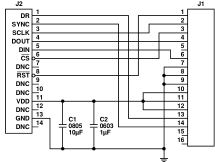

日本語参考資料最新版英語データシートはこちら

ANALOG DEVICE

# 小型、 高精度 6 DOF (自由度) 慣性センサー

## 特長

3 軸デジタル・ジャイロ・センサー

测定範囲:±100°/sec (最小值)

動作中のバイアス安定性: 8°/hr (代表値)

x 軸の角度ランダム・ウォーク: 0.12o/√ hr (代表值)

3 軸デジタル加速度センサーのダイナミック・レンジ: ±5 g 自律動作とデータ収集

外部設定コマンド不要

短い起動時間

感度、バイアス、 軸アライメントをエ場出荷時にキャリプレー ション

捕正温度範图:0°C ≤ TAS 70°C

シリアル・ベリフェラル・インターフェース (SPI) データ通

信

データ・アクイジション同期用データ・レディ信号

温度センサー内藏

プログラマプルな動作と制御

自動と手動のバイアス補正制御

バートレット・ウィンドウの有限インパルス応答 (FIR) フ イルタ、 可変タップ数

外部サンプル・クロック・オブション: 直接

シングル・コマンドのセルフ・テスト

単電源動作: 3.15 V ~ 3.45 V

2000 g の衝擊耐性

動作温度範圍: -25 °C ~ +85 °C

## アブリケーション

スマート農業╱建設檂械

無人航空機 (UAV) ノドローン、 ナビゲーション、 積載物の安定化

ロボット装置

エ場ノエ業用オートメーション、 社員ノ資産の管理

## 概要

ADIS16460 iSensor® デバイスは、 3 軸ジャイロ・センサーと 3 軸加速度センサーを備えた全機能内蔵型の慣性システムです。

ADIS16460 内の各センサーには、 業界最先端の iMEMS® 技術動的性能を最適化するシグナル・コンディショニングが組み合 わされています。 工場出荷時のキャリブレーションで、 感度、 バイアス、 アライメントについて各センサーの特性が評価され ています。 その結果、 各センサーは個別の動的補正式を備え、 高精度なセンサー計測を行うことができます。

ADIS16460 は、高精度の多軸慣性センシングを工業用システム に組み込むためのシンプルで費用対効果に優れたソリューショ ンを提供します。 これは、 とりわけディスクリート部品を使用 した設計と比較して、 複雑さや費用而でメリットがあります。 すなわち、 製品に必要なモーション・テストと補正が全て工場 の製造工程に組み込まれているため、 システムを統合する時間 を大幅に短縮できます。 厳密な直交アライメントにより、 ナビ ゲーション・システムの慣性フレーム・アライメントが容易にな ります。 SPI とレジスタ構造により、 データ収集と設定制御の めのインターフェースが簡単です。

ADIS16460 は、約 $22.4 \mathrm{~mm} \times 22.4 \mathrm{~mm} \times 9 \mathrm{~mm}$ のアルミニウム・ モジュール・バッケージに収容され、14 ピンのコネクタ・イコ ターフェースを催えています。

## 機能プロック図

[3] 1.

ナログ・デバイセズ社は,提候する情報が正確で信頼できるものであることを期していますが、その情報の利用に関して、あるいは利用によっ にる第三者の特許やその他の推判の侵害に関してー切の責任と自いません。また,アナログ・デバイセズ社の特許または特許の権判の使用を戦 または暗求的に許誤するものでもあリません。 仕様は。 予含なく変更される慢会があリます。 本提款裁の商場みよび盘は向様は、 それぞれの用 の財産です。 ※日本族族党料は PREVISIONが言い噪合があリます。 裁柄の内容については、 英雄麻をご參照ください。

Rev.

アナログ・デバイセズ株式会社

本 社/干105-6891 東京都港区海岸 1-16-1 ニュービア竹芝サウスタワービル 電話 03 (5402) 8200 大阪営業所/干532-0003 大阪府大阪市淀川区宮原 3-5-36 新大阪トラストタワー 電話 06 (6350) 6868

---

データシート

ADIS16460

## 目次

## 改訂履歷

### 6/2017—Rev.A to Rev.

<table><tr><td>Changed ML-14-5 to ML-14-6</td><td>Universal</td></tr><tr><td>Change to Gryoscope/Misalignment/Axis to Axis Parameter, Table 1 .3</td><td>13</td></tr><tr><td>Changes to Figure 6</td><td>15</td></tr><tr><td>Changes to Figure 26</td><td>23</td></tr><tr><td>Changes to Figure 28</td><td>26</td></tr><tr><td>Changes to Figure 32</td><td>26</td></tr></table>

### 8/2016-Rev. 0 to Rev.A

<table><tr><td>Changes to Features</td><td>1</td></tr><tr><td>Changes to Table 1</td><td>3</td></tr><tr><td>Changes to b NV Parameter, Table 2</td><td>5</td></tr><tr><td>Changed Acceleration (Shock) Parameter to Mechanical Shock</td><td>6</td></tr><tr><td>Survival Parameter, Table 3</td><td>6</td></tr><tr><td>Changes to Burst Read Function Section and Figure 21</td><td>11</td></tr><tr><td>Change to Bit 7, Table 44</td><td>19</td></tr></table>

### 1/2016—Revision 0: Initial Version

Rev.B

226-

---

データシート

ADIS16460

## 仕様

特に指定のない限り、 $\mathrm{T}_{\mathrm{A}}=25^{\circ} \mathrm{C} 、 \mathrm{VDD}=3.3 \mathrm{~V}$ 、角速度 $=0^{\circ} / \mathrm{sec}, \pm 1 \mathrm{~g} 、 \mathrm{MSC} 、 \mathrm{CTRL}=0 \times 00 \mathrm{C} 1$

<table><tr><td>Parameter</td><td>Test Conditions/Comments</td><td>Min</td><td>Typ</td><td>Max</td><td>Unit</td></tr><tr><td colspan="6">GYROSCOPES</td></tr><tr><td>Dynamic Range</td><td></td><td>±100</td><td></td><td></td><td>°/sec</td></tr><tr><td>Initial Sensitivity</td><td>16-bit data format 1</td><td></td><td>0.005</td><td></td><td>°/sec/LSB</td></tr><tr><td>Repeatability 2</td><td>32-bit data format 1</td><td></td><td>7.63 × 10 −8</td><td></td><td>°/sec/LSB</td></tr><tr><td>Sensitivity Temperature Coefficient</td><td>0°C ≤ TA ≤ 70°C</td><td></td><td></td><td>1</td><td>%</td></tr><tr><td>Misalignment</td><td>Axis to axisAxis to frame (package)</td><td></td><td>±20</td><td></td><td>ppm/°C</td></tr><tr><td>Nonlinearity</td><td>Best fit straight line</td><td></td><td>±0.05</td><td></td><td>Degrees</td></tr><tr><td>Bias Repeatability 2, 3</td><td>0°C ≤ TA ≤ 70°C, 1 σ</td><td></td><td>0.5</td><td></td><td>% of FS</td></tr><tr><td>In-Run Bias Stability</td><td>1 σ</td><td></td><td>0.5</td><td></td><td>°/sec</td></tr><tr><td>Angle Random Walk</td><td>1 σ, x-axis1 σ, y-axis, z-axis</td><td></td><td>8</td><td></td><td>°/hr</td></tr><tr><td>Bias Temperature Coefficient</td><td>0°C ≤ TA ≤ 70°C</td><td></td><td>0.12</td><td></td><td>°/√hr</td></tr><tr><td>Linear Acceleration Effect on Bias</td><td>Any axis, 1 σ</td><td></td><td>0.17</td><td></td><td>°/√hr</td></tr><tr><td>Vibration Rectification Error</td><td>20 Hz to 2000 Hz, 5 g rms</td><td></td><td>±0.007</td><td></td><td>°/sec/°C</td></tr><tr><td>Bias Supply Sensitivity</td><td>3.15 V ≤ VDD ≤ 3.45 V</td><td></td><td>±0.01</td><td></td><td>°/sec/g</td></tr><tr><td>Output Noise</td><td>No filtering</td><td></td><td>±0.0004</td><td></td><td>°/sec/g 2</td></tr><tr><td>Rate Noise Density</td><td>10 Hz to 40 Hz, no filtering</td><td></td><td>0.037</td><td></td><td>°/sec/V</td></tr><tr><td>−3 dB Bandwidth</td><td></td><td></td><td>0.075</td><td></td><td>°/sec rms</td></tr><tr><td>Sensor Resonant Frequency</td><td></td><td></td><td>0.004</td><td></td><td>°/sec/√Hz rms</td></tr><tr><td>ACCELEROMETERS</td><td></td><td></td><td>375</td><td></td><td>Hz</td></tr><tr><td colspan="6">Dynamic Range</td></tr><tr><td>Initial Sensitivity</td><td>Each axis</td><td>±5</td><td></td><td></td><td>g</td></tr><tr><td>Repeatability 2</td><td>16-bit data format 4</td><td></td><td>0.25</td><td></td><td>mg/LSB</td></tr><tr><td>Sensitivity Temperature Coefficient</td><td>32-bit data format 4</td><td></td><td>3.81 × 10 −6</td><td></td><td>mg/LSB</td></tr><tr><td>Misalignment</td><td>0°C ≤ TA ≤ 70°CAxis to axisAxis to frame (package)</td><td></td><td>±15</td><td></td><td>%</td></tr><tr><td>Nonlinearity</td><td>Best fit straight line</td><td></td><td>±0.05</td><td></td><td>Degrees</td></tr><tr><td>Bias Repeatability 2, 3</td><td>0°C ≤ TA ≤ +70°C, 1 σ</td><td></td><td>±1</td><td></td><td>Degrees</td></tr><tr><td>In-Run Bias Stability</td><td>1 σ</td><td></td><td>±0.1</td><td></td><td>% of FS</td></tr><tr><td>Velocity Random Walk</td><td>1 σ</td><td></td><td>±15</td><td></td><td>mg</td></tr><tr><td>Bias Temperature Coefficient</td><td>0°C ≤ TA ≤ 70°C</td><td></td><td>0.2</td><td></td><td>mg</td></tr><tr><td>Vibration Rectification Error</td><td>20 Hz to 2000 Hz, 1 g rms</td><td></td><td>0.09</td><td></td><td>m/sec/√hr</td></tr><tr><td>Bias Supply Sensitivity</td><td>3.15 V ≤ VDD ≤ 3.45 V</td><td></td><td>±0.05</td><td></td><td>mg/°C</td></tr><tr><td>Output Noise</td><td>No filtering</td><td></td><td>72</td><td></td><td>mg/V</td></tr><tr><td>Noise Density</td><td>10 Hz to 40 Hz, no filtering</td><td></td><td>4.5</td><td></td><td>mg rms</td></tr><tr><td>−3 dB Bandwidth</td><td>No filtering</td><td></td><td>4.5</td><td></td><td>mg rms</td></tr><tr><td>Sensor Resonant Frequency</td><td>10 Hz to 40 Hz, no filtering</td><td></td><td>0.2</td><td></td><td>mg/√Hz rms</td></tr><tr><td>TEMPERATURE</td><td></td><td></td><td>350</td><td></td><td>Hz</td></tr><tr><td>Sensitivity</td><td>See 内部成功测定データけ TEMP_OUT レジスタじロードされえす (表 37 参 ) 。 温度データのアーマットを表 38 に示します。 この道比は的部成の測定情であり、 外部の状態を正確に表すものではないととじ注意してくだきい。 TEMP_OUTの使用自由は逆の相対変化そニタすることです。</td><td></td><td>0.05</td><td></td><td>°C/LSB</td></tr><tr><td colspan="6">LOGIC INPUTS 5</td></tr><tr><td>Input High Voltage, V Ht</td><td></td><td>2.0</td><td></td><td></td><td>V</td></tr><tr><td>Input Low Voltage, V LL</td><td></td><td></td><td></td><td>0.8</td><td>V</td></tr><tr><td>Logic 1 Input Current, L Ht</td><td>V Ht = 3.3 V</td><td></td><td>±0.2</td><td>±10</td><td>μA</td></tr></table>

Rev.B

3/26-

---

<table><tr><td>Parameter</td><td>Test Conditions/Comments</td><td>Min</td><td>Typ</td><td>Max</td><td>Unit</td></tr><tr><td>Logic 0 Input Current, I H , All Pins Except RST</td><td rowspan="4">V H = 0 V</td><td></td><td></td><td>40</td><td>60</td><td>μA</td></tr><tr><td>RST Pin</td><td></td><td></td><td>1</td><td></td><td>mA</td></tr><tr><td>Input Capacitance, C IN</td><td></td><td></td><td>10</td><td></td><td>pF</td></tr><tr><td>DIGITAL OUTPUTS 9</td><td></td><td></td><td></td><td></td><td></td></tr><tr><td>Output High Voltage, V OH</td><td>I SOURCE = 1.6 mA</td><td>2.4</td><td></td><td></td><td></td></tr><tr><td>Output Low Voltage, V OL</td><td>I ERK = 1.6 mA</td><td></td><td></td><td>0.4</td><td>V</td></tr><tr><td>FLASH MEMORY</td><td>Endurance 6</td><td>10,000</td><td></td><td></td><td>Cycles</td></tr><tr><td>Data Retention 7</td><td>T I = 85°C</td><td>20</td><td></td><td></td><td>Years</td></tr><tr><td>FUNCTIONAL TIMES 8</td><td rowspan="3">Time until new data is available</td><td></td><td></td><td></td><td></td></tr><tr><td>Power-On Start-Up Time</td><td></td><td>290</td><td></td><td>ms</td></tr><tr><td>Reset Recovery Time 9, 10</td><td></td><td>222</td><td></td><td>ms</td></tr><tr><td>Reset Initiation Time 11</td><td>10</td><td></td><td></td><td>μs</td></tr><tr><td colspan="6">CONVERSION RATE</td></tr><tr><td>x_GYRO_OUT, x_ACCL_OUT</td><td></td><td></td><td>2048</td><td></td><td>SPS</td></tr><tr><td>Clock Accuracy</td><td></td><td></td><td></td><td>±3</td><td>%</td></tr><tr><td>Sync Input Clock 12</td><td>MSC_CTRL[3:2] = 01</td><td>0.8</td><td></td><td>2000</td><td>Hz</td></tr><tr><td>PPS Input Clock</td><td>MSC_CTRL[3:2] = 10</td><td></td><td></td><td>128</td><td>Hz</td></tr><tr><td>POWER SUPPLY</td><td>Operating voltage range, VDD</td><td>3.15</td><td>3.3</td><td>3.45</td><td>V</td></tr><tr><td>Power Supply Current</td><td>VDD = 3.15 V</td><td></td><td>44</td><td>55</td><td>mA</td></tr></table>

ADIS16460

1 X_GYRO_LOW (表 10) 、 Y_GYRO_LOW (表 12) 、 Z_GYRO_LOW (表 14) の各レジスタには、 ユーザ設定可能なフィルタに聞連するビットの増加分 が取り込まれます。 2 再現性の仕様は、 以下のドリフトの要因と条件に基づく分析的な予測を表しています。 これらは、 温度ヒステリシス (0 °C 〜 70 °C) 、 電子回路のドリゴ ト (高温動件時の寿命テスト: 85 °C, 500 時間) 、 温度サイクルによるドリフト (JESD22、 Method A104-C, Method N, 500 サイクル、 一40 °C 〜 +85 °C) 、 レート・ラングム・ウオーク (10 年予朗) 、 およびブロードバンド・ノイズです。 3 パイアス再現性は、 さまざまな条件での長期的な動作特性を表します。 短期再現性は、 動作中のパイアス安定度とノイズ需度の仕様に開係しています。 4 X_ACCL_LOW (表 24) 、 Y_ACCL_LOW (表 26) 、 Z_ACCL_LOW (表 28) の各レジスタには、 ユーザ設定可能なフィルタに開連するビットの増加分に 取り込まれます。 5 デジタルIO 信号は 3.3 V の内部電源で驱動され、 入力は 5 V を 將室します。 6 書換え回数は JEDEC 規格 22 Method A117 に準模し、 一40 °C, +25 °C, +85 °C, +125 °C で 割定しています。 7 等編データ株持寿命は、 JEDEC 規格 22 Method A117 に準模した 85 °C のジャンクション温度 (官) での值です。 データ株持寿命はジャンクション温度に ともなって類くなります。 8 これらの時間には、 全体の精度に影響を与える可能性がある、 熱安定時間と内部ブイルタ応答時間 (375 Hz 帯城幅) は含まれていません。 9 このバラメータは、 リセット・サイクル開始前に全起動シーケンスが完了していると仮定しています。 10 このバラメータは、 REST ラインの立上がりから DR ラインのバルスがオンに反る (通常創作に戻る) までの時間を表します。 11 このバラメータは、 リセット動作を麻実に開始する REST ラインのバルス時間を表します。 12 規定された最小值を下回る同期入力クロックでも動作しますが、 性能レベルは低下します。

Rev.B

4/26-

---

-タンー

ADIS16460

## タイミング仕様

特に指定のない隈り、TA = 25 °C、VDD = 3.3 V。

<table><tr><td rowspan="2">Parameter</td><td rowspan="2">Description</td><td colspan="3">Normal Mode</td><td colspan="3">Burst Read</td><td rowspan="2">Unit</td></tr><tr><td>Min1</td><td>Typ</td><td>Max</td><td>Min1</td><td>Typ</td><td>Max</td></tr><tr><td>fSCLK</td><td>Serial clock</td><td>0.1</td><td></td><td>2.0</td><td>0.1</td><td></td><td>1.0</td><td>MHz</td></tr><tr><td>fSTALL</td><td>Stall period between data</td><td>16</td><td></td><td></td><td>N/A2</td><td></td><td></td><td>μs</td></tr><tr><td>fREADRATE</td><td>Read rate</td><td>24</td><td></td><td></td><td></td><td></td><td></td><td>μs</td></tr><tr><td>tCS</td><td>Chip select to SCLK edge</td><td>200</td><td></td><td></td><td>200</td><td></td><td></td><td>ns</td></tr><tr><td>IONV</td><td>DOUT valid after SCLK edge</td><td></td><td></td><td>25</td><td></td><td></td><td>25</td><td>ns</td></tr><tr><td>tOSU</td><td>DIN setup time before SCLK rising edge</td><td>25</td><td></td><td></td><td>25</td><td></td><td></td><td>ns</td></tr><tr><td>tOHD</td><td>DIN hold time after SCLK rising edge</td><td>50</td><td></td><td></td><td>50</td><td></td><td></td><td>ns</td></tr><tr><td>fSCLKR, fSCLKF</td><td>SCLK rise/fall times</td><td></td><td>5</td><td>12.5</td><td></td><td>5</td><td>12.5</td><td>ns</td></tr><tr><td>ton, tge</td><td>DOUT rise/fall times</td><td></td><td>5</td><td>12.5</td><td></td><td>5</td><td>12.5</td><td>ns</td></tr><tr><td>tsrs</td><td>CS high after SCLK edge</td><td>0</td><td></td><td></td><td>0</td><td></td><td></td><td>ns</td></tr><tr><td>t1</td><td>Input sync positive pulse width</td><td>25</td><td></td><td></td><td>25</td><td></td><td></td><td>μs</td></tr><tr><td>STDR</td><td>Input sync to data ready valid transition</td><td></td><td>636</td><td></td><td></td><td>636</td><td></td><td>μs</td></tr><tr><td>tNV</td><td>Data invalid time</td><td></td><td>47</td><td></td><td></td><td>47</td><td></td><td>μs</td></tr><tr><td>t2</td><td>Input sync period</td><td>500</td><td></td><td></td><td>500</td><td></td><td></td><td>μs</td></tr></table>

1 壮様については出荷テストを行っていませんが、 設計と特性評価により保証しています。 2 バースト読出しそードを使用する場合、 待ち時間は適用されません。

図 2.SPI のタイミングトシーケンス

网3.待与時間とデータ・レー

図 4. 入カクロックのタイミング図、 MSC CTRL [0] - 1

Rev.B

5/26-

---

データシート

ADIS16460

## 絶対最大定格

<table><tr><td>Parameter</td><td>Rating</td></tr><tr><td colspan="2">Mechanical Shock Survival</td></tr><tr><td>Any Axis, Unpowered</td><td>2000 g</td></tr><tr><td>Any Axis, Powered</td><td>2000 g</td></tr><tr><td>VDD to GND</td><td>−0.3 V to +3.45 V</td></tr><tr><td>Digital Input Voltage to GND</td><td>−0.3 V to +5.3 V</td></tr><tr><td>Digital Output Voltage to GND</td><td>−0.3 V to +VDD + 0.3 V</td></tr><tr><td colspan="2">Temperature</td></tr><tr><td>Operating Range</td><td>−25°C to +85°C</td></tr><tr><td>Storage Range</td><td>−65°C to +125°C 1.2</td></tr></table>

表 3.

1 −25 °C 〜 +8 °C の規定温度の範囲外に長時間放置すると、 工場出荷時 のキャリブレーションの精度に悪影響を与える可能性があります。 こ の精度を排持するには、 デバイスを −25 °C 〜 +85 °C の規定動作温度範囲内で保管する必要があります。 2 デバイスは 150 °C の温度に知時間放置しても支障ありませんが、 長時間放置すると機械内部の品質に関網が生じるおそれがあります。

上記の絶対最大定格を超えるストレスを加えると、デバイスに 恒久的な損傷を与えることがあります。 この仕様規定は定格の みを指定するものであり、 この仕様の動作のセクションに記載 する規定值以上でデバイスが動作することを意味するものでは ありません。 長時間にわたり絶対最大定格を超える状態で動作 させると、 デバイスの信頼性に影響を与えることがあります。

<table><tr><td>Package Type</td><td>θ IA (°C/W)</td><td>θ IC (°C/W)</td><td>Mass (grams)</td></tr><tr><td>ML-14-6</td><td>36.5</td><td>16.9</td><td>15</td></tr></table>

表4.八ッケージ特性

## ESD に関する注意

Rev.B

6/26-

---

データシート

ADIS16460

## ピン配置およびピン機能説明

NOTES

1. THIS REPRESENTS THE PIN ASSIGNMENTS WHEN LOOKING DOWN AT THE CONNECTOR. SEE FIGURE 6. 2. MATING CONNECTOR: SAMTEC CLM-107-02 SERIES OR EQUIVALENT. 3. DNC = DO NOT CONNECT.

网 6.ビン位置

<table><tr><td>Pin No.</td><td>Mnemonic</td><td>Type</td><td>Description</td></tr><tr><td>1</td><td>DR</td><td>Output</td><td>データ・レディ・インジケータ。</td></tr><tr><td>2</td><td>SYNC</td><td>Input/Output</td><td>外部同期の入出力(MSC_CTRLによる)。 表 50 を参照してくだきい。</td></tr><tr><td>3</td><td>SCLK</td><td>Input</td><td>SPI シリアル・クロック。</td></tr><tr><td>4</td><td>DOUT</td><td>Output</td><td>SPI データ出力。 このビンはSCLKの立下がリエッジでクロック出力します。</td></tr><tr><td>5</td><td>DIN</td><td>Input</td><td>SPI データ入力。 このビンはSCLKの立上がリエッジでクロック入力します。</td></tr><tr><td>6</td><td>CS</td><td>Input</td><td>SPI テップ・セレクト。</td></tr><tr><td>7</td><td>DNC</td><td>Not applicable</td><td>接続なし。 このビンには接続しないでくだきい。</td></tr><tr><td>8</td><td>RST</td><td>Input</td><td>リセット。</td></tr><tr><td>9</td><td>DNC</td><td>Not applicable</td><td>接続なし。 このビンには接続しないでくだきい。</td></tr><tr><td>10</td><td>DNC</td><td>Not applicable</td><td>接続なし。 このビンには接続しないでくだきい。</td></tr><tr><td>11</td><td>VDD</td><td>Supply</td><td>電源。</td></tr><tr><td>12</td><td>DNC</td><td>Not applicable</td><td>接続なし。 このビンには接続しないでくだきい。</td></tr><tr><td>13</td><td>GND</td><td>Supply</td><td>電源グラウンド。</td></tr><tr><td>14</td><td>DNC</td><td>Not applicable</td><td>接続なし。 このビンには接続しないでくだきい。</td></tr></table>

表 5. ビン櫰能の説明

7/26-

Rev.B

---

データシート

ADIS16460

## 代表的な性能特性

図 7. ジャイロ・センサーのルート・アラン分散

図 8. 低温から高温への温度変化対ジャイロ・センサーの 感度誤差

図 9. 低温から高温への温度変化対ジャイロ・センサーの バイアス誤差

図 10. 加速度センサーのルート・アラン分散

図 11. 高温から低温への温度変化対ジャイロ・センサーの 感度誤差

図 12. 高温から低温への温度変化対ジャイロ・センサーの バイアス誤差

Rev.B

8/26-

---

データシート

ADIS16460

网13. 低温から高温への温度変化対加速度センサーの感度調差

图 14. 低温から高温への温度変化対加速度センサーの バイアス澔差

15.高温から低温への温度变化対加速度センサーの感度調差

図 16. 高温から低温への温度変化対加速度センサーの バイアス澔差

Rev.B

9/26-

---

这是一篇與中國人物相關的小作品。 你可以编辑或修订扩充其内容。

ADIS16460

## 動作原理

ADIS16460 は初期化が不要な自律センサー・システムです。 VDD ビンと GND ビンの間に適正な電源が供給されると、 この デバイスは自身で初期化を行い、 2048 SPS のサンブル・レー ド でセンサー・データのサンブリング、 処理、 出力レジスタへの ロードを開始します。 各サンブリング・サイクルが完了する と、 DR ビン (図 5 参照) のバルスがハイ・レベルになりま す。 SPI インターフェースにより、 多くの組み込みブロセッサ のブラットフォームと容易に純合することができます (図 17 (電気的接続) と表 6 (ビンの機能) を参照) 。

冈17.電気的接続网

<table><tr><td>Pin Name</td><td>Function</td></tr><tr><td>SS</td><td>Slave select</td></tr><tr><td>SCLK</td><td>Serial clock</td></tr><tr><td>MOSI</td><td>Master output, slave input</td></tr><tr><td>MISO</td><td>Master input, slave output</td></tr><tr><td>IRQ</td><td>Interrupt request</td></tr></table>

ADIS16460 の SPI インターフェースは、 全二重シリアル通信 (同時送受信) に対応し、 図 20 に示すビット・シーケンスを使用します。 ADIS16460 と通信するプロセッサのシリアル・ポー トを初期化する際に注意を要する一般的な設定項目のリストを 表 7 に示します。

<table><tr><td>Processor Setting</td><td>Description</td></tr><tr><td>Master</td><td>The ADIS16460 operates as a slave</td></tr><tr><td>SCLK Rate1</td><td>Maximum serial clock rate, see 表 2</td></tr><tr><td>SPI Mode 3</td><td>CPOL = 1 (polarity), CPHA = 1 (phase)</td></tr><tr><td>MSB First</td><td>Bit sequence, see [8] 20</td></tr><tr><td>16-Bit Length</td><td>Shift register/data length</td></tr></table>

$^{1}$ バースト読出しの場合, SCLKレートは I MHz 以内です

## センサー・データの読出し

ADIS16460 では、センサー・データを取得するために、シング ル・レジスタとバースト・レジスタの2つのオブションを備えて います。 シングル・レジスタ読出しには 2つの 16 ビット SPI サ イクルを必要とします。 最初のサイクルで、 図 20 のビット割り 当てを使ってレジスタの㨁が要求されます。 読出しではビット DC7 〜 ビット DC0 は ドント・ケアになり、 2 番目のシーケンス では DOUT に出力レジスタ值が続きます。 連続する 3 つのシン グル・レジスタ読出しを図 18 に示します。

この例では、 最初に DIN = 0x0600 で X_GYRO_OUT の值を要求 し、 続いて 0x0A00 で Y_GYRO_OUT の值を、 0x0E00 で Z_GYRO_OUT の值を要求しています。 全二重動作では、 ブロ セッサが DIN による次のデータ・セットを要求しながら、 同じ 16 ビット SPI サイクルを使って DOUT からデータを読み出すこ とができます。 織返しバターンで X_GYRO_OUT を読み出すと きの 4 つの SPI 信号の例を図 19 に示します。

网18.SPI読出しの優

図 19.SPI 読出しの例、2 番目のシーケン

NOTES

1. THE DOUT BIT PATTERN REFLECTS THE ENTIRE CONTENTS OF THE REGISTER IDENTIFIED BY [A6:A0]

IN THE PREVIOUS 16-BIT DIN SEQUENCE WHEN R 'W = 0.

2. IF R 'W = 1 DURING THE PREVIOUS SEQUENCE, DOUT IS NOT DEFINED.

210%

図 20. SPI 通信のビット・シーケンス

Rev.B

10/26 —

---

データシート

ADIS16460

## バースト読出し機前

バースト読出し機能では、 1 つの連続したビット・ストリーム 内の全てのデータを読み出すことができ、 各 16 ビット・セグメ ントの間に待ち時間がありません。 図 21 に示すように、 このモ ードは、 はじめに DIN = 0x3E00 と設定し、 続いて $\overline {\mathbf { CS } }$ をローに 保持したまま、 DIAG_STAT、 X_GYRO_OUT、 Y_GYRO_OUT、 Z_GYRO_OUT、 X_ACCL_OUT、 Y_ACCL_OUT、 Z_ACCL_OUT、 TEMP_OUT、 SMPL_CNTR、 チェックサムの各レジスタを読み出します。 次式を使用してチ ェックサム値を確認します。 なお、 式中、 各バイトを独立した 符号なしの 8 ビット数として扱います。

チェックサム = DIAG_STAT [15:8] + DIAG_STAT [7:0] + X_GYRO_OUT [15:8] + X_GYRO_OUT [7:0] + Y_GYRO_OUT [15:8] + Y_GYRO_OUT [7:0] + Z_GYRO_OUT [15:8] + Z_GYRO_OUT [7:0] + X_ACCL_OUT [15:8] + X_ACCL_OUT [7:0] + Y_ACCL_OUT [15:8] + Y_ACCL_OUT [7:0] + Z_ACCL_OUT [15:8] + Z_ACCL_OUT [7:0] + TEMP_OUT [15:8] + TEMP_OUT [7:0] + SMPL_CNTR [15:8] + SMPL_CNTR [7:0]

図 21. バースト読出しシーケンス

## SPI 読出しのテスト・シーケンス

SPI 通信をテストするためのテスト・バターンを図 22 に示しま す。 このバターンでは、 鍋返しバターンで DIN ラインに 0x5600 を書き込み、 各 16 ビット・シーケンスの待ち時間条件(表 2 巻照) を満たした時点でチップ・セレクトを立ち上げます。

DOUTは, 2 番目の 16 ビット・シーケンスから関始して

図 22. SPI 読出しのテスト・バターン (DIN = 0x5600、 DOUT ― 0x404C)

## デバイスの設定

表 8 のコントロール・レジスタを使ってさまざまな設定を選択 することができます。 SPI では、 図 20 のビット割り当てを使っ て、 一度に 1 バイトずつこれらのレジスタにアクセスします。 各レジスタは 16 ビットで、 ビット [7:0] は下位アドレスに対応し、 ビット [15:8] は上位アドレスに対応します。 アドレス 0x3Eに 0x01 を書き込む例を図 23 に示します (GLOB_CMD [1] 、 DIN = 0xBE01 を使用) 。

网23.SPI書込みシーケンスのイ

## デュアル・メモリ構造

設定データをコントロール・レジスタに書き込むと、 その SRAM (揮発性メモリ) の内容が更新されます。 システム内の 関連する各コントロール・レジスタの設定值を最適化したら、 GLOB_CMD [3] = 1 (DIN = 0xBE08) に設定して、 これらのに 定值を不揶発性フラッシュ・メモリにコビーします。 フラッシ ュ更新処理では、 全処理時間の間、 適正な電源レベルを必要と します (表 44 巻照) 。 ユーザ・レジスタのメモリ・マップをも 8に示します。 この表にはフラッシュ・バックアップ情報の欄 があります。 この欄が「 yes」 の場合は、 そのレジスタにフラッ シュのミラー・ロケーションがあることを示しており、 適正に バックアップされると、 起動中やリセット後に自動的に復元さ れます。 動作の管理や重要なユーザ設定值の保存に使用するデ ュアル・メモリ構造を図 24 に示します。

図 24. SRAM とフラッシュ・メモリの図

Rev.B

11/26 —

---

データシート

ADIS16460

## ューザ・レジスタ

<table><tr><td>Name</td><td>R/W</td><td>Flash Backup</td><td>Address 2</td><td>Default</td><td>Function</td><td>Bit Assignments</td></tr><tr><td>FLASH_CNT</td><td>R</td><td>Yes</td><td>0x00</td><td>N/A</td><td>Flash memory write count</td><td>See Table 49</td></tr><tr><td>DIAG_STAT</td><td>R</td><td>No</td><td>0x02</td><td>0x0000</td><td>Diagnostic and operational status</td><td>See Table 43</td></tr><tr><td>X_GYRO_LOW</td><td>R</td><td>No</td><td>0x04</td><td>N/A</td><td>X-axis gyroscope output, lower word</td><td>See Table 10</td></tr><tr><td>X_GYRO_OUT</td><td>R</td><td>No</td><td>0x06</td><td>N/A</td><td>X-axis gyroscope output, upper word</td><td>See Table 11</td></tr><tr><td>Y_GYRO_LOW</td><td>R</td><td>No</td><td>0x08</td><td>N/A</td><td>Y-axis gyroscope output, lower word</td><td>See Table 12</td></tr><tr><td>Y_GYRO_OUT</td><td>R</td><td>No</td><td>0x0A</td><td>N/A</td><td>Y-axis gyroscope output, upper word</td><td>See Table 13</td></tr><tr><td>Z_GYRO_LOW</td><td>R</td><td>No</td><td>0x0C</td><td>N/A</td><td>Z-axis gyroscope output, lower word</td><td>See Table 14</td></tr><tr><td>Z_GYRO_OUT</td><td>R</td><td>No</td><td>0x0E</td><td>N/A</td><td>Z-axis gyroscope output, upper word</td><td>See Table 15</td></tr><tr><td>X_ACCL_LOW</td><td>R</td><td>No</td><td>0x10</td><td>N/A</td><td>X-axis accelerometer output, lower word</td><td>See Table 24</td></tr><tr><td>X_ACCL_OUT</td><td>R</td><td>No</td><td>0x12</td><td>N/A</td><td>X-axis accelerometer output, upper word</td><td>See Table 25</td></tr><tr><td>Y_ACCL_LOW</td><td>R</td><td>No</td><td>0x14</td><td>N/A</td><td>Y-axis accelerometer output, lower word</td><td>See Table 26</td></tr><tr><td>Y_ACCL_OUT</td><td>R</td><td>No</td><td>0x16</td><td>N/A</td><td>Y-axis accelerometer output, upper word</td><td>See Table 27</td></tr><tr><td>Z_ACCL_LOW</td><td>R</td><td>No</td><td>0x18</td><td>N/A</td><td>Z-axis accelerometer output, lower word</td><td>See Table 28</td></tr><tr><td>Z_ACCL_OUT</td><td>R</td><td>No</td><td>0x1A</td><td>N/A</td><td>Z-axis accelerometer output, upper word</td><td>See Table 29</td></tr><tr><td>SMPL_CNTR</td><td>R</td><td>No</td><td>0x1C</td><td>N/A</td><td>Sample counter, MSC_CTRL[3:2] = 11</td><td>See Table 52</td></tr><tr><td>TEMP_OUT</td><td>R</td><td>No</td><td>0x1E</td><td>N/A</td><td>Temperature (internal, not calibrated)</td><td>See Table 37</td></tr><tr><td>Reserved</td><td>N/A</td><td>N/A</td><td>0x20, 0x22</td><td>N/A</td><td>Reserved, do not use</td><td>N/A</td></tr><tr><td>X_DELT_ANG</td><td>R</td><td>No</td><td>0x24</td><td>N/A</td><td>X-axis delta angle output</td><td>See Table 18</td></tr><tr><td>Y_DELT_ANG</td><td>R</td><td>No</td><td>0x26</td><td>N/A</td><td>Y-axis delta angle output</td><td>See Table 19</td></tr><tr><td>Z_DELT_ANG</td><td>R</td><td>No</td><td>0x28</td><td>N/A</td><td>Z-axis delta angle output</td><td>See Table 20</td></tr><tr><td>X_DELT_VEL</td><td>R</td><td>No</td><td>0x2A</td><td>N/A</td><td>X-axis delta velocity</td><td>See Table 32</td></tr><tr><td>Y_DELT_VEL</td><td>R</td><td>No</td><td>0x2C</td><td>N/A</td><td>Y-axis delta velocity</td><td>See Table 33</td></tr><tr><td>Z_DELT_VEL</td><td>R</td><td>No</td><td>0x2E</td><td>N/A</td><td>Z-axis delta velocity</td><td>See Table 34</td></tr><tr><td>Reserved</td><td>N/A</td><td>N/A</td><td>0x30</td><td>N/A</td><td>Reserved, do not use</td><td>N/A</td></tr><tr><td>MSC_CTRL</td><td>R/W</td><td>Yes</td><td>0x32</td><td>0x00C1</td><td>Miscellaneous control</td><td>See Table 50</td></tr><tr><td>SYNC_SCAL</td><td>R/W</td><td>Yes</td><td>0x34</td><td>0x7FFF</td><td>Sync input scale control</td><td>See Table 51</td></tr><tr><td>DEC_RATE</td><td>R/W</td><td>Yes</td><td>0x36</td><td>0x0000</td><td>Declination rate control</td><td>See Table 53</td></tr><tr><td>FLTR_CTRL</td><td>R/W</td><td>Yes</td><td>0x38</td><td>0x0500</td><td>Filter control, autonull record time</td><td>See Table 54</td></tr><tr><td>Reserved</td><td>N/A</td><td>N/A</td><td>0x3A, 0x3C</td><td>N/A</td><td>Reserved, do not use</td><td>N/A</td></tr><tr><td>GLOB_CMD</td><td>W</td><td>No</td><td>0x3E</td><td>N/A</td><td>Global commands</td><td>See Table 44</td></tr><tr><td>X_GYRO_OFF</td><td>R/W</td><td>Yes</td><td>0x40</td><td>0x0000</td><td>X-axis gyroscope bias offset factor</td><td>See Table 55</td></tr><tr><td>Y_GYRO_OFF</td><td>R/W</td><td>Yes</td><td>0x42</td><td>0x0000</td><td>Y-axis gyroscope bias offset factor</td><td>See Table 56</td></tr><tr><td>Z_GYRO_OFF</td><td>R/W</td><td>Yes</td><td>0x44</td><td>0x0000</td><td>Z-axis gyroscope bias offset factor</td><td>See Table 57</td></tr><tr><td>X_ACCL_OFF</td><td>R/W</td><td>Yes</td><td>0x46</td><td>0x0000</td><td>X-axis acceleration bias offset factor</td><td>See Table 58</td></tr><tr><td>Y_ACCL_OFF</td><td>R/W</td><td>Yes</td><td>0x48</td><td>0x0000</td><td>Y-axis acceleration bias offset factor</td><td>See Table 59</td></tr><tr><td>Z_ACCL_OFF</td><td>R/W</td><td>Yes</td><td>0x4A</td><td>0x0000</td><td>Z-axis acceleration bias offset factor</td><td>See Table 60</td></tr><tr><td>Reserved</td><td>N/A</td><td>N/A</td><td>0x4C, 0x4E, 0x50</td><td>N/A</td><td>Reserved, do not use</td><td>N/A</td></tr><tr><td>LOT_ID1</td><td>R</td><td>Yes</td><td>0x52</td><td>N/A</td><td>Lot Identification Number 1</td><td>See Table 39</td></tr><tr><td>LOT_ID2</td><td>R</td><td>Yes</td><td>0x54</td><td>N/A</td><td>Lot Identification Number 2</td><td>See Table 40</td></tr><tr><td>PROD_ID</td><td>R</td><td>Yes</td><td>0x56</td><td>0x404C</td><td>Product identifier</td><td>See Table 41</td></tr><tr><td>SERIAL_NUM</td><td>R</td><td>Yes</td><td>0x58</td><td>N/A</td><td>Lot specific serial number</td><td>See Table 42</td></tr><tr><td>CAL_SGNTR</td><td>R</td><td>N/A</td><td>0x60</td><td>N/A</td><td>Calibration memory signature value</td><td>See Table 46</td></tr><tr><td>CAL_CRC</td><td>R</td><td>N/A</td><td>0x62</td><td>N/A</td><td>Calibration memory CRC values</td><td>See Table 48</td></tr><tr><td>CODE_SGNTR</td><td>R</td><td>N/A</td><td>0x64</td><td>N/A</td><td>Code memory signature value</td><td>See Table 45</td></tr><tr><td>CODE_CRC</td><td>R</td><td>N/A</td><td>0x66</td><td>N/A</td><td>Code memory CRC values</td><td>See Table 47</td></tr></table>

${ }^{1} \mathrm{~N} / \mathrm{A}$ は適用なしを表します。 备レジスタは 2 パイトで構成されます。示されているアドレスは下位パイトのものです。上位バイトのアドレスは下位パイトのアドレスに 1 を足した値で った。

Rev.B

12/26 —

---

这是一篇與中國人物相關的小作品。 你可以编辑或修订扩充其内容。

ADIS16460

## 出カデータ・レジスタ

出力データ・レジスタには、 慣性センサー (ジャイロ・センサ ー 、 加速度センサー) の測定值、 角度変化の計算值、 速度変化 の計算值、 相対温度のモニタ值などが含まれています。

## 回転

ADIS16460 は、 iMEMS ジャイロ・センサーを用い、 角速度と角度変位 (角度変化) の 2 つの異なるフォーマットを使って、 3 つの直交軸開りで回転慣性測定を行います。 それぞれの出力レ ジスタ (表 9 参照) の正の応答に対応する軸割り当てと回転の 方向を図 26 に示します。

## 角速度のデータ

回転角速度のデータは、 3 軸 MEMS ジャイロ・センサーからの 補正された応答を表します。 6 個のレジスタにより、 これらの 測定值にリアルタイムでアクセスすることができます。 各軸に はプライマリ・レジスタとセカンダリ・レジスタ の 2 つの専用 レジスタがあります。 図 26 の 3 つの軸 (ox、 av、 av) のそれ ぞれに対するレジスタ割り当てを表 9 に示します。

<table><tr><td>Axis</td><td>Primary Register</td><td>Secondary Register</td></tr><tr><td>ω X</td><td>X_GYRO_OUT (see Table 11)</td><td>X_GYRO_LOW (see Table 10)</td></tr><tr><td>ω Y</td><td>Y_GYRO_OUT(see Table 13)</td><td>Y_GYRO_LOW (see Table 12)</td></tr><tr><td>ω Z</td><td>Z_GYRO_OUT (see Table 15)</td><td>Z_GYRO_LOW (see Table 14)</td></tr></table>

ブライマリ・レジスタは、 16 ビットの 2 の補数を供給します。 ニニで、 スケール・ファクタ (K0) は 0.008°/sec/LSB に等しい 值です。 セカンダリ・レジスタは、 ユーザ設定可能なデジタ ル・フィルタ (表 53 と表 54 を参照) の加算関数に関連するビ ットの増加分を捕捉でさるようにします。 X 軸関りの回転角連度に対して最大 32 ビットのデジタル分解能のデジタル值を生成 するための、 ブライマリ・レジスタ (X_GYRO_OUT) とセカ ンダリ・レジスタ (X_GYRO_LOW) の組み合わせ方を、 図 25 に示します。

25.32ビット・ジャイロ・センサーのデータ・フォーマット

<table><tr><td>Bits</td><td>Description</td></tr><tr><td>[15:0]</td><td>X-axis, gyroscope, output dataBit growth from X_GYRO_OUT data path</td></tr></table>

表 11. X_GYRO_OUT (ベース・アドレス = 0x06) 、 読出し專用

<table><tr><td>Bits</td><td>Description</td></tr><tr><td>[15:0]</td><td>X-axis, gyroscope output data, 0.005°/sec/LSB (K G )0°/sec = 0x0000, twos complement format</td></tr></table>

表12.Y_GYRO_LOW(ベース・アドレス=0x08)、読出し取

<table><tr><td>Bits</td><td>Description</td></tr><tr><td>[15:0]</td><td>Y-axis, gyroscope, output dataBit growth from Y_GYRO_OUT data path</td></tr></table>

表 13. Y_GYRO_OUT (ベース・アドレス = 0x0A) 、 読出し専用

<table><tr><td>Bits</td><td>Description</td></tr><tr><td>[15:0]</td><td>Y-axis, gyroscope output data, 0.005°/sec/LSB (K C )0°/sec = 0x0000, twos complement format</td></tr></table>

表 14. Z_GYRO_LOW (ベース・アドレス =0x0C) 、 読出し專用

<table><tr><td>Bits</td><td>Description</td></tr><tr><td>[15:0]</td><td>Z-axis, gyroscope, output dataBit growth from Z_GYRO_OUT data path</td></tr></table>

表 15. Z_GYRO_OUT (ベース・アドレス = 0x0E) 、 読出し専用

<table><tr><td>Bits</td><td>Description</td></tr><tr><td>[15:0]</td><td>Z-axis, gyroscope output data, 0.005°/sec/LSB (K C ) 0°/sec = 0x0000, twos complement format</td></tr></table>

26. 慣性センサーの軸の定軸

Rev.B

13/26 —

---

データシート

ADIS16460

16 ビット測定にブライマリ・レジスタのみを使う場合の、 デジ タル・データ・フォーマットのフつの例を表 16 に示します。

<table><tr><td>Rotation Rate (°/sec)</td><td>Decimal</td><td>Hex</td><td>Binary</td></tr><tr><td>+100</td><td>20,000</td><td>0x4E20</td><td>0100 1110 0010 0000</td></tr><tr><td>+0.01</td><td>+2</td><td>0x0002</td><td>0000 0000 0000 0010</td></tr><tr><td>+0.005</td><td>+1</td><td>0x0001</td><td>0000 0000 0000 0001</td></tr><tr><td>0</td><td>0</td><td>0x0000</td><td>0000 0000 0000 0000</td></tr><tr><td>−0.005</td><td>−1</td><td>0xFFFF</td><td>1111 1111 1111 1111</td></tr><tr><td>−0.01</td><td>−2</td><td>0xFFFE</td><td>1111 1111 1111 1110</td></tr><tr><td>−100</td><td>−20.000</td><td>0xB1E0</td><td>1011 0001 1110 0000</td></tr></table>

全てではないとしても、多くの場合、センサーの主要な性能基準を維持するために、アプリケーションが 32 ビットのデジタル 分解能の全てを必要とすることはありません。 データ幅を小さ いビット数に切り詰める場合、 以下の式を使って最下位ビット に対するスケール・ファクタを計算します。

$1 \mathrm{LSB}=K_{G} \times \frac{1}{2^{N-16}}$ $=-\mathrm{T}$ 、 $\mathrm{N}$ は全ビット数です。

例えば、 システムが X_GyRO_LOW レジスタの 4 ビットを使用 する場合、 データ幅は 20 ビットになり、 LSB の重みは 0.0003215°/sec に等しい值になります。

$1 \mathrm{LSB}=0.005^{\circ} / \mathrm{sec} \times \frac{1}{2^{30-16}}$ $1 \mathrm{LSB}=0.005^{\circ} / \sec \times \frac{1}{16}=0.0003125^{\circ} / \mathrm{sec}$ ブライマリ・レジスタとセカンダリ・レジスタを使って回転速度に対する 20 ビット数を生成する場合の、デジタル・デ-

タ・フォーマットのフつの例を表 17 に示します。

<table><tr><td>Rotation Rate (°/sec)</td><td>Decimal</td><td>Hex</td><td>Binary</td></tr><tr><td>+100</td><td>+320,000</td><td>0x4E200</td><td>0100 1110 0010 0000 0000</td></tr><tr><td>+0.000625</td><td>+2</td><td>0x00002</td><td>0000 0000 0000 0000 0010</td></tr><tr><td>+0.0003125</td><td>+1</td><td>0x00001</td><td>0000 0000 0000 0000 0001</td></tr><tr><td>0</td><td>0</td><td>0x00000</td><td>0000 0000 0000 0000 0000</td></tr><tr><td>−0.0003125</td><td>−1</td><td>0xFFFFF</td><td>1111 1111 1111 1111 1111</td></tr><tr><td>−0.000625</td><td>−2</td><td>0xFFFFE</td><td>1111 1111 1111 1111 1110</td></tr><tr><td>−100</td><td>−320,000</td><td>0xB1E00</td><td>1011 0001 1110 0000 0000</td></tr></table>

表 17. 回転速度、 20 ピットの例

## 角度変化のデータ

角度変化の測定值 (図 $26 の \Delta \theta_{\mathrm{X}} 、 \Delta \theta_{\mathrm{Y}} 、 \Delta \theta_{\mathrm{Z}}$ ) は、各データ処理 サイクルでのそれぞれの軸周りの角度変位を表します。 各軸 (x、 y、 z) には専用のレジスタがあり、 その 3 つのレジスタに よって、 これらの測定値にリアルタイムでアクセスできます。

X_DELT_ANG (表 18 参照) は x 軸の出力データ・レジスタ (図 26 の Δ 0 X) 、 Y_DELT_ANG (表 19 参照) は y 軸の出力デ ータ・レジスタ (図 26 の Δ 0 Y) 、 Z_DELT_ANG (表 20 参照) は z 軸の出力データ・レジスタ (図 26 の Δ 0 X) です。 これらの レジスタのスケール・ファクタは、 ジャイロ・センサーのスケ

MSC_CTRL〔3:2〕 (表 50 参照) に関連するサンプル・クロッ ク (fSAMPLE) 、 およびデシメーション・レートの設定值 (DEC_RATE、 表 53 参照) に依存します。

<table><tr><td>Bits</td><td>Description</td></tr><tr><td>[15:0]</td><td>X-axis, delta angle output data0° = 0x0000, twos complement format1 LSB = K G × (DEC_RATE + 1)/f SAMPLE (degrees) f SAMPLE = 2048 Hz when MSC_CTRL[3:2] = 00 f SAMPLE is the external clock rate when MSC_CTRL[3:2] ± 00</td></tr></table>

表 18. X_DELT_ANG (ベース・アドレス = 0x24) 、 読出し專用

<table><tr><td>Bits</td><td>Description</td></tr><tr><td>[15:0]</td><td>Y-axis, delta angle output data0° = 0x0000, twos complement format1 LSB = K 0 × (DEC_RATE + 1)/f SAMPLE (degrees)f SAMPLE =2048 Hz when MSC_CTRL[3:2] = 00f SAMPLE is the external clock rate when MSC_CTRL[3:2] ± 00</td></tr></table>

表19.Y DELT ANG(ベース·アドレス=0x26)、読出し専用

<table><tr><td>Bits</td><td>Description</td></tr><tr><td>[15:0]</td><td>Z-axis, delta angle output data0° = 0x0000, twos complement format1 LSB = K 0 × (DEC_RATE + 1)/f SAMPLE (degrees) f SAMPLE = 2048 Hz when MSC_CTRL[3:2] = 00 f SAMPLE is the external clock rate when MSC_CTRL[3:2] ± 00</td></tr></table>

表20.Z_DELT_ANG(ベース・アドレス=0x28)、読出し専

MSC_CTRL [3:2] = 00 (fSAMPLE = 2048 Hz) 、 DEC_RATE = 0x0000 のときの数値による角度変化のデータ・フォーマットく 例を表 21 に示します。

表21.x DELT ANGデータ・フォーマット、例1

<table><tr><td>Angle (°)1</td><td>Decimal</td><td>Hex</td><td>Binary</td></tr><tr><td>+0.079998</td><td>+32,767</td><td>0x7FFF</td><td>0111 1111 1111 1111</td></tr><tr><td>+0.0000048828</td><td>+2</td><td>0x0002</td><td>0000 0000 0000 0010</td></tr><tr><td>+0.0000024414</td><td>+1</td><td>0x0001</td><td>0000 0000 0000 0001</td></tr><tr><td>0</td><td>0</td><td>0x0000</td><td>0000 0000 0000 0000</td></tr><tr><td>−0.0000024414</td><td>−1</td><td>0xFFFF</td><td>1111 1111 1111 1111 1111</td></tr><tr><td>−0.0000048828</td><td>−2</td><td>0xFFFE</td><td>1111 1111 1111 1111 1110</td></tr><tr><td>−0.080000</td><td>−32,768</td><td>0x8000</td><td>1000 0000 0000 0000</td></tr></table>

表22.x_DELT_ANGデータ・フォーマット、例2

${ }^{1} \mathrm{MSC} \_\mathrm{CTRL}[3: 2]=00, t_{\mathrm{SAMPLE}}=2048 \mathrm{~Hz} 、 \mathrm{DEC} \_\mathrm{RATE}=0 \times 0000$ 。 $\left(\mathrm{f}_{\mathrm{SAMPLE}}\right)=2000 \mathrm{~Hz} 、 \mathrm{DEC} \_\mathrm{RATE}=0 \times 0009$ のときの数值による角度変化の データ・フォーマットの例を表 22 に示します。

<table><tr><td>Angle (°)1</td><td>Decimal</td><td>Hex</td><td>Binary</td></tr><tr><td>+0.81918</td><td>+32,767</td><td>0x7FFF</td><td>0111 1111 1111 1111</td></tr><tr><td>+0.000050</td><td>+2</td><td>0x0002</td><td>0000 0000 0000 0010</td></tr><tr><td>+0.000025</td><td>+1</td><td>0x0001</td><td>0000 0000 0000 0001</td></tr><tr><td>0</td><td>0</td><td>0x0000</td><td>0000 0000 0000 0000</td></tr><tr><td>−0.000025</td><td>−1</td><td>0xFFFF</td><td>1111 1111 1111 1111</td></tr><tr><td>−0.000050</td><td>−2</td><td>0xFFFE</td><td>1111 1111 1111 1110</td></tr><tr><td>−0.81920</td><td>−32,768</td><td>0x8000</td><td>1000 0000 0000 0000</td></tr></table>

${ }^{1}$ MSC_CTRL $[3: 2]=01, f_{\text {SAMPLE }}=2000 \mathrm{~Hz}$, DEC_RATE = 0x0009。

Rev.B

14/26 —

---

这是一篇與中國人物相關的小作品。 你可以编辑或修订扩充其内容。

ADIS16460

## 加速度センサー

ADIS16460 は、 iMEMS 加速度センサーを用い、 線形加速度と速度変化の 2 つの異なるフォーマットを使って、 3 つの直交軸に 沿って線形慣性を測定します。 軸割り当てと、 それぞれの出力 レジスタ (表 9 参照) の正の応答に対応する線形加速度の方向 を図 28 に示します。

## 線形加速度

線形加速度の測定值は、 3 軸 MEMS 加速度センサーからの補正 された応答を表します。 6 個のレジスタにより、 これらの測定值にリアルタイムでアクセスすることができます。 各軸にはプ ライマリ・レジスタとセカンダリ・レジスタ の 2 つの専用レジ スタがあります。 図 28 の 3 つの軸 (ax、 ay、 az) のそれぞれに 対するレジスタ割り当てを表 23 に示します。

<table><tr><td>Axis</td><td>Primary Register</td><td>Secondary Register</td></tr><tr><td>ax</td><td>X_ACCL_OUT (see Table 25)</td><td>X_ACCL_LOW (see Table 24)</td></tr><tr><td>ay</td><td>Y_ACCL_OUT (see Table 27)</td><td>Y_ACCL_LOW (see Table 26)</td></tr><tr><td>az</td><td>Z_ACCL_OUT (see Table 29)</td><td>Z_ACCL_LOW (see Table 28)</td></tr></table>

ブライマリ・レジスタは、 16 ビットの 2 の補数を与えます。 こ こで、 スケール・ファクタ $\left(\mathbf{K}_{\mathrm{A}}\right)$ は $0.25 \mathrm{mg} / \mathrm{LSB}$ に等しい值で す。 セカンダリ・レジスタは、 ユーザ設定可能なデジタル・フ ィルタ (表 53 と表 54 を参照) の加算関数に関連するビットの 増加分を捕捉できるようにします。 ブライマリ・レジスタ

(X_ACCL_OUT) とセカンダリ・レジスタ (X_ACCL_LOW) をどのように組み合わせて、 X 軸に沿った線形加速度に対して 最大 32 ビットのデジタル分解能のデジタル値を生成するかを図 27 に示します。

4 27. 32 ピット加速度センサーのデータ・フォーマット

<table><tr><td>Bits</td><td>Description</td></tr><tr><td>[15:0]</td><td>X-axis, accelerometer, output dataBit growth from X_ACCL_OUT data path</td></tr></table>

表24.X_ACCL_LOW(ベース・アドレス=0x10)、読出し専

<table><tr><td>Bits</td><td>Description</td></tr><tr><td>[15:0]</td><td>X-axis, accelerometer output data, 0.25 mg /LSB (K A ) 0 mg = 0x0000, twos complement format</td></tr></table>

表 25. X_ACCL_OUT (ベース・アドレス = 0x12) 、 読出し専用

<table><tr><td>Bits</td><td>Description</td></tr><tr><td>[15:0]</td><td>Y-axis, accelerometer, output dataBit growth from Y_ACCL_OUT data path</td></tr></table>

表26.YACCLLOW(ベース・アドレス=0x14)、読出し專

表27.Y_ACCL_OUT(ベース・アドレス=0x16)、読出し専

<table><tr><td>Bits</td><td>Description</td></tr><tr><td>[15:0]</td><td>Y-axis, accelerometer output data, 0.25 mg/LSB (K A ) 0 mg = 0x0000, twos complement format</td></tr></table>

表 28. Z_ACCL_LOW(ベース・アドレス $=0 x 18)$ 、読出し専用

<table><tr><td>Bits</td><td>Description</td></tr><tr><td>[15:0]</td><td>Z-axis, accelerometer, output dataBit growth from Z_ACCL_OUT data path</td></tr></table>

表29.Z_ACCL_OUT(ベース・アドレス=0x1A)、読出し專用

<table><tr><td>Bits</td><td>Description</td></tr><tr><td>[15:0]</td><td>Z-axis, accelerometer output data, 0.25 mg/LSB (K A ) 0 mg = 0x0000, twos complement format</td></tr></table>

28. 慣性センサーの軸の定義

Rev.B

15/26 —

---

データシート

ADIS16460

16 ビット測定にブライマリ・レジスタのみを使う場合の、 デジ タル・データ・フォーマットのフつの例を表 30 に示します。

<table><tr><td>Acceleration (mg)</td><td>Decimal</td><td>Hex</td><td>Binary</td></tr><tr><td>+5000</td><td>20,000</td><td>0x4E20</td><td>0100 1110 0010 0000</td></tr><tr><td>+0.5</td><td>+2</td><td>0x0002</td><td>0000 0000 0000 0010</td></tr><tr><td>+0.25</td><td>+1</td><td>0x0001</td><td>0000 0000 0000 0001</td></tr><tr><td>0</td><td>0</td><td>0x0000</td><td>0000 0000 0000 0000</td></tr><tr><td>−0.25</td><td>−1</td><td>0xFFFF</td><td>1111 1111 1111 1111</td></tr><tr><td>−0.5</td><td>−2</td><td>0xFFFE</td><td>1111 1111 1111 1110</td></tr><tr><td>−5000</td><td>−20,000</td><td>0xB1E0</td><td>1011 0001 1110 0000</td></tr></table>

全てではないとしても、多くの場合、センサーの主要な性能基準を維持するために、アブリケーションが 32 ビットのデジタル 分解能の全てを必要とすることはありません。 データ幅を小さ いビット数に切り詰める場合、 以下の式を使って最下位ビット に対するスケール・ファクタを計算します。

$1 \mathrm{LSB}=K_{A} \times \frac{1}{2^{N-16}}$ ニニで、 $\mathrm{N}$ は全ビット数です。 例えば、 システムが $\mathrm{X} \_\mathrm{ACCL} \_\mathrm{LOW}$ レジスタから 2 ビットを使用する場合、 データ幅は 18 ビットになり、 LSB の重みは 0.0625 mg に等しい值になります。 1 LSB=0.25 mg× $\frac{1}{2^{18-16}}$ 1 LSB=0.25 mg× $\frac{1}{4}$ =0.0625 mg ブライマリ・レジスタとセカンダリ・レジスタを使って回転角速度に対する 18 ビット数を生成する場合の、 デジタル・デー

<table><tr><td>Acceleration (mg)</td><td>Decimal</td><td>Hex</td><td>Binary</td></tr><tr><td>+5000</td><td>80,000</td><td>0x13880</td><td>01 0011 1000 1000 0000</td></tr><tr><td>+0.125</td><td>+2</td><td>0x00002</td><td>00 0000 0000 0000 0010</td></tr><tr><td>+0.0625</td><td>+1</td><td>0x00001</td><td>00 0000 0000 0000 0001</td></tr><tr><td>0</td><td>0</td><td>0x00000</td><td>00 0000 0000 0000 0000</td></tr><tr><td>−0.0625</td><td>−1</td><td>0x3FFFF</td><td>11 1111 1111 1111 1111</td></tr><tr><td>−0.125</td><td>−2</td><td>0x3FFFF</td><td>11 1111 1111 1111 1110</td></tr><tr><td>−5000</td><td>−80,000</td><td>0x2C780</td><td>10 1100 0111 1000 0000</td></tr></table>

## 速度変化のデータ

速度変化の測定值 (図 $28$ の $\Delta \mathbf{V}_{\mathrm{X}} 、 \Delta \mathbf{V}_{\mathrm{Y}} 、 \Delta \mathbf{V}_{\mathrm{Z}}$ ) は、 各データ処理サイクルでのそれぞれの軸に沿った速度変化を表します。 各軸 (x、 y、 z) には専用のレジスタぷあり、その 3 つのレジスタ によって、 これらの測定値にリアルタイムでアクセスできま す。 X_DELT_VEL (表 32 巻照) は x 軸の出力データ・レジス タ (図 $28$ の $\Delta \mathbf{V}_{\mathrm{X}}$ ) 、 Y_DELT_VEL (表 33 巻照) は y 軸の出力 データ・レジスタ (図 $28$ の $\Delta \mathbf{V}_{\mathrm{Y}}$ ) 、 Z_DELT_VEL (表 34 巻照) は z 軸の出力データ・レジスタ (図 $28$ の $\Delta \mathbf{V}_{\mathrm{Z}}$ ) です。これ らのレジスタのスケール・ファクタは、 加速度センサーのスケ ール・ファクタ (表 25 巻照、 $\mathbf{K}_{\mathrm{A}}$ = 0.25 mg/sec/LSB) 、 MSC_CTRL [3:2] (表 50 巻照) に関連するサンプル・クロッ ク (f SAMPLE ) 、 およびデシメーション・レートの設定值 (DEC_RATE, 表 53 巻照) に依存します。

<table><tr><td>Bits</td><td>Description</td></tr><tr><td>[15:0]</td><td>X-axis, delta velocity output data0° = 0x0000, twos complement format1 LSB = K A × 10 × (DEC_RATE + 1)/f SAMPLE (mm/sec)f SAMPLE = 2048 Hz when MSC_CTRL[3:2] = 00 f SAMPLE is the external clock rate when MSC_CTRL[3:2] ≠ 00</td></tr></table>

<table><tr><td>Bits</td><td>Description</td></tr><tr><td>[15:0]</td><td>Y-axis, delta velocity output data0° = 0x0000, twos complement format1 LSB = K A × 10 × (DEC_RATE + 1)/f 5AMPLE (mm/sec) f 5AMPLE = 2048 Hz when MSC_CTRL[3:2] = 00 f 5AMPLE is the external clock rate when MSC_CTRL[3:2] ± 00</td></tr></table>

<table><tr><td>Bits</td><td>Description</td></tr><tr><td>[15:0]</td><td>Z-axis, delta velocity output data0° = 0x0000, twos complement format1 LSB = K A × 10 × (DEC_RATE + 1)/f SAMPLE (mm/sec) f SAMPLE =2048 Hz when MSC_CTRL[3:2] = 00 f SAMPLE is the external clock rate when MSC_CTRL[3:2] ± 00</td></tr></table>

表 34. Z_DELT_VEL (ベース・アドレス = 0x2E) 、 読出し専用

MSC_CTRL [3:2] = 00、 fsAMPLE = 2048 Hz、 DEC_RATE = 0x0000 のときの数值による速度変化のデータ・フォーマットの 例を表 35 に示します。

<table><tr><td>Velocity (mm/sec)1</td><td>Decimal</td><td>Hex</td><td>Binary</td></tr><tr><td>+39.999</td><td>+32,767</td><td>0x7FFF</td><td>0111 1111 1111 1111</td></tr><tr><td>+0.0024414</td><td>+2</td><td>0x0002</td><td>0000 0000 0000 0010</td></tr><tr><td>+0.0012207</td><td>+1</td><td>0x0001</td><td>0000 0000 0000 0001</td></tr><tr><td>0</td><td>0</td><td>0x0000</td><td>0000 0000 0000 0000</td></tr><tr><td>−0.0012207</td><td>−1</td><td>0xFFFF</td><td>1111 1111 1111 1111</td></tr><tr><td>−0.0024414</td><td>−2</td><td>0xFFFE</td><td>1111 1111 1111 1110</td></tr><tr><td>−40</td><td>−32,768</td><td>0x8000</td><td>1000 0000 0000 0000</td></tr></table>

表35.x_DELT_VELデータ・フォーマット、例1

${ }^{1}$ MSC_CTRL $[3: 2]=00, \quad \xi_{\mathrm{SAMPLE}}=2840 \mathrm{~Hz}$, DEC_RATE $=0 \times 0000$

Rev.B

16/26 —

---

データシート

ADIS16460

MSC_CTRL [3:2] = 01、 fsample = 2000 Hz、 DEC_RATE = 0x0009 のときの数值による速度変化のデータ・フォーマットの 例を表 36 に示します。

<table><tr><td>Velocity (mm/sec)†</td><td>Decimal</td><td>Hex</td><td>Binary</td></tr><tr><td>+409.59</td><td>+32,767</td><td>0x7FFF</td><td>0111 1111 1111 1111</td></tr><tr><td>+0.0250</td><td>+2</td><td>0x0002</td><td>0000 0000 0000 0010</td></tr><tr><td>+0.0125</td><td>+1</td><td>0x0001</td><td>0000 0000 0000 0001</td></tr><tr><td>0</td><td>0</td><td>0x0000</td><td>0000 0000 0000 0000</td></tr><tr><td>−0.0125</td><td>−1</td><td>0xFFFF</td><td>1111 1111 1111 1111</td></tr><tr><td>−0.0250</td><td>−2</td><td>0xFFFE</td><td>1111 1111 1111 1110</td></tr><tr><td>−409.6</td><td>−32,768</td><td>0x8000</td><td>1000 0000 0000 0000</td></tr></table>

表36.x_DELT_VELデータ・フォーマット、例2

${ }^{1}$ MSC_CTRL [3:2] $=01 、$ fSAMPLE $=2000 \mathrm{~Hz} 、$ DEC_RATE $=030009$

## 内部温度

内部温度の測定データは TEMP_OUT レジスタにロードされま す (表 37 巻照) 。 温度データのフォーマットを表 38 に示しま す。 この温度は内部温度の測定値であり 、 外部の状態を正確に 表すものではないことに注意してください。 TEMP_OUT の使用目的は温度の相対変化をモニタすることです。

<table><tr><td>Bits</td><td>Description</td></tr><tr><td>[15:0]</td><td>Twos complement, 0.05°C/LSB, 25°C = 0x0000</td></tr></table>

<table><tr><td>Temperature (°C)</td><td>Decimal</td><td>Hex</td><td>Binary</td></tr><tr><td>+105</td><td>+1600</td><td>0x0640</td><td>0000 0110 0100 0000</td></tr><tr><td>+85</td><td>+1200</td><td>0x04B0</td><td>0000 0100 1011 0000</td></tr><tr><td>+25.1</td><td>+2</td><td>0x0002</td><td>0000 0000 0000 0010</td></tr><tr><td>+25.05</td><td>+1</td><td>0x0001</td><td>0000 0000 0000 0001</td></tr><tr><td>+25</td><td>0</td><td>0x0000</td><td>0000 0000 0000 0000</td></tr><tr><td>+24.95</td><td>−1</td><td>0xFFFF</td><td>1111 1111 1111 1111</td></tr><tr><td>+24.90</td><td>−2</td><td>0xFFFE</td><td>1111 1111 1111 1110</td></tr><tr><td>−40</td><td>−1300</td><td>0xFAEC</td><td>1111 1010 1110 1100</td></tr></table>

表38.温度、2の補数フォーマッ

## 製品の識別

PROD_ID レジスタには、 16,460 に相当する 2 進数が含まれてい ます(表 41 参照) 。 このレジスタは、 システム・ソフトウェア で製品固有の変数を追跡する必要のあるシステムに、 この変数 を提供します。 LOT_ID1 レジスタと LOT_ID2 レジスタとが組 み合わされて、 固有の 32 ビット・ロット鐵別コードが提供され ます(表 39 と表 40 を参照) 。

SERIAL_NUM レジスタには、 デバイス・ラベルのシリアル・ナ ンバーを表す 2 進数が含まれています (表 42 巻照) 。

SERIAL_NUM に割り当てられたシリアル・ナンパーは、ロット に困有のものです。

<table><tr><td>Bits</td><td>Description</td></tr><tr><td>[15:0]</td><td>Lot identification, binary code</td></tr></table>

表 39. LOT ID1 (ベース・アドレス = 0x52) 、 読出し専用

表 40. LOT_ID2 (ベース・アドレス = 0x54) 、 読出し専用

Bits Description

<table><tr><td>[15:0]</td><td>Lot identification, binary code</td></tr></table>

表41. PROD_ID(ベース・アドレス=0x56)、読出し専用

<table><tr><td>Bits</td><td>Description (Default = 0x404C)</td></tr><tr><td>[15:0]</td><td>Product identification = 0x404C (16,460)</td></tr></table>

表 42. SERIAL_NUM (ベース・アドレス = 0x58) 、 読出し専用

<table><tr><td>Bits</td><td>Description</td></tr><tr><td>[15:12]</td><td>Reserved, values can vary</td></tr><tr><td>[11:0]</td><td>Serial number, 1 to 4094 (0xFFE)</td></tr></table>

ステータス/エラー・フラグ

表 43 の DIAG_STAT レジスタには、 フラッシュ更新、 通信、 オ ーパーレンジ、 セルフ・テスト、 メモリの完全性に対するエラ ー・フラグとして機能する各種ビットが含まれています。 この レジスタを読み出すことにより、 各フラグの状態にアクセス し、 その後の動作のモニタリングのために全てのビットをゼロ にリセットすることができます。 エラー状態が継続した場合、 次のサンプル・サイクルの終了時にエラー・フラグが 1 に戻り ます。

<table><tr><td>Bits</td><td>Description (Default = 0x0000)</td></tr><tr><td>[15:8]</td><td>Not used, always zero</td></tr><tr><td>[9:8]</td><td>Reserved, values can vary (not always zero)</td></tr><tr><td>7</td><td>Input clock out of sync 1 = fail, 0 = pass</td></tr><tr><td>6</td><td>Flash memory test 1 = fail, 0 = pass</td></tr><tr><td>5</td><td>Self test diagnostic error flag 1 = fail, 0 = pass</td></tr><tr><td>4</td><td>Sensor overrange 1 = overrange, 0 = normal</td></tr><tr><td>3</td><td>SPI communication failure 1 = fail, 0 = pass</td></tr><tr><td>2</td><td>Flash update failure 1 = fail, 0 = pass</td></tr><tr><td>[1:0]</td><td>Not used, always zero</td></tr></table>

## マニュアル・フラッシュ更新

GLOB_CMD [3] = 1 (DIN = 0xBE08、 表 44 参照) に設定する と、 マニェアル・フラッシュ更新 (MFU) ルーチンがトリガさ れ、 ユーザ・レジスタの設定值がマニュアル・フラッシェ・メ モリにコビーされます。 これにより、 不揮発性パックアッブが 行われ、 リセットまたはパワーオン・ブロセス時にレジスタに ロードされます。 このルーチンの完了後、 DIAG_STAT [2] に合否の結果が入ります。 このビットがエラー状態 (1) に設定され ると、 再度 MFU がトリガされ、 MFU の完了後に DIAG_STAT

[2] が再度チェックされます。 このフラグがゼロのままの場合、 最新の更新が完了していて、 その後の処置が不要なことを 示します。 このエラー・フラグが出続ける場合、 フラッシェ・ メモリの不具合を示している可能性があります。

Rev.B

17/26 —

---

データシート

ADIS16460

## SPI 通信エラー

フラグ (DIAG_STAT [3] ) は、 チップ・セレクト (CS) ライ ンがロー・レベルの間の SCLK バルスの総数が 16 の整数倍に等 しくなかったことを示します。 このフラグは通信エラーを示し ている可能性があるので、 前のコマンドを繰り返すブロセス、 またはデータの完全性の検証をトリガすることができます。

## センサー・オーバーレンジ

このエラー・フラグ (DIAG_STAT [4] ) は、 慣性センサーの 1 つが測定範囲を超えた状態になったことを示します。

## セルフ・テスト・エラー

DIAG_STAT [5] ビットは、 GLOB_CMD [2] (表 44 参照) に 関係する自動セルフ・テスト機能の結果を示します。 このビッ トがエラー状態 (1) に設定されると、 再度自動セルフ・テスト (AST) がトリガされ、 AST の完了後に DIAG_STAT [5] が再

度チェックされます。 このフラグがゼロのままの場合、 最新の チェックが完了していて、 その後の処置が不要なことを示しま す。 このエラー・フラグが出続ける場合、 1 個または複数の慣性センサーの不具合を示している可能性があります。

## フラッシュ・テスト・エラー

DIAG_STAT [6] (表 43 参照) には、 GLOB_CMD [4] = 1 (DIN = 0xBE10、 表 44 参照) に設定した後に実行されるメモ リ・テストの結果が含まれています。

## 入カクロック同期エラー

このエラー・フラグ(DIAG_STAT [7] = 1) は、 SYNC ビンの 信号の周波数に対して SYNC_SCAL の值が適切でないことをえ トます

Rev.B

18/26 —

---

这是一篇與中國人物相關的小作品。 你可以编辑或修订扩充其内容。

ADIS16460

# システム機能グローバル・コマンド

GLOB_CMD レジスタは、 複数のグローバル・コマンドに対し てトリガ・ビットを提供します。 これらのルーチンを開始する には、 対応するビットを Iに設定し、 実行時間 (表 44 巻照) が 経過してから SPI ポートでその後の通信を始めます。

<table><tr><td>Bits</td><td>Description</td><td>Execution Time (Max)</td></tr><tr><td>[15:8]</td><td>Not used</td><td>Not applicable</td></tr><tr><td>7</td><td>Software reset</td><td>222 ms</td></tr><tr><td>[6-5]</td><td>Not used</td><td>Not applicable</td></tr><tr><td>4</td><td>Flash memory test</td><td>36</td></tr><tr><td>3</td><td>Manual flash update</td><td>70</td></tr><tr><td>2</td><td>Automated self test (AST)</td><td>7</td></tr><tr><td>1</td><td>Factory calibration restore</td><td>75 ms</td></tr><tr><td>0</td><td>Gyroscope bias correction</td><td>1 output data cycle 1</td></tr></table>

表 44. GLOB_CMD (ベース・アドレス = 0x3E) 、 書込み専用

1 この時間は、 DEC_RATE(表 53 泰原)とMSC_CTRL [3:2] (表 50 泰原)で設定されます。

## ソフトウェア・リセット

GLOB_CMD レジスタを使い、 GLOB_CMD [7] = 1 (DIN = 0xBE80) に設定することにより、 プロセッサのリセットを開始 することができます。

## フラッシュ・メモリ・テスト

ADIS16460 のエ場出荷時の設定では、 ブログラム・コードとキ ャリブレーションのメモリ・バンクに対して、 IEEE-802.3

CRC32 イーサネット規格の方法を使った巡回冗長検査 (CRC) が行われています。 この処理により、 これら 2 つのメモリ・パ ンクのシグネチャ植が生成され、 これらが CODE_SGNTR (表 45 参照) と CAL_SGNTR (表 46 参照) のレジスタに設定され ます。

<table><tr><td>Bits</td><td>Description</td></tr><tr><td>[15:0]</td><td>Program code signature value, constant</td></tr></table>

表 45. CODE_SGNTR(ベース・アドレス = 0x64)、 読出し専用

<table><tr><td>Bits</td><td>Description</td></tr><tr><td>[15:0]</td><td>Calibration signature value, constant</td></tr></table>

GLOB_CMD レジスタを使い、 GLOB_CMD [4] = 1 (DIN = 0xBE10、 表 44 参照) に設定することにより、 どの時点でもフ ラッシェ・メモリ・テストを開始することができます。 このテ ストでは、 プログラム・コードとキャリブレーションのメモ リ・バンクに対して同じ CRC 処理を行い、 その結果を CODE_CRC (表 47 参照) と CAL_CRC (表 48 参照) のレジス タに書き込みます。 このテストが終了すると、 合否の結果が DIAG_STAT [6] (表 43 参照) にロードされます。 合格結果 (DIAG_STAT [6] = 0) になるには以下の条件が必要です。

- CODE_CRC = CODE_SNGTR
CAL_CRC = CAL_SGNTR
<table><tr><td>Bits</td><td>Description</td></tr><tr><td>[15:0]</td><td>Program code CRC, updates continuously</td></tr></table>

表 47. CODE_CRC (ベース・アドレス = 0x66) 、 読出し専用

<table><tr><td>Bits</td><td>Description</td></tr><tr><td>[15:0]</td><td>Calibration CRC value, updates continuously</td></tr></table>

## マニュアル・フラッシュ更新

GLOB_CMD レジスタを使い、 GLOB_CMD [3] = 1 (DIN = 0xBE08、 図 24 も参照) に設定することにより、 エーザ設定値 を不揮発性フラッシェ・メモリに保存することができます。

FLASH_CNTレジスタ(表 49 参照)によって、フラッシュ更新 の実行回数が提供され、定格に基づく書換え回数の管理が容易 になります(表 1 参照)。GLOB_CMD [0] と GLOB_CMD

[1] (表 44 参照) のコマンドを開始すると、 フラッシェ・メ モリも更新されるので、 FLASH_CNT レジスタのカウントがイ ンクリメントされることに注意してください。

<table><tr><td>Bits</td><td>Description</td></tr><tr><td>[15:0]</td><td>Binary counter</td></tr></table>

表49. FLASH_CNT(ベース・アドレス=0x00)、読出し専用

## 自動セルフ・テス

ADIS16460 の各慣性センサーはセルフ・テスト機能を備えてお り、その物理的な構成素子に静電気力を加え、回転運動(ジャ イロ・センサー) と直線運動 (加速度センサー) に対する応答 をシミュレーションするようにこれらを動かします。 この動き によって各センサーの出力に予測可能で観測可能な応答が生 じ、これにより、 各センサーとそれらに関連するシグナル・チ ェーンの基本機能を検証することができます。 GLOB_CMD レ ジスタにより、 このセンサー・レベルの機能を使って各センサ ーが作動中であることを検証する自動処理を開始することがで きます。 GLOB_CMD [2] = 1 (DIN = 0xBE04、 表 44 参照) に 設定してこの AST 機能をトリガします。 この機能は、 通常のす ータ生成を停止し、 各センサーのセルフ・テスト機能を作動さ せ、 それらの応答を通常応答の範囲と比較してから、 通常のデ ータ・サンプリングを再開します。 このルーチンの完了後、 DIAG STAT [5] (表 43 参照) に合否の結果が入ります。

## 入出力の設定

ADIS16460には、サンプリングとデータ・アクイジションを暂理する SYNC と DR の 2 本のビンがあります(図 5 参照)。 MSC_CTRL レジスタには、 これらのビンを設定するためのい つかのビットが催わっています(表 50 参照)。

## データ・レディ (DR) ビンの設定

DRビンは、 出力レジスタに新しいデータが用意されたことを 示すデータ・レディ信号を提供して、 処理の遅延を最小限に扩 え、 データの衝突を防止するのに役立ちます (図 5 参照) 。こ のビンをシステム・プロセッサの割込み要求 (IRQ) ビンに検続する例を図 17 に示します。 MSC_CTRL [0] (表 50 参照) を使って極性を設定し、 システム・レベルの割込みサービス・ ルーチン (ISR) をこの信号の適切なエッジでトリガできるよ にします。 例えば、 MSC_CTRL [0] = 1 の例を図 4 に示しま す。

Rev.B

19/26 —

---

这是一篇與中國人物相關的小作品。 你可以编辑或修订扩充其内容。

ADIS16460

この場合、 バルスの立上がりエッジでトリガする IRQビンに対 して適正に機能します。 信号の立下がりエッジでトリガする

IRQ を DR で駆動する場合には、DIN = 0xB2C3 (MSC_CTRL

7:0]=0xC3)に設定します。このコードは、線形 $g$ 補憶

(MSC_CTRL〔7〕〕と振動ポイント (MSC_CTRL〔6〕〕の工場出荷時のデフォルト設定㨁も保持しています。 このデバイス が GLOB_CMD レジスタ (表 44 巻照) に関係するグローバル・ コマンドの実行中は、 データ・レディ信号が停止することに注意してください。

## SYNC ピンの設定

MSC_CTRL [3:2] (表 50 参照) により、 SYNC ビン (図 5 参照) の機能がサポートする 4 つのモード (内部サンプル・クロ ック 、 外部同期 (直接サンプル制御) 、 データ・カウンタによ る高精度入力同期、 サンプル・タイム・インジケータ) の 1 つ を違択するためのユーザ設定可能な制御を行うことができま す。 MSC_CTRL [1] は、 SYNC ビンのアクティブ状態の極性: (動作中のモードに関係なく) 設定します。

<table><tr><td>Bits</td><td>Description (Default = 0x00C1)</td></tr><tr><td>[15:7]</td><td>Not used</td></tr><tr><td>7</td><td>Linear- g compensation control1 = enabled0 = disabled (no linear- g compensation)</td></tr><tr><td>6</td><td>Point of percussion, see [8] 321 = enabled0 = disabled (no point of percussion alignment)</td></tr><tr><td>[5:4]</td><td>Not used, always set to zero</td></tr><tr><td>[3:2]</td><td>SYNC function setting11 = sample time indicator (output)10 = precision input sync with data counter01 = direct sample control (input)00 = disabled (internal sample clock)</td></tr><tr><td>1</td><td>SYNC polarity (input or output)1 = rising edge triggers sampling0 = falling edge triggers sampling</td></tr><tr><td>0</td><td>DR polarity1 = active high when data is valid0 = active low when data is valid</td></tr></table>

### サンプル・タイム・インジケータ

MSC_CTRL [3:2] = 11 (表 50 参照) の場合、 ADIS16460 は内部サンプル・クロック (2048 SPS) を使ってデータのサンプリ ングと処理を行い、 SYNC ビンはバルス信号を出力します。 こ の信号の立上がりエッジが慣性センサーのサンプル・タイムを 示します。 ADIS16460 をこのモードに設定するには、 DIN = 0xB2CD に設定しますが、 MSC_CTRL レジスタの他のデフォル ト設定值は保持します。

### データ・カウンタによる高精度入力同期

MSC_CTRL [3:2] = 10 (表 50 参照) の場合、 出力レジスタの 更新レートは入力クロック屙波数 (fsync) と SYNC_SCAL レジ スタ (表 51 参照) のスケール・ファクタ (Hss) の積に等しく なります。 このモードにより、 GPS (全地球測位システム) の

PPS (バルス毎秒) 信号やビデオ同期信号など、 低速のクロッ ク入力リファレンスに対応することができます。 ADIS16460 を このモードに設定するには DIN = 0xB2C9 に設定しますが、 MSC_CTRL レジスタの他のデフォルト設定值は保持します。 」 のモードでは、 次式を使ってスケール・ファクタ (HSS) の值 を計算し、 SYNC_SCAL レジスタに書き込みます。 HSS = floor $\left({\frac {32,768}{f_{SING}}}-1\right)$

例えば、60Hzのビデオ同期信号を使用する場合、DIN =

0xB421 および DIN = 0xB502 に設定することにより、 $\mathrm{H}_{88}$ を 5 年 に等しい值(SYNC_SCAL = 0x0221)に設定します。

$$ \\ H_{S S}=\text { floor }\left(\frac{32,768}{60}-1\right)=\text { floor }(545.13333)=545 \\ $$

$1 \mathrm{~Hz}$ (PPS) の信号を使用する場合は、このレジスタのデフォル

ト值(0x7FFF)がこのモードに対応します。 SYNC_SCAL がデ アオルト鎮でない撮合には、 DIN = 0xB4FF および DIN =

0xB57Fに設定することにより、SYNC_SCAL = 0x7FFFに設定 します。

$$ \\ H_{S S}=\text { floor }\left(\frac{32,768}{1}-1\right)=\text { floor }(32,767)=32,767 \\ $$

fsync を公称值に設定する場合、 次の関係式が成り立つことを確認してください。

$$ \\ 1945 \mathrm{~Hz} \leqq H_{55} \times f_{\text {sync }} \leqq 2048 \\ $$

この条件の範囲外で動作させると、データ・サンブリングのア 力制御ループが入力网波数にロックしない可能性があります。 DIAG_STAT [7] = 1 (表 43 参照) がこの状態を示します。 こ の場合、 入力同期信号はサンブル・タイムに影響しなくなりま す。

<table><tr><td>Bits</td><td>Description (Default = 0x7FFF)</td></tr><tr><td>15</td><td>Not used</td></tr><tr><td>[14:0]</td><td>Input sync scale factor, H SS , when MSC_CTRL[3:2] = 10. Binary format, range = 255 to 32.767.</td></tr></table>

表 51. SYNC_SCAL (ベース・アドレス = 0x34) 、 読出し/も 込み

MSC_CTRL [3:2] = 10 の場合、 SMPL_CNTR レジスタは、 各入力クロック・バルスが 24576 Hz のレートで生成した全カウント 数を提供します。 SMPL_CNTR レジスタは、 各同期入力信号の 立上がりエッジで 0x0000 にリセットされます。

<table><tr><td>Bits</td><td>Description</td></tr><tr><td>[15:0]</td><td>Data counter for the number of samples since the last input clock pulse, binary format, 0x0000 = 0 μs, 40.69 μs/LSB, each input clock pulse resets this value to 0x0000</td></tr></table>

表 52. SMPL_CNTR (ベース・アドレス = 0x1C) 、 読出し/書込み

### 直接サンプル制御

MSC_CTRL [3:2] = 01 (表 50 参照) の場合、 SYNC ビンのク ロック信号によって出力レジスタの更新レートが制御されま す。 ADIS16460 をこのモードに設定するには、 DIN = 0xB2C5 に 設定しますが、 MSC_CTRL レジスタの他のデフォルト設定值に 保持します。

Rev.B

20/26 -

---

データシート

ADIS16460

# デジタル処理の設定

## ジャイロ・センサーノ加速度センサー

ジャイロ・センサーと加連度センサーの信号処理全体を説明す る図を図 30 に示します。 内部サンプル・クロックを使用する場合 (MSC_CTRL [3:2] = 00、 表 50 参照) 、 内部サンプリン グ・システムが 2048 SPS のレートで新しいデータを生成しま す。 DEC_RATE レジスタ (表 53 参照) はユーザ設定可能な入力を提供し、 これにより、 出力レジスタの更新レートに対する デンメーション・レートを制御します。 例えば、 DEC_RATE = 0x0009 (DIN = 0xB609、 次に DIN = 0xB700) に設定して、 デシ メーション係数を 10 に設定します。 この設定により更新レート が 204.8 SPS に低減され、 ジャイロ・センサー、 加速度センサ ー、 温度の出力レジスタに反映されます。

表 53. DEC_RATE (ベース・アドレス = 0x36) 、 読出し/書込 み

<table><tr><td>Bits</td><td>Description (Default = 0x0000)</td></tr><tr><td>[15:11]</td><td>Not used, always zero</td></tr><tr><td>[10:0]</td><td>D, decimation rate setting, linear, see Figure 30</td></tr></table>

## デジタル・フィルタ処理

FLTR_CTRL レジスタ (表 54 参照) により、 デジタル・ローバ ス・フィルタを制御することができます。 このフィルタは、 バ ートレット・ウィンドウの FIR フィルタ応答を提供する 2 つの カスケード式平均化フィルタで構成されています (図 29 巻照) 。 例えば、 FLTR_CTRL [2:0] = 100 (DIN = 0xB804) に設定し、 各段を 16 タップに設定します。 2048 SPS のデフォル ト・サンブル・レートとゼロ・デシメーション (DEC_RATE = 0x00) で使用すると、 この植によりセンサーの帯域幅は約 41 Hz に減少します。

4 29.バートレット・ウィンドウの FIR フィルタの周波数応答 (位相遅延 = Nサンプル)

<table><tr><td>Bits</td><td>Description (Default = 0x0500)</td></tr><tr><td>[15:9]</td><td>Reserved</td></tr><tr><td>[10:8]</td><td>Sensor bias estimation time factor (NBE) Setting range = 0 to 6 Estimation time = (1/2048) × 2 (NBE + 11) (seconds)</td></tr><tr><td>[7:3]</td><td>Reserved</td></tr><tr><td>[2:0]</td><td>Filter Size Variable B, setting range = 0 to 6 Number of taps in each stage; N B = 2 &amp; See Figure 29 for the filter response</td></tr></table>

図 30. センサーのサンプリングと周波数応答のプロック図

Rev.B

21/26 —

---

データシート

ADIS16460

## キャリブレーション

ADIS16460 は、 温度サイクル、 衝撃、 振動、 その他の環境条件 に曝きれた後でも、 その機械的構造とアセンブリ工程により、 各センサーの位置とアライメントは安定しています。 工場出荷時のキャリブレーションには、 各ジャイロ・センサーと加速度 センサーの温度に対する動的特性評価が含まれており、 センサ ー因有の補正式が生成されます。

### ジャイロ・センサー

X_GYRO_OFF (表 55 参照) 、 Y_GYRO_OFF (表 56 参照) 、 Z_GYRO_OFF (表 57 参照) の各レジスタは、 ジャイロ・セン サーの x 軸、 y 軸、 z 軸のユーザ設定可能なバイアス調整機能を それぞれ提供します。 図 31 は、 これらのレジスタのそれぞれの バイアス補正係数が、 各センサーの出力レジスタのデータに直接影響を与えることを示しています。

図 31. ジャイロ・センサーと加速度センサーのキャリプレーション

<table><tr><td>Bits</td><td>Description (Default = 0x0000)</td></tr><tr><td>[15:0]</td><td>X-axis, gyroscope offset correction factor, twos complement, 1 LSB = 0.000625°/sec, 0°/sec = 0x0000</td></tr><tr><td colspan="2">表 56. Y_GYRO_OFF (ベース・アドレス = 0x42) 、 読出しノ書込み</td></tr><tr><td>Bits</td><td>Description (Default = 0x0000)</td></tr><tr><td>[15:0]</td><td>Y-axis, gyroscope offset correction factor, twos complement, 1 LSB = 0.000625°/sec, 0°/sec = 0x0000</td></tr></table>

<table><tr><td>Bits</td><td>Description (Default = 0x0000)</td></tr><tr><td>[15:0]</td><td>Z-axis, gyroscope offset correction factor, twos complement, 1 LSB = 0.000625°/sec, 0°/sec = 0x0000</td></tr></table>

### ジャイロ・センサーのバイアス誤差の計算

システム・レベルのキャリプレーションでは、 バイアス誤差の 計算から始める必要があります。 バイアス誤差の計算では、 通常、 ADIS16460 が静的慣性状態で動作しているときのジャイ ロ・センサーのデータの時間記録の収集と平均化を行います。 この計算に関係する時間記録の長さは、 精度の目標值によって 異なります。 アラン分散の関係 (図 7 本照) から、 バイアス測定の平均化時間と期待精度の問のトレードオフの関係が与えら れます。 振動、 温度勾配、 電源の不安定性が、 このプロセスの 精度に影響を与える可能性があります。

### ジャイロ・センサーのバイアス補正係数

バイアス計算が完了したら、 計算值に −1 を掛けて極性を変え、 オフセット補正レジスタ (表 55、 表 56、 表 57 を参照) に対応 するデジタル・フォーマットに変換し、 補正レジスタに補正保数を書き込みます。 例えば、 X_GYRO_OFF = 0xFFF6 (DIN = 0xC1FF、 0xC0F6) に設定して、 x 軸のバイアスを 10 LSB (0.00625°/sec) だけ下げます。

### シングル・コマンドのバイアス補正

GLOB_CMD [0]=1 (DIN=0xBE01、表44 参照) (二股定寸名 と、ADIS16460 注 X_GYRO_OFF、Y_GRYO_OFF、

Z_GYRO_OFF の各レジスタに、 バックワード・ルッキング連続 バイアス・エスティメータ (CBE) の値を自動的にロードしま す。 CBE の配録長および記録時間は、 FLTR_CTRL [10:8] のビ ット (表 54 巻照) に関係しています。 この計算の精度は、

FLTR_CTRL [10:8] の計算時間中に回転運動が生じないことを前想としています

### 加速度センサー

X_ACCL_OFF(表 58 参照)、Y_ACCL_OFF(表 59 参照)、 Z_ACCL_OFF(表 60 参照)の各レジスタは、加速度センサー の x 軸、y 軸、z 軸のユーザ設定可能なバイアス調整機能をそれ ぞれ提供します。 図 31 は、これらのレジスタのそれぞれのバイ アス補正係数が、各センサーの出力レジスタのデータに直接影響を与えることを示しています。

表 58. X_ACCL_OFF (ベース・アドレス = 0x46) 、 読出しノ 書込み

<table><tr><td>Bits</td><td>Description (Default = 0x0000)</td></tr><tr><td>[15:0]</td><td>X-axis, accelerometer offset correction factor, twos complement, 0.03125 mg/LSB, 0 g = 0x0000</td></tr><tr><td colspan="2">表 59. Y_ACCL_OFF (ベース・アドレス = 0x48) 、 読出しノ書込み</td></tr><tr><td>Bits</td><td>Description (Default = 0x0000)</td></tr><tr><td>[15:14]</td><td>Not used</td></tr><tr><td>[13:0]</td><td>Y-axis, accelerometer offset correction factor, twos complement, 0.03125 mg/LSB, 0 g = 0x0000</td></tr></table>

表 60. 乙_ACCL_OFF (ベース・アドレス = 0x4A) 、 読出し/ 書込み

<table><tr><td>Bits</td><td>Description (Default = 0x0000)</td></tr><tr><td>[15:14]</td><td>Not used</td></tr><tr><td>[13:0]</td><td>Z-axis, accelerometer offset correction factor, twos complement, 0.03125 mg/LSB, 0 g = 0x0000</td></tr></table>

### 加速度センサーのバイアス誤差の計算

静止状態で、 各加速度センサーを重力に対する反応が予測可能 な方向に設定します。 一般的な方法では、 各加速度センサーの 応答がビークになる方向に置かれているときの応答を測定しま す。 つまり、 ±1 g になるときが最適な測定位置になります。 波 に、 +1 g と −1 g の加速度センサーの測定值を平均して残留バー アス誤差を計算します。 回転のポイントを増やすことにより、 応答の精度を向上させることができます。

### 加速度センサーのバイアス補正係数

バイアス計算が完了したら、 計算值に -1 を掛けて極性を変え, オフセット補正レジスタ(表 58、 表 59、 表 60 を参照)に対応 するデジタル・フォーマットに変換し、 補正レジスタに補正研数を書き込みます。

例えば、 $\mathrm{Y}_{-} \mathrm{ACCL}_{-} \mathrm{OFF}=0 \mathrm{xFFF} 4$ (DIN $=0 \mathrm{xC} 7 \mathrm{FF}$ 、 $(0 \mathrm{xC} 6 \mathrm{F} 4) 、 \mathrm{C}$ 設定して、 $\mathrm{y}$ 軸のバイプスを $12 \mathrm{LSB} 、(0.375 \mathrm{mg})$ だけ小さくし ます

Rev.B

22/26 —

---

データシート

ADIS16460

## 振動ポイント・アライメント

MSC_CTRL [6] = 1 (DIN = 0xB2C1、 表 50 参照) に設定し て、 この機能をイネーブルし、 DR ビンと SYNC ビンの工場出荷時のデフォルト設定值を維持します。 この機能により, 振動 ポイントは図 32 に示すポイントに移動されます。 MSC_CTRL の詳細については表 50 を参照してください。

冈32.振勒术イントの物理的な基準

## エ場出荷時キャリブレーション値の復元

GLOB_CMD [1] = 1 (DIN = 0xBE02、 表 44 参照) に設定し て、 工場出荷時キャリブレーション值の復元機能を実行しま す。 これにより、 ジャイロ・センサーと加速度センサーのオフ セット・レジスタが 0x0000 に、 全てのセンサー・データが 0ト リセットされます。 この処理はフラッシュ・メモリを自動更新 することにより完了し、 通常のデータ・サンブリングとデータ 処理に戻ります。

Rev.B

23/26 —

---

这是一篇與中國人物相關的小作品。 你可以编辑或修订扩充其内容。

ADIS16460

## アプリケーション情報実装上のポイント

ADIS16460 のバッケージは、 3 本の M2 (2-56) マシン・ネジを 使用して、 20 インチ・オンス〜 40 インチ・オンスのトルク で、 ブリント回路ボード (PCB) や困定筐体に実裝することが できます。 ADIS16460 の機械的インターフェースを設計する際 には、 電気的コネクタに不要な並進応力がかからないようにし ます。 この応力がかかると、 慣性センサーのバイアス再現性に 影響を与える可能性があります。 同じ PCB に接続用コネクタが ある場合、 実裝ネジ用の質通穴が必要になる可能性がありま す。 CLM-107-02 ファミリーのコネクタ・タイブの 1 つを使った PCB バッド設計の詳細図を図 33 に示します。

网33.接続用コネクタの設計詳細

### 電源に関する考慮事項

起動時、VDD が 1.6 V に達すると、内部電力変換システムが電流を流し始めます。VDD が 2.35 V に等しくなると、内部プロ セッサが初期化を関始します。ブロセッサの起動後、VDD は 128 ms 以内に 2.7 V に達する必要があります。また、内部プロ セッサを確実にシャットダウンさせるには、電源が 1.6 V を下回るようにする必要があります。VDD と GND の間に 10 μF 以上の容量を配置します。ADIS16460 のコネクタのできるだけ近 くに高品質の積層セラミック・コンデンサを配置すると、 最良 の結果が得られます。このコンデンサを使用すると、 センサー に最適なノイズ性能が得られます。

### ブレークアウト・ボード

ADIS16IMU4/PCBZ ブレークアウト・ポードは、 組み込みブロ セッサ開発システムへの接続をシンブルにするためのリボン・ ケーブル・インターフェースを帰えています。 このブレークア ウト・ボードの回路図を図 34 に、 上面図を図 35 に示します。 J2 は ADIS16460 のコネクタに直接接続でき、 J1 は 1 mm のリボ ン・ケーブル・システムに容易に接続できます。

图34.ADIS16IMU4/PCBZの回路区

图 35. ADIS16IMU4/PCBZ の上面图

图 36. ADIS16IMU4/PCBZ の J1 のピン配

Rev.B

24/26 —

---

データシート

ADIS16460

## PC ベースの評価ツール

ADIS16IMU4/PCBZ は、 ADIS16460 を EVAL-ADIS 評価シスな ムに接続するためのシンブルな方法を提供します。 これによ り、 基本的な機能と性能を PC べースで評価することができ す。 詳細については、 ウィキ・ガイド ADIS1646X/AD24000 Evaluation on a PC を盡照してください。

### 関連ビット数の計算

ブライマリ出力データ・レジスタは、 各慣性センサーに対して 16 ビットの分解能を備えています。 この分解能は、 内部フィル タを使用しない場合や、 ADIS16460 が出力レジスタにロードす る全てのサンプルを収集する場合に、 主要なセンサー動作を縮持するのに十分な值です。 内部フィルタを使用するシステムで は、 これらのフィルタの累積機能によって生じるビットの増加分がセカンダリ出力データ・レジスタに取り込まれます。 この ビットの増加分の大きさは、 これら両方のレジスタの設定值に よって決まります。 可変設定值 (表 53 の D、 表 54 の B) と以下の式を使って、 加算関数の総数 (NS) とともに、 データ・ハ スの関連ビットの増加分 (NNG) を計算します。 NS = D + 2 ゙ NNG = √NS

例えば、 B = 5、 D = 4 の場合、 内部データ・バスのビットの増加分は 6 ビットになります。 すなわち、 各セカンダリ・レジス タの上位 6 ビット (X_GYRO_LOW [15:10] など) のみが適用 されます。 NS = D + 2 ゙ = 4 + 2 ゙ = 36 サンプル NS = √NS = √36 = 6 ビット システム・プロセッサのデータ・バスに繰り上げるビット数を 決める場合、 各センサーの安定性能も考慮するベきです。 例え ば、 ジャイロ・センサーのセカンダリ・レジスタを上位 6 ビッ トに維持すると、 0.000078125°/sec (0.28°/hour) のデジタル分解能が得られます。 これは、 ADIS16460 ジャイロ・センサーの助作中のバイアス安定度よりも大幅に小さい值です。

Rev.B

25/26 —

---

データシート

ADIS16460

## 外形寸法

図 37. コネクタ・インターフェース付き 14 ピン・モジュール [MODULE] (ML-14-6)

参考文献

オーダー・ガイド

<table><tr><td>Model1</td><td>Temperature Range</td><td>Package Description</td><td>Package Option</td></tr><tr><td>ADIS16460AMLZ</td><td>−25°C to +85°C</td><td>14-Lead Module with Connector Interface [MODULE]</td><td>ML-14-6</td></tr></table>

'Z=R0HS 道都型品

Rev.B

26/26-

