$\displaystyle \sum \limits _{ \mathsf { M i c r o c h i p } }$

MCP9700/01

## 低消費電力リニアアクティブサーミスタIC

### 特徵

- ・小型アナログ温度センサー
- ・使用バッケージ:SC70-5
- • 広い温度測定範囲: -40°C ~ +125°C
- · 精度:±4°C (max.), 0°C − +70°C
- ・アナログディジタルコンバータ (ADC) に最適:
- MCP9700: 10.0 mV/°C (typ.)
- MCP9701: $19.5 \mathrm{mV} /{ }^{\circ} \mathrm{C}$ (typ.)
- · 広い動作電圧範囲:
- - MCP9700: VDD = 2.3V - 5.5V
- MCP9701: VDD = 3.1V - 5.5V
- • 低い動作電流: 6 μA (typ.)
• 高負荷容量の負荷ドライブ
### 用途

- ・八ードディスクドライプや他の PC 周辺機器
- ・エンターテイメントシステム
- ·家庭電気製品
- ·オフィス機器
- ・バッテリバックや携帯機器
- • 汎用の温度モニタ
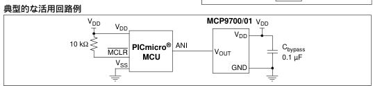

这是一篇與鱸形目相關的小作品。 你可以编辑或修订扩充其内容。

这是一篇與鱸形目相關的小作品。 你可以编辑或修订扩充其内容。

2006 Microchip Technology Inc.

DS21942B_JP-page 1

---

MCP9700/01

### 1.0 電気的特性

絶対最大定格

<table><tr><td>V DD *</td><td>6.0V</td></tr><tr><td>保存温度 :...................................................... -65°C – +150°C</td><td>-6150°C</td></tr><tr><td>動作時周囲温度 :...................................... -40°C – +125°C</td><td>-40°C – +125°C</td></tr><tr><td>接合部温度 (T 3 ):...................................... 150°C</td><td>-150°C</td></tr><tr><td>全ビンの ESD 保護 (HBM:MM):.................. (4 kV:200V)</td><td>-150°C</td></tr><tr><td>各ビンのラッチアップ電流 :.............................. +200 mA</td><td>-150°C</td></tr></table>

↑ 注意:上記の「 最大定格」 を超えるストレスを加えると、 デ バイスに恒久的な損傷を与えることがあります。 この規定は ストレス定格のみを規定するものであり、 この仕様の動作条件に記載する規定値以上でのデバイス動作を定めたものでは ありません。 長時間デバイスを最大定格状態にすると、 デバ イスの信頼性に影響を与えることがあります。

## DC 電気的特性

<table><tr><td colspan="8">電気的仕様 : 特に指定しない限り : MCP9700: V DD = 2.3V から 5.5V, GND = グランド , TA = -40°C ~ +125°C, MCP9701: V DD = 3.1V から 5.5V, GND = グランド , TA = -10°C ~ +125°C, 負荷なし</td></tr><tr><td>バラメータ</td><td>記号</td><td>Min</td><td>Typ</td><td>Max</td><td>単位</td><td>条件</td></tr><tr><td colspan="7">供給電源</td></tr><tr><td>動作電圧範囲</td><td>V DD V DD</td><td>2.3 3.1</td><td>― ―</td><td>5.5 5.5</td><td>V V</td><td>MCP9700 MCP9701</td></tr><tr><td>動作電流</td><td>IDD</td><td>―</td><td>6</td><td>12</td><td>μA</td><td></td></tr><tr><td>電源変動除去率</td><td>PSRR</td><td>―</td><td>0.1</td><td>―</td><td>°C/V</td><td></td></tr><tr><td colspan="7">センサー精度 (注 1, 2)</td></tr><tr><td>TA = +25°C TA = 0°C ~ +70°C TA = -40°C ~ +125°C TA = -10°C ~ +125°C</td><td>TACY TACY TACY</td><td>― -4.0 -4.0 ―</td><td>±1 ― ― +6.0 ―</td><td>― +4.0 +6.0 +6.0</td><td>°C °C °C °C</td><td>MCP9700 MCP9701</td></tr><tr><td colspan="7">センサー出力</td></tr><tr><td>出力電圧 : TA = 0°C TA = 0°C</td><td>V 0°C V 0°C</td><td>― ―</td><td>500 400</td><td>― ―</td><td>mV mV</td><td>MCP9700 MCP9701</td></tr><tr><td>温度低数</td><td>TC 1 TC 1</td><td>― ―</td><td>10.0 19.5</td><td>― ―</td><td>mV/°C mV/°C</td><td>MCP9700 MCP9701</td></tr><tr><td>出力非直線性</td><td>V ONL</td><td>―</td><td>±0.5</td><td>―</td><td>°C</td><td>TA=0°C ~ +70°C (注 2)</td></tr><tr><td>出力電流</td><td>IOUT</td><td>―</td><td>―</td><td>100</td><td>μA</td><td></td></tr><tr><td>出力インピーグンス</td><td>ZOUT</td><td>―</td><td>20</td><td>―</td><td>Ω</td><td>IOUT = 100 μA, f = 500 Hz</td></tr><tr><td>出力負荷安定度</td><td>ΔV OUT/ΔIOUT</td><td>―</td><td>1</td><td>―</td><td>Ω</td><td>TA = 0°C ~ +70°C, IOUT = 100 μA</td></tr><tr><td>起動時間</td><td>t ON</td><td>―</td><td>800</td><td>―</td><td>μs</td><td></td></tr><tr><td>標準負荷容量 (注 3)</td><td>CLOAD</td><td>―</td><td>―</td><td>1000</td><td>pF</td><td></td></tr><tr><td>63% までの応速度</td><td>t RES</td><td>―</td><td>1.3</td><td>―</td><td>s</td><td>30°C ( 気中 ) ~ +125°C (流体槽 ) (注 4)</td></tr></table>

注 1: MCP9700 の精度は VDD = 3.3V でテスト, MCP9701 の精度は VDD = 5.0V でテスト 2: MCP9700/01 は 式 4-2で表される一次式か直線特性 3: MCP9700/01 ファミリの特性は 1000 pF の容量負荷での工場内テストによる 4: 1x1 インチの両面鋼張リ基板での熱応答

DS21942B_JP-page 2

2006 Microchip Technology Inc.

---

MCP9700/01

## 温度特性

<table><tr><td colspan="8">電気的仕様 : 特に指定しない限り : MCP9700: V DD = 2.3V − 5.5V, GND = グランド, TA = -40°C − +125°C, 負荷なし MCP9701: V DD = 3.1V − 5.5V, GND = グランド, TA = -10°C − +125°C, 負荷なし</td></tr><tr><td>バラメータ</td><td>記号</td><td>Min</td><td>Typ</td><td>Max</td><td>単位</td><td>条</td><td>件</td></tr><tr><td colspan="8">溫度範圍</td></tr><tr><td rowspan="2">溫度範圍規格</td><td>TA</td><td>-40</td><td>—</td><td>+125</td><td>°C</td><td colspan="2">MCP9700 (注)</td></tr><tr><td>TA</td><td>-10</td><td>—</td><td>+125</td><td>°C</td><td colspan="2">MCP9701 (注)</td></tr><tr><td>動作溫度範圍</td><td>TA</td><td>-40</td><td>—</td><td>+125</td><td>°C</td><td></td><td></td></tr><tr><td>保存溫度範圍</td><td>TA</td><td>-65</td><td>—</td><td>+150</td><td>°C</td><td></td><td></td></tr><tr><td colspan="8">バッケージの熱抵抗</td></tr><tr><td>熱抵抗 , 5リードの SC70</td><td>θJA</td><td>—</td><td>331</td><td>—</td><td>°C/W</td><td></td><td></td></tr></table>

ま: この範囲の動作では、T」は最大接合部温度 $\left(+150^{\circ} \mathrm{C}\right)$ を超えてはなりません

© 2006 Microchip Technology Inc.

DS21942B_JP-page 3

---

MCP9700/01

### 2.0 典型的な性能久ラフ

注: 以下の本項のグラフヤ表は、有限のサンプルの統計值に基づいていて、情報提供のためにだけのもので す。ここに記述された性能特性は未テストか非保証です。いくつかのグラフヤ表では、仕様の動作範囲 を超えています(例えば供給電源範囲外)従って保証範囲外です。

注: 特に指定しない限り, MCP9700: $V_{D D}=2.3 \mathrm{~V}-5.5 \mathrm{~V} ; \mathrm{MCP} 9701: \mathrm{V}_{D D}=3.1 \mathrm{~V}-5.5 \mathrm{~V} ; \mathrm{GND}=\mathrm{グランド}$ $C_{\text {bypass }}=0.1 \mu \mathrm{F}$.

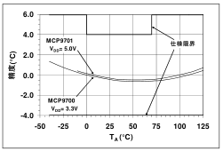

國 2- 1: 周囲温度と精度

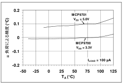

國 2-4: 周囲温度と精度の変化 ( 負荷による )

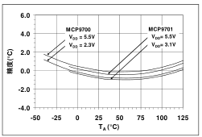

図 2-2: 周囲温度と $V_{D D}$ による精度

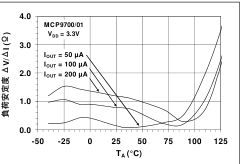

國 2- 5: 周囲温度と負荷安定度

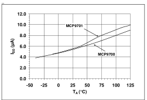

图 2-3: 温度と供給電流

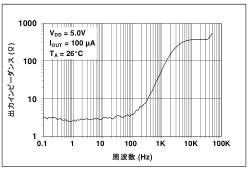

図 2-6: 周波数と出力インピーダンス

DS21942B_JP-page 4

2006 Microchip Technology Inc.

---

MCP9700/01

注: 特に指定しない限り, MCP9700: $V_{D D}=2.3 \mathrm{~V}$ to $5.5 \mathrm{~V} ; \mathrm{MCP} 9701: \mathrm{V}_{D D}=3.1 \mathrm{~V}$ to $5.5 \mathrm{~V} ; \mathrm{GND}=\mathrm{グランド}$ $C_{\text {bypass }}=0.1 \mu \mathrm{F}$.

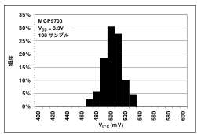

図 2-7: 0 とのときの出力電圧 (MP9700)

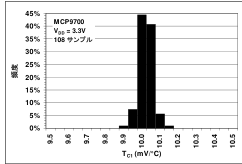

國 2-8 温度係数ごとの頻度 ( MCP9700)

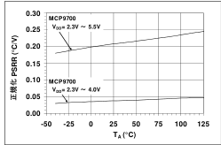

國 2-9: 周囲温度と電源変動除去比 ( PSRR)

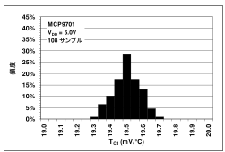

図 2-10: $0^{\circ} \mathrm{C}$ のときの出力電圧 ( MP9701).

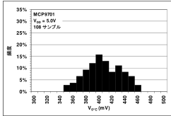

图 2-11: 温度係数ごとの頻度 (MP9701).

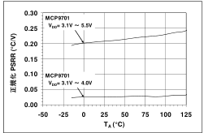

國 2-12: 温度と電源変動除去比 ( PSRR)

© 2006 Microchip Technology Inc.

DS21942B_JP-page 5

---

MCP9700/01

注: 特に指定しない限り, MCP9700: VDD = 2.3V ~ 5.5V; MCP9701: VDD = 3.1V ~ 5.5V; GND = グランド Cbypass = 0.1 μF.

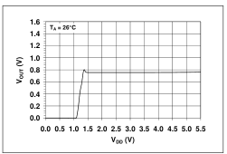

図 2-13: 電源供給と出力電圧

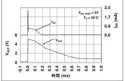

図 2-14: $\quad V_{D D}$ のステップ変動に対する出力と セトリングタイム

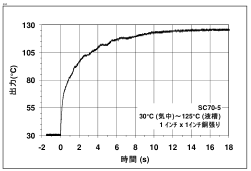

图 2-15: 温度応答

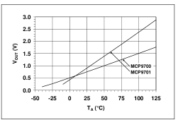

國 2- 16: 周囲温度と出力電圧

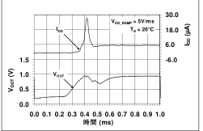

図 2-17: $V_{D D}$ のランプ変動に対する出力とセ トリングタイム

DS21942B_JP-page 6

2006 Microchip Technology Inc.

---

MCP9700/01

### 3.0 ピンの説助

ビンに関する説明を DC電気的特性に示します。

表 3-1: ビン機能ー覧表

<table><tr><td>ピン No</td><td>名称</td><td>機 能</td></tr><tr><td>1</td><td>NC</td><td>接続不要</td></tr><tr><td>2</td><td>GND</td><td>電源グランドピン</td></tr><tr><td>3</td><td>VOUT</td><td>出力電圧ピン</td></tr><tr><td>4</td><td>VDD</td><td>電源供給入力</td></tr><tr><td>5</td><td>NC</td><td>接続不要</td></tr></table>

### 3.1 電源グランドビン (GND)

GNDはシステムグランドピンです

### 3.2 電圧出力ビン (Vout)

センサー出力は VOUT で計測できます。 動作温度範囲 での電圧範囲は MCP9700 は 100 mV から 1.75V で、 MCP9701 は 200 mV から 3V です。

### 3.3 電源入カピン (VDD)

DC 電気的特性に規定された動作電圧を VO $D_{D}$ に入力し ます。

© 2006 Microchip Technology Inc.

DS21942B_JP-page 7

---

MCP9700/01

### 4.0 活用情報

リニアアクティブサーミスタI CIは温度測定に内蔵ダイ オードを使っています。 ダイオードの電気的特性は、 周囲温度が -40°C から 125°C で、 電圧変化が温度の係数となっています。 この電圧変化は MCP9700 では温度係数が 10.0 mV/°C (typ.) となっており、 MCP9701 では 19.5 mV/°C (typ.) となっています。 また 0°C のと きの出力電圧は、 MCP9700 と MCP9701 で、 それぞ れ 500 mV (typ.) と 400 mV (typ.) となっています。 こ のリニアなスケールは、 式 4-1 のようなー次関数で表 されます。

式 4-1: センサーの変換関数

$$\begin{aligned} \\ V_{O U T} & =T_{C I} \bullet T_{A}+V_{O^{\circ} C} \\ \\ \text { ここで: } & \\ \\ \mathrm{T}_{\mathrm{A}} & =周围温度 \\ \\ \mathrm{~V}_{\mathrm{OUT}} & =\mathrm{七} ン サ-出力電圧 \\ \\ \mathrm{~V}_{0^{\circ} \mathrm{C}} & =0^{\circ} \mathrm{C} \text { のときのセンサー出力電圧 } \\ \\ \mathrm{T}_{\mathrm{C} 1} & =温度係数 \\ \end{aligned}$$

### 4.1 精度の改善

MCP9700/01 の精度は、 ある温度でシステムを校正す ることで改善できます。 例えば 室温 +25°C で校正す れば、 図 4-1 に示したように、 0°C から +70°C の範囲で 精度を ±0.5°C(typ.) とすることができます。 この ように、 相対的な温度を計測するときには、 このファ ミリは高精度での温度測定が可能です。

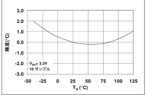

図 41: +25 ${ }^{\circ} \mathrm{C}$ のときに対する相対温度精度

校正温度からの精度の変化は、 式 4-1 で規定した一次式に対する出力の非直線性によるものです。 この精度 は出力の非直線性を補償すればかなり改善されます。

さらに高精度にするセンサー補償テクニックについて は、 AN1001 “IC Temperature Sensor Accuracy Compensation with a PICmicro® Microcontroller” (DS01001) を参照して下さい。 このアプリケーション ノートには、 MCP9700 を室温で校正した上でさらに 補償して、 センサー精度を、 動作温度範囲で ±0.5°C (typ.) まで改善する方法が示されています。 ( 図 4-2).

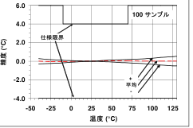

國 4-2: MP9700 の校正後の精度

この補償テクニックにより、 リニアな温度特性となり ます。 センサーの誤差を補正するためにファームウェ アの変換テープルを作成して使います。

### 4.2 マイクロコントローラの I/O ビンで シャットダウンする

MCP9700/01 は 6 μA (typ.) という低い動作電流ですの で、 バッテリ動作に最適です。 しかし、 さらに厳しい 電源条件の場合、 このデバイスをマイクロコントロー ラの入出力ピン(I/O)を使って電源供給することができ ます。 I/O ピンを使えばデバイスをシャットダウンに 切り替えることができます。 このような応用では、 マ イクロコントローラの内部ディジタルスイッチングノ イズが MCP9700/01 の電源ノイズとなってしまいま す。 このスイッチングノイズは、 計測精度に影響を与 えます。 このため、 デカップリングコンデンサと直列抵抗がシステムノイズ用のフィルタとして必要となり ます。

### 4.3 実装配置上の注意

MCP9700/01 は動作させるには追加部品を何も必要と しません。しかし、0.1 μF から 1 μF のデカップリング コンデンサを VDD と GND ビン問に付加することを推奨します。 高ノイズでの応用では VDD ビンを、1 μF の デカップリングコンデンサと 200Ω の抵抗を使って電源供給ビンに接続します。 高周波用セラミックコンデ ンサがお勧めです。 コンデンサはノイズ防止を効果的 にするため、 電源ピンのできるだけ近くに取り付ける 必要があります。 さらにディジタル配線パターンをセ ンサーに隣接させないようにして下さい。

DS21942B_JP-page 8

2006 Microchip Technology Inc.

---

MCP9700/01

### 4.4 放熱対策

MCP9700/01 はダイ上のダイオードの電圧をモニタす ることで温度を計測します。 ピン接続によって、 ダイ と PCB 間の熱抵抗を低くすることができます。 こう することで MCP9700/01 が PCBの温度を効果的にモニ タできるようにします。 プラスチックのデバイスパッ ケージは熱絶縁物なので、 周囲空気との熱接触は良く ありません。 この制限はプラスチックバッケージの温度センサーに適用されます。 周囲温度の計測が必要な 場合には、 PCB とセンサービンが適切に熱接続される ように設計する必要があります。

MCP9700/01 は source/sink 100 μA (max.) で設計され ています。 出力電流による消費電力は相対的に影響を 与えません。 出力電流による影響は 式 4-2 で表され ます。

式 4-2: 自己発熱の影響

$$\begin{aligned} \\ T_{J}-T_{A} & =\theta_{J A}\left(V_{D D} I_{D D}+\left(V_{D D}-V_{O U T}\right) I_{O U T}\right) \\ \\ \text { ここで: } & \\ \\ \mathrm{T}_{\mathrm{J}} & =\text { 接合部温度 } \\ \\ \mathrm{T}_{\mathrm{A}} & =\text { 周囲温度 } \\ \\ \theta_{\mathrm{JA}} & =\text { 八ッケージの熱抵抗 } \\ \\ \mathrm{V}_{\text {OUT }} & =\text { センサー出力電圧 } \\ \\ \mathrm{I}_{\text {OUT }} & =\text { センサー出力電流 } \\ \\ \mathrm{I}_{\text {DD }} & =\text { 動作電流 } \\ \\ \mathrm{V}_{\text {DD }} & =\text { 動作電圧 } \\ \end{aligned}$$

$\mathrm{T}_{\mathrm{A}}=+25^{\circ} \mathrm{C}\left(\mathrm{V}_{\mathrm{OUT}}=0.75 \mathrm{~V}\right) \mathrm{で}$ 、最大定格の $\mathrm{I}_{\mathrm{DD}}=12 \mu \mathrm{A}$, $\mathrm{V}_{\mathrm{DD}}=5.5 \mathrm{~V} 、 \mathrm{I}_{\mathrm{OUT}}=+100 \mu \mathrm{A}$ のとき、消費電力による 自己発熱 $\left(\mathrm{T}_{\mathrm{J}}-\mathrm{T}_{\mathrm{A}}\right)$ は $0.179^{\circ} \mathrm{C}$ です。

© 2006 Microchip Technology Inc.

DS21942B_JP-page 9

---

MCP9700/01

### 5.0 バッケージ情報

### 5.1 バッケージのマーキング情報

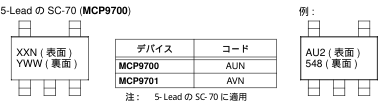

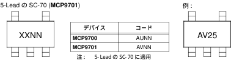

<table><tr><td>凡例:</td><td>XX...X Y YY WW NNN (e3)</td><td>カスタマ仕樣情報 年コード(カレンダ年の下位 1 桁目 ) 年コード(カレンダ年の下位 2 桁目 ) 週コード(1月 1日を週 ‘01’とする) 英数字のトレース用コード 録メッキ(Sn)に関する鉛フリーJEDEC 区別コード 本バッケージは鉛フリーです。 鉛フリーJEDEC 区別はパッケージの外観から見えるようにしています。</td><td>(e3)</td></tr><tr><td>Note:</td><td colspan="3">マイクロチップのバーツ番号全体が 1 行で入らないときは、次の行にはみもます。 このためカスタマ仕様情報用の文字数が制限されます。</td></tr></table>

DS21942B_JP-page 10

2006 Microchip Technology Inc.

---

MCP9700/01

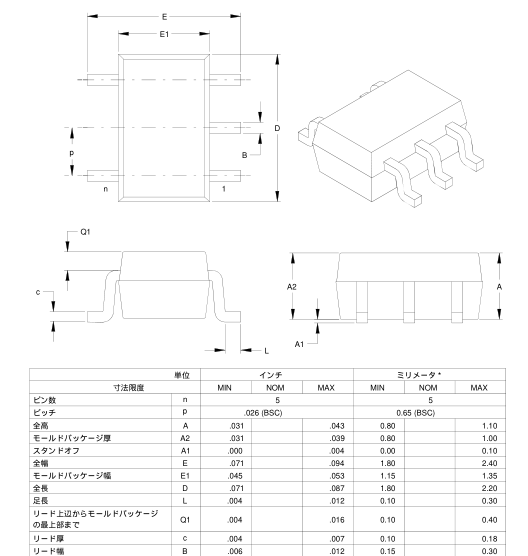

5-Lead Plastic Small Outline Transistor (LT) (SC-70

注: D と E1 の寸法はモールドのはみ出しや突出部を含みません。 モールドのはみ出しや突出部は側面から.005° (0.127mm) 以上はありません BSC: 基本寸法. 理論上の誤差のない正確な值 ASME Y14.5M 参照 JEITA (EIAJ) 標準: SC-70 Drawing No. C04-061

2006 Microchip Technology In

DS21942B_JP-page 1

---

MCP9700/01

NOTES:

DS21942B_JP-page 12

2006 Microchip Technology Inc.

---

MCP9700/01

付録 A: 改版履歴

レビジョン B (2005 年 10 月

下記は修正リスト

- 第3.0項 “ ピンの説明”を追加
- Linear Active ThermistorTM IC商標を追加
- 2 次の温度式と温度係数グラフを削除
- AN1001 の参照と説明を追加
- 図 4-2 と説明を追加
- ·初版リリース
© 2006 Microchip Technology Inc.

DS21942B_JP-page 13

---

MCP9700/01

NOTES

DS21942B_JP-page 14

2006 Microchip Technology Inc.

---

MCP9700/01

製品識別システム

<table><tr><td>PART NO.</td><td>–</td><td>X</td><td>OX</td><td>(9):</td></tr><tr><td>デリイス</td><td>温度範囲</td><td>八ッケージ</td><td>(1)</td><td>MCP9700T-ELT:UZP797-(7 +-128 1C, テーブとリール・40°C ~ +125°C, 5LD SC70 バッケ-ジ .</td></tr><tr><td>デリイス:</td><td>MCP9700T:</td><td>リニアアクライブナーミスタ1C, テーブとリール, 総コリーズロジーズロジーズリール・ヨンリー</td><td>a)</td><td>MCP9701T-ELT:UZP797-(7 +-128 1C, テーブとリール・40°C ~ +125°C, 5LD SC70 バッケ-ジ .</td></tr><tr><td>温度範囲:</td><td>E</td><td>=</td><td>-40°C ~ +125°C</td><td></td></tr><tr><td>バッケージ:</td><td>LT</td><td>=</td><td>Plastic Small Outline Transistor, 5-lead</td><td></td></tr></table>

© 2006 Microchip Technology Inc.

DS21942B_JP-page 15

---

MCP9700/01

NOTES:

DS21942B_JP-page 16

2006 Microchip Technology Inc.

---

マイクロチップデバイスのコード保護機能に開する以下の点に留意ください。

- ・ マイクロチップの製品は各製品独自のマイクロチップデーターシートにある仕様を満たしています.
- ・各製品ファミリーは、 通常の状態で所定の方法で利用いただければ市場にある類似製品の中で最も安全なファミリーの一つと
マイクロチップは信じております。
- ・ 不正かつ非合法な方法を使ったコード保護機能の侵害があります。 弊社の理解ではこうした手法は、 マイクロチップデーター
シートにある動作仕様書以外の方法でマイクロチップ製品を使用することになります。 こうした手法を使用した人は、 ほとん
どの場合、 知的財産権の侵害となります。
- • マイクロチップはコードの統合性に関心をお持ちの願客とは協働させていただきます,
- ・ マイクロチップまたは他のセミコンダクターメーカーがコードの安全性を保証したものではありません。 コード保護は製品保
護が「 破られない」 ということを保証するものではありません。
コード保護は常に進化します。マイクロチップは、当社製品のコード保護機態を継続的に改善することをお釣束いたします。マクロ チップのコード保護機能を破ることは、デジタル・ミレニアム著作権法に違反します。こうした行為によるソフトウェアーや著作権 に開わる作品への不正アクセスがあった場合、同法に基づき賠償請求する権利があります。

本書の日本語版はユーザーの使用のために提供されます。 Microchip Technology Inc. とその子会社、 関連会社、 すべ ての取締役、 役員、 職員、 代理人は翻訳の間違いにより起こ るいかなる責も負わないものとします。 間違いが疑われる個所については、 Microchip Technology Inc. 発行のオリジナ ル文書を参照いただくようお奨めします。

本書に書かれているデバイスアプリケーション等に関する内容は、 参考情報に適ぎません。 ご利用のアプリケーションが 仕様を満たしているかどうかについては、 お客様の責任にお いて確認をお願いします。 これらの情報の正確さ、 またはこ れの情報の使用に関し、 マイクロチップテク ノロジーインク はいかなる表明と保証を行うものではなく、 また、 一切の責任を負うものではありません。 マイクロチップの明示的な書面による承認なしに、 生命維持装置あるいは生命安全用途に マイクロチップの製品を使用することはすべて購入者のリス クとし、 また購入者はこれによって起きたあらゆる損害、 ク レーム、 訴訟、 費用に関して、 マイクロチップは擁護され、 免責され、 損害をうけないにとに同意するものとします。 知的財産権に基づくライセンスを暗示的に与えたものではあり ません。

# QUALITY MANAGEMENT SYSTEM CERTIFIED BY DNV

=ISO/TS 16949:2002 ==

## 商標

マイクロチップの名称とロゴ、 マイクロチップのロゴ、 Accuron、 dsPIC、 KEELOQ、 microID、 MPLAB、 PIC、 PICmicro、 PICSTART、 PRO MATE、 PowerSmart、 rfPIC、 SmartShunt は米国及び他の国々のにおいて、 マイクロチッ プテクノロジーインク の登録商標です。

AmpLab、 FilterLab、 Migratable Memory、 MXDEV、 MXLAB、 PICMASTER、 SEEVAL、 SmartSensor、 The Embedded Control Solutions Company は、 米国にあいてマイクロチッ プテクノロジーインク の登録商標です。

Analog-for-the-Digital Age、 Application Maestro、 dsPICDEM、 dsPICDEM.net、 dsPICworks、 ECAN、 ECONOMONITOR、 FanSense、 FlexROM、 fuzzyLAB、 InCircuit Serial Programming、 ICSP、 ICEPIC、 Linear Active Thermistor、 MPASM、 MPLIB、 MPLINK、 MPSIM、 PICkit、 PICDEM、 PICDEM.net、 PICLAB、 PICtail、 PowerCal、 PowerInfo、 PowerMate、 PowerTool、 rfLAB、 rfPICDEM、 Select Mode、 Smart Serial、 SmartTel、 Total Endurance、 UNI/O、 WiperLock、 及び Zena は、 米国及び他の国々のにお いて、 マイクロチップテクノロジーインク の登録商標とで す。

SQTP は米国においてマイクロチップテクノロジーインクの サービスマークです。

本書に記載された上記以外の商標は、 それぞれの会社の財産 です。

著作權。 (2006年) イクロチップテクノロジーインク、 米国で印刷。 無断複写・転載を禁じます。

再生紙を使用

マイクロチップは、 1OS/TS-16949 を灵けました。 本社、 アリゾナ 州チャンドラーとテンベとカリフォルニア州マウンテンピューにあ るデザイン及ぴウエハー織設に対する 2003 年 10 月品質システム跟証です。 弊社の品質システムプロセスと手続きは、 PICmicro® 8-bit MCUs、 KEELOG® コードホッピングデバイス、 シリアル EEPROMs マイクロベリフェラル、 キ揮発性メモリーとアナログ製品を対象と していほす。 更に、 悪発システムの設計及び製造に囲するマイクロ チップの品質システムは、 2000 年に ISO9001 の節証を受けていま す。

© 2006 Microchip Technology Inc.

DS21942B_JP-page 17

---

MICROCHIP

<table><tr><td>AMERICAS</td><td>ASIA/PACIFIC</td><td>ASIA/PACIFIC</td><td>EUROPE</td></tr><tr><td>Corporate Office</td><td>Australia - Sydney</td><td>India - Bangalore</td><td>Austria - Wels</td></tr><tr><td>2355 West Chandler Blvd.</td><td>Tel: 61-2-9868-6733</td><td>Tel: 91-80-4182-8400</td><td>Tel: 43-7242-2244-399</td></tr><tr><td>Chandler, AZ 85224-6199</td><td>Fax: 61-2-9868-6755</td><td>Fax: 91-80-4182-8422</td><td>Fax: 43-7242-2244-393</td></tr><tr><td>Tel: 480-792-7200</td><td>China - Beijing</td><td>India - New Delh</td><td>Denmark - Copenhagen</td></tr><tr><td>Fax: 480-792-7277</td><td>Tel: 86-10-8528-2100</td><td>Tel: 91-11-5160-8631</td><td>Tel: 45-4450-2828</td></tr><tr><td>Technical Support: http://support.microchip.com</td><td>Fax: 86-10-8528-2104</td><td>Fax: 91-11-5160-8632</td><td>Fax: 45-4485-2829</td></tr><tr><td>Web Address: www.microchip.com</td><td>China - ChengduTel: 86-28-8676-6200</td><td>India - PuneTel: 91-20-2566-1512Fax: 91-20-2566-1513</td><td>France - ParisTel: 33-1-69-53-63-20Fax: 33-1-69-30-90-79</td></tr><tr><td>Atlanta</td><td>China - Fuzhou</td><td>Japan - Yokohama</td><td>Germany - Munich</td></tr><tr><td>Alpharetta, GA</td><td>Tel: 86-591-8750-3506</td><td>Tel: 81-45-471- 6166</td><td>Tel: 49-89-627-144-0</td></tr><tr><td>Tel: 770-640-0034</td><td>Fax: 86-591-8750-3521</td><td>Fax: 81-45-471-6122</td><td>Fax: 49-89-627-144-44</td></tr><tr><td>Fax: 770-640-0307</td><td>China - Hong Kong SAR</td><td>Korea - Gumi</td><td>Italy - Milan</td></tr><tr><td>Boston</td><td>Tel: 852-2401-1200</td><td>Tel: 82-54-473-4301</td><td>Tel: 39-0331-742611</td></tr><tr><td>Wesborough, MA</td><td>Fax: 852-2401-3431</td><td>Fax: 82-54-473-4302</td><td>Fax: 39-0331-466781</td></tr><tr><td>Tel: 774-760-0087</td><td>China - Qingdao</td><td>Korea - Seoul</td><td>Netherlands - Drunen</td></tr><tr><td>Fax: 774-760-0088</td><td>Tel: 86-532-8502-7355</td><td>Tel: 82-2-554-7200</td><td>Tel: 31-416-690399</td></tr><tr><td>Chicago</td><td>Fax: 86-532-8502-7205</td><td>Fax: 82-2-558-5932 or</td><td>Fax: 31-416-690340</td></tr><tr><td>Itasca, IL</td><td>China - Shanghai</td><td>82-2-558-5934</td><td>Spain - Madrid</td></tr><tr><td>Tel: 630-285-0071</td><td>Tel: 86-21-5407-5533</td><td>Malaysia - Penang</td><td>Tel: 34-91-708-08-90</td></tr><tr><td>Fax: 630-285-0075</td><td>Fax: 86-21-5407-5066</td><td>Tel: 60-4-646-8870</td><td>Fax: 34-91-708-08-91</td></tr><tr><td>Dallas</td><td>China - Shenyang</td><td>Fax: 60-4-646-5086</td><td>UK - Wokingham</td></tr><tr><td>Addison, TX</td><td>China - Shenyang</td><td></td><td>Tel: 44-118-921-5869</td></tr><tr><td>Tel: 972-818-7423</td><td>Tel: 86-24-2334-2829</td><td>Philippines - Manila</td><td>Fax: 44-118-921-5820</td></tr><tr><td>Fax: 972-818-2924</td><td>Fax: 86-24-2334-2393</td><td>Tel: 63-2-634-9065</td><td></td></tr><tr><td>Detroit</td><td>China - Shenzhen</td><td>Fax: 63-2-634-9069</td><td></td></tr><tr><td>Farmington Hills, MI</td><td>Tel: 86-755-8203-2660</td><td>Singapore</td><td></td></tr><tr><td>Tel: 248-538-2250</td><td>Fax: 86-755-8203-1760</td><td>Tel: 65-6334-8870</td><td></td></tr><tr><td>Fax: 248-538-2260</td><td>China - Shunde</td><td>Fax: 65-6334-8850</td><td></td></tr><tr><td>Kokomo</td><td>Tel: 86-757-2839-5507</td><td>Taiwan - Hsin Chu</td><td></td></tr><tr><td>Kokomo, IN</td><td>Fax: 86-757-2839-5571</td><td>Tel: 886-3-572-9526</td><td></td></tr><tr><td>Tel: 765-864-8360</td><td>China - Wuhan</td><td>Fax: 886-3-572-6459</td><td></td></tr><tr><td>Fax: 765-864-8387</td><td>Tel: 86-27-5980-5300</td><td>Taiwan - Kaohsiung</td><td></td></tr><tr><td>Los Angeles</td><td>Fax: 86-27-5980-5118</td><td>Tel: 886-7-536-4818</td><td></td></tr><tr><td>Mission Viejo, CA</td><td>China - Xian</td><td>Fax: 886-7-536-4803</td><td></td></tr><tr><td>Tel: 949-462-9523</td><td>Tel: 86-29-8833-7250</td><td>Taiwan - Taipe</td><td></td></tr><tr><td>Fax: 949-462-9608</td><td>Fax: 86-29-8833-7256</td><td>Tel: 886-2-2500-6610</td><td></td></tr><tr><td>San Jose</td><td></td><td>Fax: 886-2-2508-0102</td><td></td></tr><tr><td>Mountain View, CA</td><td></td><td>Thailand - Bangkok</td><td></td></tr><tr><td>Tel: 650-215-1444</td><td></td><td>Tel: 66-2-694-1351</td><td></td></tr><tr><td>Fax: 650-961-0286</td><td></td><td>Fax: 66-2-694-1350</td><td></td></tr></table>

全世界の販売及びサービス拠点

DS21942B_JP-page 18

2006 Microchip Technology Inc.

