製品データシート

00813-0104-3900, Rev AC

2021 年 8 月

## Rosemount $^{TM}$ 3900/3900VP

汎用 $\mathrm{pH} / \mathrm{ORP}$ センサ

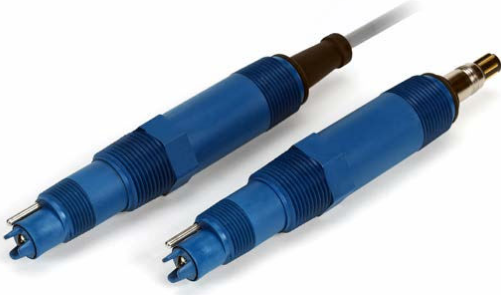

お客様のプロセス pH/ORP ニーズに応える高性能

Rosemount 3900 および 3900VP pH/ORP の組み合わせセンサは、 パイプライン、 開放タンク、 または池 の水溶液の信頼性の高いpH または酸化還元電位の測定に使用されます。 堅牢な設計により 、

Rosemount 3900 および 3900VP のセンサは、 幅広い用途で使用することができます。

ROSEMOUNT

EMERSON

---

Rosemount 3900/3900VP

2021年8月

## 概要

堅牢なセンサ設計

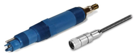

- を用いたセンサ寿命の延長と被毒イオンに対する保護
- ひび割れ耐性を持つガラスを採用することで、 高性能化と
長寿命化を実現。
- 堅牢なポリフェニレンスルファイド製のボディによって
最高の耐薬品性を実現。
- 氷点下-10.0°C までの温度で動作
- 高度な診断を可能にする。
多彩な設置オブション

- センサ本体は、前面および背面の両方に向いたプロセススレッドを備えた一体構造を特徴としています
- タインチと 1 インチのオスの米国管用ネジ (MNPT) プロセス接続を使用して、 さまざまな用途に対する設置要件を満たし
ます。
- Variopol (VP8) ケーブル接続オブションは、 ケーブルからセンサへの迅速な取り外しを可能にし、 ケーブルのねじれを解
消します。
SMART スリアンズ

- Rosemount 伝送器による $\mathrm{pH}$ センサの自動認識: 1066、1057、1056、56
- pH校正データが保存されるため、現場で「プラグアンドブレイ」で設置するためにセンサを事前に校正しておくことがで
きます。
目次

概要…… 2

注文情報…… 3

付属部品…… 6

仕様……7

Rosemount pH/ORP センサ製品認証…… 8

寸法図および設置図…… 13

2

Emerson.com/Rosemount

---

2021 年 8 月

Rosemount 3900/3900VP

## 注文情報

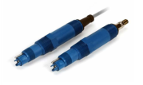

Rosemount 3900 および 3900VP 汎用 pH/ORP センサは、 耐薬品性に優れた Ryton® プラスチックのボディに加え、 高度な診断を可能にする内蔵の溶液グランドと、 温度補償用の Pt-100 測温抵抗体 (RTD) を搭載しています。 これらのセンサは、 一体型ケーブル接続 (Rosemount 3900) または Variopol (VP8) コネクク (Rosemount3900VP) のいずれかとともに利用できます。 Variopol ケーブルは別売りです (付属部品を参照)。

### Rosemount 3900 注文情報

注

Rosemount3900pH/ORPセンサは、 高度な診断用の溶液グランドを内藏した Ryton®プラスチックボディに収容されています。 温度補正装置用に Pt-100 が提供されています。 このセンサーは、 一体型ケーブルと一緒に購入可能です。 どちらも別売りのプ ロセスコネクタを使用してセンサを取り付けることが可能です。 送信機に一体型プリアンプがない場合は、 ブリアンプ付きの ジャンクションボックスキットを個別に注文することも可能です。

モデル

<table><tr><td>コード</td><td>説明</td></tr><tr><td>3900</td><td>汎用 pH/ORPセンサ</td></tr></table>

プリアンプのオブション

<table><tr><td>コード</td><td>説明</td></tr><tr><td>01</td><td>SMART ブリアンプ、 酸化遗元電位 (ORP) と併用する場合は 10 m ケーブル (1)</td></tr><tr><td>02</td><td>アンプなし、 5 mケーブル)</td></tr><tr><td>04</td><td>SMART ブリアンプ、 15 mケーブル (1)</td></tr><tr><td>05</td><td>SMART ブリアンプ、 20 mケーブル (1)</td></tr><tr><td>06</td><td>SMART ブリアンプ、 30 mケーブル (1)</td></tr><tr><td>07</td><td>ブリアンプなし、 1 mケーブル</td></tr><tr><td>08</td><td>ブリアンプなし、 3 mケーブル</td></tr></table>

(1) 標準不行為之。

測定コード

<table><tr><td>コード</td><td>説明</td></tr><tr><td>10</td><td>汎用低抵抗(GPLR)pHガラス(0 ~ 14 pH)</td></tr><tr><td>12</td><td>白金酸化還元電位(ORP)</td></tr></table>

Rosemount 3900/3900VP

3

---

Rosemount 3900/3900VP

2021年8月

校正証明書・オブションレベル

<table><tr><td>コード</td><td>説明</td></tr><tr><td>CC</td><td>校正証明書(デストデータなし)</td></tr><tr><td>LC</td><td>ループ校正証明書(センサおよびトランスミッターは、デストデータを用いて枚正されています)</td></tr><tr><td>EC</td><td>エレクトロニック校正証明書(センサは、デストデータを用いて工場の機器と照らし合わせて枚正されています)</td></tr></table>

4

Emerson.com/Rosemount

---

2021 年 8 月

Rosemount 3900/3900VP

## Rosemount 3900VP 注文情報

### モデル

<table><tr><td>コード</td><td>説明</td></tr><tr><td>3900VP</td><td>Variopolコネクタ付汎用 pH/ORPセンサ</td></tr></table>

### プリアンプのオブション

<table><tr><td>コード</td><td>説明</td></tr><tr><td>01</td><td>SMART ブリアンプ(1)</td></tr><tr><td>02</td><td>ブリアンプなし</td></tr></table>

(1) 酸化逐元電位(ORP) で使用する場合は標準プリアンフ

測定コード

<table><tr><td>コード</td><td>説明</td></tr><tr><td>10</td><td>汎用低抵抗 (GPLR) pH ガラス (0 ~ 14 pH)</td></tr><tr><td>12</td><td>白金酸化選元電位 (ORP)</td></tr></table>

### 校正証明書-オブションレベル

<table><tr><td>コード</td><td>説明</td></tr><tr><td>CC</td><td>校正証明書(テストデータなし)</td></tr><tr><td>LC</td><td>ループ校正証明書(センサおよびトランスミッターは、 テストデータを用いて校正されています)</td></tr><tr><td>EC</td><td>エレクトロニック校正証明書(センサは、 テストデータを用いて工場の機器と照らし合わせて校正されています)</td></tr></table>

Rosemount 3900/3900VP

5

---

Rosemount 3900/3900VP

2021年8月

## 付属部品

<table><tr><td>部品香号</td><td>説明</td></tr><tr><td>11275-01</td><td>手すり取り付け部品</td></tr><tr><td>12707-00</td><td>ジェット嗜霧えクリーナー</td></tr><tr><td>2002011</td><td>塩素化ボリ塩化ビニル製フルースルーティーと11⁄2インチ米国管用ネジ (NPT) プロセス接続</td></tr><tr><td>23242-02</td><td>取り付けアダブター、11⁄2インチ 差し込み部品、1x34インチ</td></tr><tr><td>23555-00</td><td>検索箱、ブリアンプと互換性のある Rosemount 54/5081/1055/Xmt</td></tr><tr><td>24091-00</td><td>出口および入り口が14-インチの低流量セル</td></tr><tr><td>33894-00</td><td>1インチ低流量セルの NPTねじアダブタ</td></tr><tr><td>24281-00</td><td>4.57 mW 8ケーブル</td></tr><tr><td>24281-01</td><td>7.62 mW 8ケーブル</td></tr><tr><td>24281-02</td><td>0.762 mW 8ケーブル</td></tr><tr><td>24281-03</td><td>15.24 mW 8ケーブル</td></tr><tr><td>24281-04</td><td>30.48 mW 8ケーブル</td></tr><tr><td>24281-05</td><td>1.22 mW 8ケーブル</td></tr><tr><td>24281-06</td><td>3.05 mW 8ケーブル</td></tr><tr><td>24281-07</td><td>6.10 mW 8ケーブル</td></tr><tr><td>24281-08</td><td>9.14 mW 8ケーブル</td></tr><tr><td>9200273</td><td>1 フィート当たり 11 のコンジット、シールド付き、即席の拡張ケーブル</td></tr><tr><td>9210012</td><td>pH 4.01、453.6 g</td></tr><tr><td>9210013</td><td>pH 6.86、453.6 g</td></tr><tr><td>9210014</td><td>pH 9.18、453.6 g</td></tr><tr><td>00390-7101-0001</td><td>低流量パネル</td></tr><tr><td>R508-8OZ</td><td>酸化選元電位(ORP)キャリブレーション基準 460 ± 10mV</td></tr></table>

6

Emerson.com/Rosemount

---

2021 年 8 月

Rosemount 3900/3900VP

## 仕樣

<table><tr><td>pH 範圍</td><td>直陳性</td></tr><tr><td>0∼7</td><td>97%</td></tr><tr><td>1∼7</td><td>98%</td></tr><tr><td>4∼7</td><td>98%</td></tr><tr><td>7∼10</td><td>99%</td></tr><tr><td>7∼12</td><td>97%</td></tr><tr><td>7∼13</td><td>96%</td></tr><tr><td>7∼14</td><td>95%</td></tr></table>

表1:pH範囲に対する直線性(%)

<table><tr><td colspan="2">测定範围</td></tr><tr><td>pH</td><td>0~14</td></tr><tr><td>酸化遗元電位(ORP)</td><td>-1500 ~ +1500 mV</td></tr><tr><td colspan="2">勤作温度</td></tr><tr><td colspan="2">-10 °C 100 °C まで、自動温度補正-10 °C 〜 100 °C</td></tr><tr><td colspan="2">最大压力</td></tr><tr><td colspan="2">689.5 kPa @ 100 °C</td></tr><tr><td colspan="2">CRN 泽庙: 413.7 kPa 最大 100 °C</td></tr><tr><td colspan="2">構造部の材料</td></tr><tr><td>センサ木体</td><td>Ryton®:ポリフェニレンサルファイド(PPS)</td></tr><tr><td>O リング</td><td>EPDM</td></tr><tr><td>pH電極</td><td>ガラス</td></tr><tr><td>ORP 電極</td><td>ガラス、ブラチナ</td></tr><tr><td>溶液グランド</td><td>ステンレス網</td></tr><tr><td>基準核点</td><td>PTFE</td></tr><tr><td colspan="2">電導度</td></tr><tr><td colspan="2">低流量パネルで使用される膜、最低電導度である 0.1 μS/cm での pHの変化に反応します。サンプルの流量は 1 時間あたり 2gal に制御する必要があります。</td></tr><tr><td colspan="2">プロセス接続部</td></tr><tr><td>前面仕上げ面</td><td>34インチと 1 インチのオス来国管用ネジ(MNPT)</td></tr><tr><td>背面仕上げ面</td><td>1インチMNPT</td></tr><tr><td colspan="2">温度補償</td></tr><tr><td colspan="2">Pt-100</td></tr></table>

表 2: Rosemount 3900/3900VP pH/ORP 七ンサの仕様

Rosemount 3900/3900VP

7

---

Rosemount 3900/3900VP

2021年8月

<table><tr><td colspan="2">ケーブル</td></tr><tr><td>3900</td><td>プリアンプ内蔵の場合の各種ケーブル長(ブリアンプのオブション参照) ;ブリアンプなしの場合は 4.57 m 以下</td></tr><tr><td>3900VP</td><td>24281-XX を使用、 0.762 m〜30.48 m。 付属部品を参照。</td></tr><tr><td colspan="2">重量積荷重量</td></tr><tr><td rowspan="2" colspan="2">0.5 kg/0.9 kg</td></tr></table>

表 2 : Rosemount 3900/3900VP pH/ORP センサの仕様 (続き

# Rosemount pH/ORP センサ製品認証

Rev 0.

## 欧州指令情報

EU 適合宣言書の写しは、 クイック・スタート・ガイドの最後にあります。 EU 適合宣言書の最新版は Emerson.com/Rosemount をご覧ください。

## 通常の場所での使用に関する認証

標準として、伝送器はその設計が基本的な電気的、機械的、および防火要件を設計が満たしていることを確認するために、連邦労働安全衛生局(OSHA)の認定を受けた国家認定試験機関(NRTL)によって検査および試験されます。

## 北米での機器の設置

米国電気工事規程®(NEC)およびカナダ電機規定(CEC)では、ディビジョンのマーキングがついた装置のゾーン内での使用 と、ゾーンのマークがついた装置のディビジョンでの使用が許可されています。そのマーキングは、地域分類、ガス、温度クラ スに適合していなければなりません。この情報はそれぞれの規定に明確に定義されています。

## 米国

### FM 本質安全

<table><tr><td>認定書</td><td>FM17US0198X</td></tr><tr><td>規格</td><td>FM クラス 3600:1998、 FM クラス 3610:2010、 FM クラス 3611: 2004、 FM クラス 3810: 2005</td></tr><tr><td rowspan="4">マーキング</td><td>IS/I,II,III/1/ABCDEFG/T6 Ta = −20 °C 〜 60 °C</td></tr><tr><td>I/0/AEx ia IIC/T6 Ta = −20 °C 〜 60 °C</td></tr><tr><td>NI/I/2/ABCD/T6 Ta = −20 °C 〜 60 °C</td></tr><tr><td>S/II,III/2/EFG/T6 Ta = −20 °C 〜 60 °C</td></tr></table>

安全な使用のための特定条件 $(\mathbf{X})$

1.モデル 1700702 プリアンプ付きセンサ:

8

Emerson.com/Rosemount

---

2021 年 8 月

Rosemount 3900/3900VP

a. モデル 385+-a-b-c. 3 接点 pH/ORP セン+

b.モデル 389-a-b-c-d-e. pH/ORP センサ

c. モデル 389VP-a-b-c-d. pH/ORP センサ

d. モデル 396VP-a-b-c-d. 浸漬/挿入 $\mathrm{pH} / \mathrm{ORP}$ センサ

e. モデル 396P-a-b-c-d-e. 浸漬/挿入pH/ORP センサ

f. モデル 396PVP-a-b-c-d-e. 浸漬/挿入 pH/ORP センサ

g. モデル 396RVP-a-b-c-d-e. リトラクション/浸漬/挿入 pH/ORP センサ

h. モデル 398RVP-a-b-c-d-e-f.pH/ORP センサ

i. モデル 3200HP-00.高純度水 pH センサ

j. モデル 3300HTVP-a-b-c-d. 高性能 pH および ORP センサ

k. モデル 3400HTVP-a-b-c-d-e. 高性能 pH および ORP センサ

I. 3500P-a-b-c-d-e-f. 高性能 pH および ORP センサ

m.3500VP-a-b-c-d-e-f.高性能pHおよびORP センサ

n. モデル 3900-a-b-c. 汎用 $\mathrm{pH} / \mathrm{ORP}$ センサ

0. モデル 3900VP-a-b. 汎用 pH/ORP センサ

上記のすべての装置のボリマー表面は、静電気を蓄えて発火源となる可能性があります。 表面の清掃は、 湿らせた布で 行ってください。

2. モデル 1700702 ブリアンプなしセンサ (シンプルな装置):

a. モデル 385-a-b-c-d-e. 格納式 pH/ORP センサ

。 モデル 385+-a-b-c 3 接点 pH/ORP センサ

:.モデル 389-a-b-c-d-e. pH/ORP センサ

1. モデル 389VP-a-b-c. pH/ORP センサ

e. モデル 396-a-b-c. 浸漬/挿入 pH センサ

f. モデル 396VP-a-b. 浸漬/挿入 pH センサ

3. モデル 396P-a-b-c-d-e. 浸漬/挿入 pH/ORP センサ

1. モデル 396PVP-a-b-c-d. 浸漬/挿入 pH/ORP センサ

i. モデル 396R-a-b-c-d-e. リトラクション|浸漬/押入 pH/ORP センサ

j. モデル 396RVP-a-b-c-d. リトラクション/浸漬/挿入pH/ORP センサ

k. モデル 397-a-b-c-d-e. pH センサ

1. モデル 398-a-b-c-d-e. pH/ORP センサ

m. モデル 398VP-a-b-c. pH/ORP センサ

n. モデル 398R-a-b-c-d-e-f. pH/ORP センサ

0. モデル 398RVP-a-b-c-d-e-f.pH/ORP センサ

p. モデル 3200HP-00.高純度水 pH センサ

q. モデル 3300HT-a-b-c-d. 高性能 $\mathrm{pH}$ および ORP セン

r. モデル 3300HTVP-a-b-c-d. 高性能 pH および ORP センサ

Rosemount 3900/3900VP

9

---

Rosemount 3900/3900VP

2021年8月

s. モデル 3400HT-a-b-c-d-e-f. 高性能 $\mathrm{pH}$ および ORP センサ

t. モデル 3400HTVP-a-b-c-d-e-f. 高性能 pH および ORP センサ

u. モデル 3500P-a-b-c-d-e-f. 高性能 $\mathrm{pH}$ および ORP セン+

v. モデル 3500VP-a-b-c-d-e-f. 高性能 $\mathrm{pH}$ および ORP センサ

w. モデル 3800-a. オートクレープおよび蒸気滅菌式pH センザ

x. モデル 3800VP-a. オートクレーブおよび蒸気滅菌式pH セン+

y.モデル 3900-a-b-c. 汎用 pH/ORP センサ

ž. モデル 3900VP-a-b. 汎用 pH/ORP センサ

上記のすべての装置のボリマー表面は、 静電気を蓄えて発火源となる可能性があります。 表面の清掃は、 湿らせた布で 行ってくだきい。

## CSA 本質安全

認定書 70164066

規格 C22.2 No 0-10、 C22.2 No 0.4-M2004、 C22.2 No 94-M1991、 C22.2 No 142 – M1987、 C22.2 No 157-M1992、 CAN/CSA E60079-0:07、 CAN/CSA E60079-11:02、 UL 50-11th Ed、 UL 508-17th Ed、 UL 913-7th Ed、 UL 60079-0: 2005、 UL 60079-11:2002

マーキン ブリアンブアセンブリ: グ クラスト ディビジョン

ビジョン 2、 グルーブ ABCD、 周辺温度定格 –20 °C 〜 +60 °C、 Exia IIC、 T6: クラス I、 ゾーン 0、 AEx ia IIC、 T6 ブリアンブ付きセンサ装置: クラス I、 ディビジョン 1、 グルーブ ABCD、 クラス Ii、 ディビジョン 1、 グルーブ EFG、 クラス III、 クラス I、 ディ ビジョン 2、 グルーブ ABCD、 周辺温度定格 –20 °C 〜 +60 °C、 Exia IIC、 T6: クラス I、 ゾーン 0、 AEx ia IIC、 T6 センサ装置: クラス I、 ディビジョン 1、 グルーブ ABCD、 クラス II、 ディビジョン 1、 グルーブ EFG、 クラス III、 クラス I、 ディ ビジョン 2、 グルーブ ABCD、 Exia IIC、 T6、 周辺温度定格 –20 °C 〜 +60 °C: (シンプルな装置)

## カナダ

### CSA 本質安全

認定書 70164066

规格 C22.2 No 0-10、 C22.2 No 0.4-M2004、 C22.2 No 94-M1991、 C22.2 No 142 - M1987、 C22.2 No 157-M1992、 CAN/CSA E60079-0:07、 CAN/CSA E60079-11:02、 UL 50-11th Ed、 UL 508-17th Ed、 UL 913-7th Ed、 UL 60079-0: 2005、 UL 60079-11: 2002

マーキン プリアンプアセンプリ: グ クラスト, ディビジョン 1、 グルーブ ABCD、 クラス II、 ディビジョン 1、 グルーブ EFG、 クラス III、 クラス I、 ディ ビジョン 2、 グルーブ ABCD、 周辺温度定格 -20 °C 〜 +60 °C、 Ex ia IIC、 T6: クラス I、 ゾーン 0、 AEx ia IIC、 T6

《大唐書·卷164》, 出自陈梦雷《大唐書》 , 出自陈梦雷《大唐書》 , 出自陈梦雷《大唐書》 , 出自陈梦雷《大唐書》 , 出自陈梦雷《大唐書》 , 出自陈梦雷《大唐書》 , 出自陈梦雷《大唐書》 , 出自陈梦雷《大唐書》 , 出自陈梦雷《大唐書》 , 出自陈梦雷《大唐書》 , 出自陈梦雷《大唐書》 , 出自陈梦雷《大唐書》 , 出自陈梦雷《大唐書》 , 出自陈梦雷《大唐書》 , 出自陈梦雷《大唐書》 , 出自陈梦雷《大唐書》 , 出自陈梦雷《大唐書》 , 出自陈梦雷《大唐書》 , 出自陈梦雷《大唐書》 , 出自陈梦雷《大唐書》 , 出自陈梦雷《大唐書》 , 出自陈梦雷《大唐書》 , 出自陈梦雷《大唐書》 , 出自陈梦雷《大唐書》 , 出自陈梦雷《大唐書》 , 出自陈梦雷《大唐書》 , 出自陈梦雷

クラスト、ディビジョン 1、グループ ABCD、クラス Ii、ディビジョン 1、グループ EFG、クラス III、クラス I、ディ ビジョン 2、グループ ABCD、 周辺温度定格 -20 °C 〜 +60 °C、 Ex ia IIC、 T6: クラス I、 ゾーン 0、 AEx ia IIC、 T6

センサ装置:

クラスト、 ディビジョン 1、 グループ ABCD、 クラス II、 ディビジョン 1、 グループ EFG、 クラス III、 クラス I、 ディ ビジョン 2、 グループ ABCD、 Ex ia lIC、 T6、 周辺温度定格 −20 °C 〜 +60 °C: (シンプルな装置)

10

Emerson.com/Rosemount

---

2021 年 8 月

Rosemount 3900/3900VP

## ヨーロッパ

### ATEX 本質安全

認定

Baseefa10ATEX0156

規格

EN 60079-0: 2012+A11: 2013、 EN 60079-11: 2012

マーキング

ブリアンプが装着されていない $\mathrm{pH} / \mathrm{ORP}$ センサ

11 G ExiaIIC T4 Ga (-20°C ~ +60°C)

内藏スマートブリアンブを装着した $\mathrm{pH}$ センサ

11 G ExiaIIC T4 Ga (-20°C ~ +60°C)

内藏標準プリアンプを装着した ORP センサ

11GExiaIIC T4 Ga(-20°C~+80°C)

Ex ia IIC T5 Ga (-20 "C~+40 "C)

内藏標準プリアンプを装着した $\mathrm{pH}$ センサ

11 G Ex ia IIC T4 Ga (−20 °C ~ +80 °C)

Ex ia IIC T5 Ga (-20 °C ~ +40 °C)

安全に使用するための特定要件 $(\mathbf{X})$ :

1、 プラスチック製の筐体や露出したプラスチック部品を持つすべての pH/ORP センサモデルは、 静電気の薔積による発火 の危険性を避けるために、 湿った布でのみ清掃する必要があります。

2. 金属製の箇体を持つすべての pH/ORPセンサモデルは、 衝撃や摩擦による発火の潜在的リスクが考えられます。このリ スクからセンサを保護するために、 設置時には注意を私う必要があります。

3. センサへの外部接続は、 適切な終端処理を行い、 少なくとも IP20 の保護等級を確保する必要があります。

4. すべての pH/ORP センサモデルは、 プロセス流体との接触を意図しており、 接地に対する 500V r.m.s. テストを満たして いない場合があります。 これは設置時に考慮しなければなりません。

## 国際

### IECEx 本質安全

認定

IECEx BAS 10.0083X

規格

IEC 60079-0: 2011, IEC 60079-11: 201

マーキング

ブリアンブが装着されていない $\mathrm{pH} / \mathrm{ORP}$ センサ Ex ia IIC T4 Ga $\left(-20^{\circ} \mathrm{C} \sim+60^{\circ} \mathrm{C}\right)$

内藏スマートブリアンブを装着した $\mathrm{pH}$ センサ

Ex ja IIC T4 Ga (−20 °C ~ +60 °C

内藏標準プリアンプを装着した ORP センサ

Ex ia IIC T4 Ga (-20 °C ~ +80 °C)

Ex ia IIC T5 Ga (-20 °C ~ +40 °C)

内藏標準プリアンブを装着した pH センサ

Ex ia IIC T4 Ga (-20 °C ~ +80 °C)

Ex ia IIC T5 Ga (-20 °C ~ +40 °C)

Rosemount 3900/3900VP

11

---

Rosemount 3900/3900VP

2021年8月

安全に使用するための特定要件(X):

1、 プラスチック製の筐体や露出したプラスチック部品を持つすべての pH/ORP センサモデルは、 静電気の薔積による発火 の危険性を避けるために、 湿った布でのみ清掃する必要があります。

2. 金属製の箇体を持つすべての pH/ORPセンサモデルは、 衝撃や摩擦による発火の潜在的リスクが考えられます。このリ スクからセンサを保護するために、 設置時には注意を私う必要があります。

3. センサへの外部接続は、 適切な終端処理を行い、 少なくとも IP20 の保護等級を確保する必要があります。

4. すべての pH/ORP センサモデルは、 プロセス流体との接触を意図しており、 接地に対する 500V r.m.s. テストを満たして いない場合があります。 これは設置時に考慮しなければなりません。

## 中国

NEPSI 本質安全

认定

GYB19.1035X

规格

GB 3836.1-2010、 GB 3836.4-2010、 GB 3836.20-2010

マーキング

$\xiaIIC T4 Ga(-20°C~+60°C)$

安全な使用のための特定条件 $(\mathbf{X})$

- 1. 静電気発火の危険性を防ぐために、製品のブラスチックシェル部分をこすることは厳しく禁じられています。
- 2. 奥品シェルに軽金属が含まれている場合は、ゾーン 0 環境での使用を避ける必要があります。
## 関税同盟技術規則 (EAC)

### EAC 本質安全

認定:

マーキング

TC RU C-US.MIO62.B.0601

ブリアンプが装着されていない $\mathrm{pH} / \mathrm{ORP}$ センサ

Ex ia IIC T4 Ga (−20 °C ~ +60 °C)

内藏スマートブリアンブを装着した $\mathrm{pH}$ センサ

Ex ia IIC T4 Ga (-20 °C ~ +60 °C)

内藏標準プリアンブを装着した ORP センサ

Ex ia IIC T4 Ga (-20 °C ~ +80 °C)

Ex ia IIC T5 Ga (-20 °C ~ +40 °C)

内藏標準プリアンプを装着した pH センサ

Ex ia IIC T4 Ga (−20 °C ~ +80 °C)

Ex ia IIC T5 Ga (-20°C ~ +40°C)

安全に使用するための特定条件 $(\mathbf{X})$ :

特別な条件については、 認定書を参照してください。

12

Emerson.com/Rosemount

---

2021 年 8 月

Rosemount 3900/3900VP

## 寸法図および設置図

図 1: センサの適切な設置方向

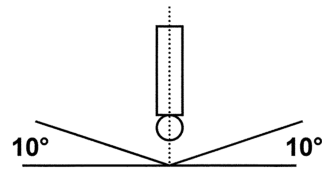

センサを垂直 80 度以内に設置してください。

図 2: 一体型ケーブル接続付き Rosemount 3900

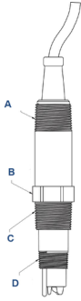

A. 1 インチのオス米田管用ネジ (MNPT) B. 幅 1.30 インチのレンチ平面 C. 1 インチMNPT D. も インチMNPT

Rosemount 3900/3900VP

13

---

Rosemount 3900/3900VP

2021年8月

図 3:Variopol ケーブル接続付き Rosemount 3900VP

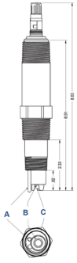

A. 溶液グランドの温度補償 B. 基準接点 C. pH 電極

<table><tr><td>圧力</td><td>温度</td></tr><tr><td>1.03 MPa</td><td>150 °F</td></tr><tr><td>882.5 kPa</td><td>160 °F</td></tr><tr><td>703.3 kPa</td><td>170 °F</td></tr><tr><td>551.6 kPa</td><td>180 °F</td></tr><tr><td>393.0 kPa</td><td>200 °F</td></tr><tr><td>330.9 kPa</td><td>210 °F</td></tr></table>

表 3: 水平なディー字菅(PN 2002011)圧力/温度定格

14

Emerson.com/Rosemount

---

2021 年 8 月

Rosemount 3900/3900VP

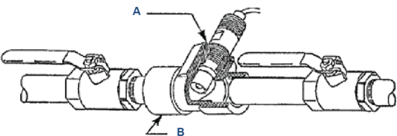

図 4:PN 2002011 パイブティーを使用した一般的な直接挿入挿入設置

A. 11⁄2 インチ×1 インチ 径違い継ぎ手 B. 11⁄2 インチのティー字管PN 2002011

<table><tr><td colspan="2">徭渭村科</td></tr><tr><td>本体およびナット</td><td>ポリエステルノポリカーポネート</td></tr><tr><td>継手</td><td>316 ステンレス銅</td></tr><tr><td>シール</td><td>シリコーン</td></tr><tr><td colspan="2">フローセルの位置づけ</td></tr><tr><td>温度</td><td>32 * F 〜 158 * F</td></tr><tr><td>最大圧力</td><td>620.5 kPa</td></tr><tr><td>流量:</td><td>2 gal 〜 5 gal/ 時間</td></tr><tr><td colspan="2">センサスレッドの接続</td></tr><tr><td>24091-00</td><td>1 インチの米国管用ネジ (NPT) のアダブタ</td></tr><tr><td>24091-02</td><td>34-インチの NPT のアダブタ</td></tr></table>

表 4 : 低流量セルの仕様 PN 24091-00/24091-02

Rosemount 3900/3900VP

15

---

Rosemount 3900/3900VP

2021年8月

図 5: ローフローセル (PN 24091-00)

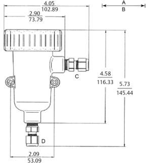

A

B. mm

C. アウトレッ.

D. インレット

16

Emerson.com/Rosemount

---

2021 年 8 月

Rosemount 3900/3900VP

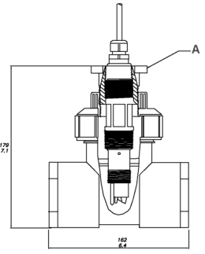

図6:フロースルーティー(2インチ)(PN 914240-XX)

## A. ブダブタ

Rosemount3900/3900VPには、次のフロースルーディーを使用できます

- 915240-03
- 915240-04
- 915240-05
新規設置の場合は、上記の適切なティーを使用して S10283-LQD アダブターを追加します。

既存のRosemount 399 を Rosemount 3900 センサーと交換する場合は、 S10283-LQD アダブターを追加してティーを Rosemount 3900 センサーを受け入れるように変換します。

Rosemount 3900/3900VP

17

---

Rosemount 3900/3900VP

2021年8月

図 7: ジェット噴霧式クリーナー

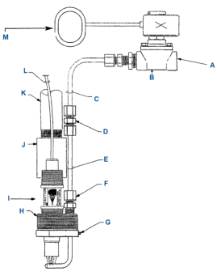

A 他社製の洗浄液

B. 電磁バルブまたは手動バルブ (所掌外

C. 耐食チュープ (所掌外)

D. ポリプロピレン製リィンチ(6.4 mm) 圧縮フィッティンサ

E. 14 in (6.4 mm) 316 ステンレス鋼

F. 14 in $(6.4 \mathrm{~mm})$ ポリプロビレ.

G、 スプレーノズル高さ劇整用ステンレス止めネジ

H. 2 in (50.8 mm) NPT * : $>$

センザ

}- 浸漬用途用1インチ(25.4 mm) PVC カップリング(所掌外)

K. 1 インチ(25.4 mm) のPVC またはステンレス製コンジット(所掌外)

参考文献

M. 他社支給のタイマー、 または、 Rosemount 装置でタイマー機施を使用

18

Emerson.com/Rosemount

---

2021 年 8 月

Rosemount 3900/3900VP

図8:ジェット噴霧式クリーナー付 Rosemount 3900 センサ

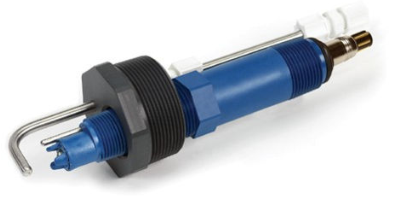

ジェット噴霧式クリーナは、 センサを水あるいは圧縮空気で洗浄することで、 手作業による定期的なメンテナンスが不要にな りました。 電磁弁を使用してクリーナー内の流量のコントロールが可能です。

13

ハンドレール取り付けアセンプリ (PN 11275-01、 図示なし) にジェット噴霧式クリーナーを使用、 または図 8 に示すように 導管を通して取り付けることもできます。

Rosemount 3900/3900VP

19

---

Rosemount 3900/3900VP

2021年8月

図 9: 定流量バネル PN 00390-7101-000

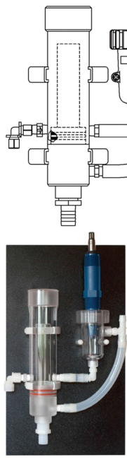

20

Emerson.com/Rosemount

---

2021 年 8 月

Rosemount 3900/3900VP

<table><tr><td>流入量</td><td>3 gal ~ 80 gal/ 時間</td></tr><tr><td>流入圧力</td><td>20.7 kPa ~ 448.2 kPa(1)</td></tr><tr><td>温度</td><td>0 °C ~ 50 °C</td></tr></table>

表 5 : 低流量バネルの仕様

《1》 逆止弃を開くには疑小入口圧力が必要です。 これにより, サンプルフローが失われた場合でもフローセル内のサンプル液は梯出され ません。 逆止弃を取り外すと、 入口圧力条件が下がります。

Rosemount 3900/3900VP

21

---

Rosemount 3900/3900VP

2021年8月

22

Emerson.com/Rosemount

---

2021 年 8 月

Rosemount 3900/3900VP

Rosemount 3900/3900VP

23

---

00813-0104-3900

Rev. AC

2021 年 8 月

详細注,Emerson.com をご覧ください。

022 Emerson 無断複写·転截を禁じます

Emerson の販売条件は、 ご要望に応じて提供させていただき ます。 Emerson のロゴは、 Emerson Electric Co. の商標および サービスマークです。 Rosemount は、 Emerson 系列企業であ る一社のマークです。 他のすべてのマークは、 それぞれの所有者に帰属します。

EMERSON.

